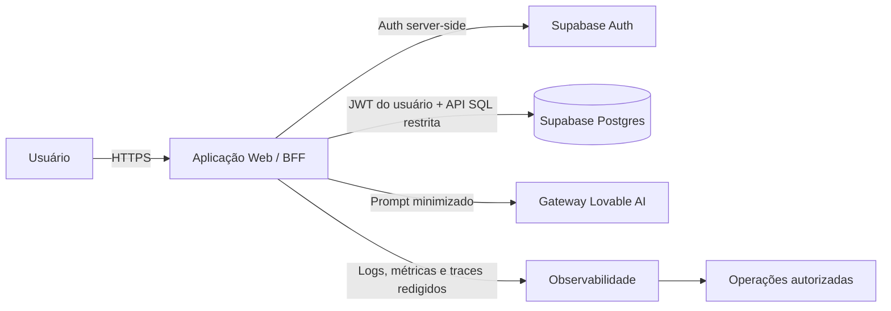
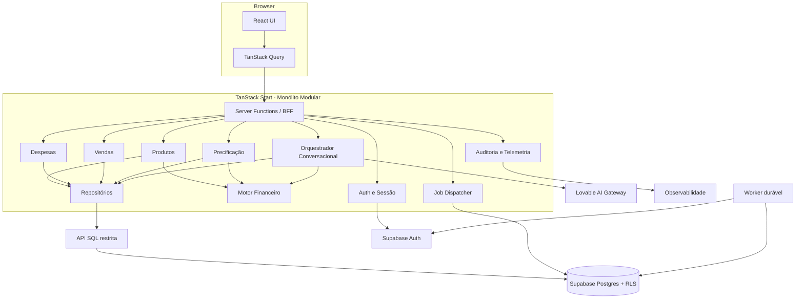
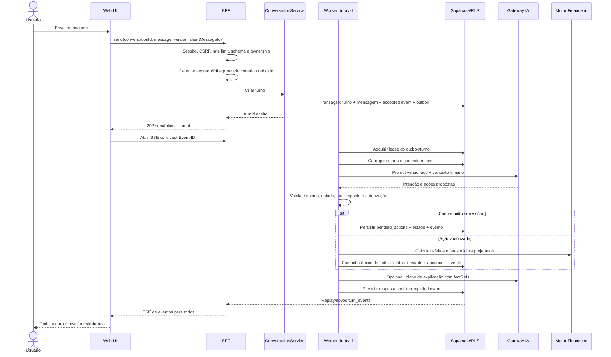

# Software Design Document

## Preço que Dá Lucro

| Campo            | Valor                                                                      |
| ---------------- | -------------------------------------------------------------------------- |
| Documento        | Software Design Document - SDD                                             |
| Versão           | 1.4                                                                        |
| Estado           | Baseline técnica proposta                                                  |
| Data             | 2026-08-02                                                                 |
| Origem           | `PLANO_MESTRE_OTIMIZACAO_E_CIBERSEGURANCA.md` versão 1.5                   |
| Sistema atual    | React 19, TanStack Start/Router, Supabase, Lovable AI, Tailwind CSS        |
| Arquitetura-alvo | Monólito modular full-stack com BFF, RLS e motor financeiro determinístico |
| Classificação    | Uso interno e confidencial                                                 |

> **Atualização P0 (2026-08-12):** este SDD preserva descrições do baseline
> legado para rastreabilidade. A decisão vigente é PostgreSQL/Neon + Drizzle e
> Better Auth server-driven, conforme ADR-019 e ADR-020. Supabase está
> descartado como runtime final e só é permitido como origem read-only da
> migração/cutover documentada em ADR-021.

> Este SDD define como o sistema deverá ser construído. O Plano Mestre permanece responsável por prioridade, sequenciamento e governança da execução. Em caso de divergência, requisitos legais e de segurança prevalecem; em seguida, este SDD; depois, ADRs aprovados e o Plano Mestre.

---

## Sumário

1. [Controle do documento](#1-controle-do-documento)
2. [Propósito e escopo](#2-propósito-e-escopo)
3. [Contexto do sistema](#3-contexto-do-sistema)
4. [Objetivos e restrições](#4-objetivos-e-restrições)
5. [Requisitos funcionais](#5-requisitos-funcionais)
6. [Requisitos não funcionais](#6-requisitos-não-funcionais)
7. [Arquitetura de solução](#7-arquitetura-de-solução)
8. [Projeto dos componentes](#8-projeto-dos-componentes)
9. [Arquitetura de dados](#9-arquitetura-de-dados)
10. [Contratos e interfaces](#10-contratos-e-interfaces)
11. [Motor financeiro](#11-motor-financeiro)
12. [Orquestração conversacional](#12-orquestração-conversacional)
13. [Arquitetura de segurança](#13-arquitetura-de-segurança)
14. [Frontend, UX e acessibilidade](#14-frontend-ux-e-acessibilidade)
15. [Observabilidade e auditoria](#15-observabilidade-e-auditoria)
16. [Implantação e DevSecOps](#16-implantação-e-devsecops)
17. [Estratégia de verificação](#17-estratégia-de-verificação)
18. [Migração e rollout](#18-migração-e-rollout)
19. [Rastreabilidade](#19-rastreabilidade)
20. [ADRs e decisões pendentes](#20-adrs-e-decisões-pendentes)
21. [Critérios de aceite do sistema](#21-critérios-de-aceite-do-sistema)

---

## 1. Controle do documento

### 1.1 Convenções normativas

As palavras abaixo possuem significado normativo:

| Termo                 | Significado                                                    |
| --------------------- | -------------------------------------------------------------- |
| DEVE / NÃO DEVE       | Requisito obrigatório e bloqueante                             |
| DEVERIA / NÃO DEVERIA | Requisito recomendado; exceção exige justificativa registrada  |
| PODE                  | Opção permitida sem obrigação                                  |
| TBD                   | Decisão pendente que deve ser encerrada antes do gate indicado |

### 1.2 Aprovação

| Papel                     | Responsabilidade de aprovação                             |
| ------------------------- | --------------------------------------------------------- |
| Produto                   | Escopo funcional, linguagem e jornada                     |
| Responsável financeiro    | Fórmulas, premissas, nomenclatura e vetores de referência |
| Líder técnico             | Arquitetura, contratos, dados e implantação               |
| Security champion         | Threat model, controles e evidências de segurança         |
| Responsável LGPD/jurídico | Bases legais, transparência, retenção e direitos          |
| QA                        | Estratégia de verificação e gates                         |
| Operações                 | SLOs, alertas, backup, restauração e incidentes           |

### 1.3 Documentos relacionados

- `README.md`: visão original do produto e requisitos de negócio.
- `PLANO_MESTRE_OTIMIZACAO_E_CIBERSEGURANCA.md`: backlog, fases e gates.
- `AGENTS.md`: regras de integração com Lovable.
- `docs/archive/supabase/migrations/*.sql`: histórico read-only do schema legado; o schema canônico está em `drizzle/`.
- `docs/adr/ADR-016-shadcn-base-ui.md`: execução da decisão fixa de shadcn/ui sobre Base UI.
- `docs/evidence/*.md`: evidências sanitizadas de build, bundle, browsers e acessibilidade.
- ADRs listados na seção 20: decisões arquiteturais complementares.

### 1.4 Gestão de mudanças

Toda alteração deste SDD DEVE:

1. Identificar requisitos e componentes afetados.
2. Atualizar a matriz de rastreabilidade.
3. Informar impacto em dados persistidos e compatibilidade.
4. Informar impacto de segurança, privacidade e auditoria.
5. Atualizar testes, migrations e plano de rollback.
6. Receber aprovação dos papéis aplicáveis.

Alterações em fórmulas financeiras, sessão, autorização, tenant, retenção, ferramentas de IA ou na camada de primitivos/design system exigem ADR e nova versão do documento.

### 1.5 Histórico e versionamento

| Versão | Data       | Alteração                                                                                                                            |
| ------ | ---------- | ------------------------------------------------------------------------------------------------------------------------------------ |
| 1.1    | 2026-08-01 | Baseline técnica anterior.                                                                                                           |
| 1.2    | 2026-08-01 | Formaliza shadcn/ui sobre Base UI, suas fronteiras, migração e gates de conformidade.                                                |
| 1.3    | 2026-08-01 | Formaliza qualidade sem warnings, proveniência Git/artifact, budget do entry e matrizes obrigatórias de browsers e leitores de tela. |
| 1.4    | 2026-08-02 | Registra execução dos gates globais, alias Vite nativo, bundle medido, matriz Playwright, Orca e exceção Nitro temporária.           |

Revisões incrementam a versão do SDD e registram requisitos, rastreabilidade e ADRs afetados. Mudança de decisão arquitetural fixada exige nova versão e ADR próprio; correção editorial sem efeito normativo pode preservar a versão.

---

## 2. Propósito e escopo

### 2.1 Propósito

O sistema auxilia pequenos empreendedores a estruturar custos, formar preços, calcular margem de contribuição, estimar ponto de equilíbrio, simular cenários e produzir diagnósticos financeiros compreensíveis.

A IA interpreta linguagem natural e explica resultados. A IA NÃO calcula valores financeiros, NÃO define autorização, NÃO escolhe livremente operações de banco e NÃO completa dados desconhecidos.

### 2.2 Escopo do MVP formalizado

O MVP inclui:

- Autenticação por e-mail/senha e OAuth suportado.
- Cadastro conversacional e manual de produtos.
- Ingredientes, rendimento, embalagens e materiais.
- Preços de compra e histórico de atualização.
- Preço atual, impostos e taxas de venda.
- Preço de mercado com fonte, região e vigência.
- Despesas fixas e variáveis normalizadas por período.
- Vendas ou volume por produto e período.
- Custo direto, margem de contribuição e ponto de equilíbrio.
- Formação de preço baseada em premissas explícitas.
- Simulações persistidas e reproduzíveis.
- Diagnósticos versionados com alertas explicáveis.
- Exportação, correção e exclusão de dados conforme LGPD.
- Auditoria, observabilidade, backup e resposta a incidentes.

### 2.3 Fora do escopo do MVP

- Controle de estoque.
- Fluxo de caixa completo.
- DRE contábil ou fiscal.
- Emissão fiscal.
- Conciliação bancária.
- Integração com WhatsApp.
- Cobrança de assinaturas.
- Marketplace de insumos.
- Recomendação tributária automática.
- Conversão cambial.
- Suporte multiempresa, equipe ou workspace compartilhado.

Itens fora do escopo NÃO DEVEM ser inferidos por mensagens, rótulos ou diagnósticos. O sistema NÃO DEVE usar “lucro líquido” quando os componentes necessários não estiverem modelados.

### 2.4 Premissas do MVP

- A moeda funcional é BRL.
- O locale é `pt-BR`.
- O tenant é o usuário autenticado individual.
- O período financeiro padrão é mensal, sempre exibido.
- Dados de demonstração são segregados de dados reais.
- Imposto desconhecido permanece desconhecido.
- O usuário confirma conversões não seguras e mutações financeiras sensíveis.
- A indisponibilidade da IA não impede edição manual nem consulta dos dados existentes.

---

## 3. Contexto do sistema

### 3.1 Estado atual

O sistema atual possui:

- Rotas públicas com SSR e área autenticada client-side.
- Sessão Supabase persistida no navegador.
- Consultas de domínio divididas entre acesso direto ao Supabase e server functions.
- RLS por `user_id` nas tabelas existentes.
- Motor financeiro em `src/lib/finance.ts`.
- Orquestração de IA e ferramentas em `src/lib/chat.functions.ts`.
- Dashboard e páginas funcionais para produtos, preços, despesas, equilíbrio, simulações e diagnóstico.

As limitações que motivam o redesenho são registradas no Plano Mestre, especialmente XSS no chat, perda de estado conversacional, defaults financeiros inseguros, ausência de constraints, arquitetura híbrida e ausência de testes.

### 3.2 Atores

| Ator                       | Responsabilidade                                                  |
| -------------------------- | ----------------------------------------------------------------- |
| Visitante                  | Conhecer o produto e iniciar autenticação                         |
| Usuário autenticado        | Gerenciar exclusivamente seus dados financeiros                   |
| Provedor de identidade     | Autenticar, emitir e renovar credenciais                          |
| Gateway de IA              | Interpretar mensagens e gerar explicações sob capacidade limitada |
| Operador autorizado        | Operar infraestrutura sem acessar dados além da necessidade       |
| Responsável financeiro     | Aprovar regras e vetores de cálculo                               |
| Encarregado/jurídico       | Governar privacidade e direitos do titular                        |
| Sistema de observabilidade | Receber sinais redigidos e trilhas autorizadas                    |

### 3.3 Diagrama de contexto



### 3.4 Fronteiras de confiança

| Fronteira                       | Regra                                                                                            |
| ------------------------------- | ------------------------------------------------------------------------------------------------ |
| Navegador para BFF              | Toda entrada é não confiável; autenticar, validar e limitar                                      |
| BFF para Supabase               | Usar identidade do usuário e API SQL restrita; tabelas não aceitam DML direto de `authenticated` |
| BFF para IA                     | Minimizar dados, limitar capacidade e validar toda resposta                                      |
| Aplicação para observabilidade  | Redigir segredos e PII antes da emissão                                                          |
| CI/CD para produção             | Artifact imutável, credencial de curta duração e aprovação                                       |
| Operador para plano de controle | MFA, menor privilégio e auditoria                                                                |

---

## 4. Objetivos e restrições

### 4.1 Objetivos arquiteturais

- Uma única camada de aplicação para domínio.
- Monólito modular, sem microserviços prematuros.
- Contratos tipados e validados em runtime.
- Cálculos puros, determinísticos e versionados.
- Segurança em profundidade no BFF e no banco.
- Estado conversacional persistente e recuperável.
- Operações mutáveis idempotentes e auditáveis.
- Dados financeiros temporalmente reproduzíveis.
- Experiência WCAG 2.2 AA e responsiva.
- Deploy reproduzível com rollback e restauração testados.

### 4.2 Restrições técnicas

- React 19 e TanStack Start/Router permanecem como base da aplicação.
- Supabase permanece como Auth e Postgres no horizonte deste SDD.
- O deploy alvo é Cloudflare Workers compatível via Nitro, com adapter e versões fixados; mudança exige ADR.
- Configuração de ambiente DEVE vir de bindings server-side ou configuração pública em runtime, nunca de rebuild por ambiente.
- O projeto conectado ao Lovable NÃO DEVE ter histórico publicado reescrito.
- Migrations DEVEM seguir expand-migrate-contract.
- A aplicação NÃO DEVE depender de APIs Node indisponíveis no runtime de produção.
- A chave service role NÃO DEVE ser incorporada ou acessível ao cliente.

### 4.3 Decisões fixadas por este SDD

| ID     | Decisão                                                                                                                                             | Estado            |
| ------ | --------------------------------------------------------------------------------------------------------------------------------------------------- | ----------------- |
| DD-001 | Arquitetura de monólito modular                                                                                                                     | Aprovada pelo SDD |
| DD-002 | BFF como única API suportada pela UI; invariantes também são impostas pela API SQL restrita                                                         | Aprovada pelo SDD |
| DD-003 | RLS, constraints e funções SQL restritas como defesa contra acesso direto ao Supabase                                                               | Aprovada pelo SDD |
| DD-004 | Motor financeiro sem dependência de IA ou banco                                                                                                     | Aprovada pelo SDD |
| DD-005 | Decimal exato para valores financeiros                                                                                                              | Aprovada pelo SDD |
| DD-006 | Produto com status e completude                                                                                                                     | Aprovada pelo SDD |
| DD-007 | IA controlada por máquina de estados server-side                                                                                                    | Aprovada pelo SDD |
| DD-008 | Tenant individual por usuário no MVP                                                                                                                | Aprovada pelo SDD |
| DD-009 | Dados demo segregados dos dados reais                                                                                                               | Aprovada pelo SDD |
| DD-010 | Artifact único promovido entre ambientes                                                                                                            | Aprovada pelo SDD |
| DD-011 | DML direto de `authenticated` revogado; escrita somente por funções SQL versionadas                                                                 | Aprovada pelo SDD |
| DD-012 | Jobs duráveis executados por outbox e worker separado da requisição web                                                                             | Aprovada pelo SDD |
| DD-013 | shadcn/ui sobre Base UI é a camada exclusiva de primitivos reutilizáveis; consumo ocorre por `@/components/ui` e Radix é eliminado conforme ADR-016 | Aprovada pelo SDD |

---

## 5. Requisitos funcionais

### 5.1 Autenticação e conta

| ID          | Requisito                                                                                                                                                   | Verificação principal |
| ----------- | ----------------------------------------------------------------------------------------------------------------------------------------------------------- | --------------------- |
| FR-AUTH-001 | O visitante DEVE criar conta com e-mail/senha conforme política do provedor                                                                                 | E2E                   |
| FR-AUTH-002 | O usuário DEVE autenticar por senha e OAuth configurado                                                                                                     | E2E                   |
| FR-AUTH-003 | O sistema DEVE preservar somente redirects internos permitidos                                                                                              | Segurança/E2E         |
| FR-AUTH-004 | O sistema DEVE tratar confirmação de e-mail, expiração, bloqueio e recuperação de senha                                                                     | E2E                   |
| FR-AUTH-005 | Logout DEVE encerrar a experiência em todas as abas e limpar caches privados                                                                                | Integração/E2E        |
| FR-AUTH-006 | Operações destrutivas e exportação DEVEM exigir reautenticação quando definido pelo risco                                                                   | E2E                   |
| FR-AUTH-007 | O usuário DEVE exercer confirmação/acesso, exportação, correção, portabilidade aplicável, oposição, restrição/anonimização, exclusão e revogação aplicáveis | E2E/LGPD              |
| FR-AUTH-008 | O sistema DEVE oferecer canal autenticado, SLA, estado e trilha para cada solicitação                                                                       | Integração            |
| FR-AUTH-009 | O usuário DEVE solicitar revisão/contestação de diagnóstico automatizado e receber canal humano                                                             | E2E/LGPD              |

### 5.2 Produtos e ficha técnica

| ID          | Requisito                                                                              | Verificação principal |
| ----------- | -------------------------------------------------------------------------------------- | --------------------- |
| FR-PROD-001 | O usuário DEVE criar produto em estado `draft`                                         | Integração            |
| FR-PROD-002 | O produto DEVE possuir nome, moeda, rendimento, unidade e status                       | Schema/integração     |
| FR-PROD-003 | O usuário DEVE adicionar, editar e remover ingredientes                                | E2E                   |
| FR-PROD-004 | Cada ingrediente DEVE guardar quantidade usada e dados de compra                       | Schema/integração     |
| FR-PROD-005 | O usuário DEVE adicionar, editar e remover embalagens e materiais                      | E2E                   |
| FR-PROD-006 | Cada material DEVE representar quantidade usada por unidade vendida                    | Unitário/integração   |
| FR-PROD-007 | O sistema DEVE apresentar ficha técnica detalhada e decomposição de custos             | E2E                   |
| FR-PROD-008 | Produto incompleto NÃO DEVE participar de indicadores consolidados                     | Unitário/E2E          |
| FR-PROD-009 | A conclusão DEVE validar todas as pendências e registrar `completed_at`                | Integração            |
| FR-PROD-010 | Exclusão ou arquivamento DEVE informar consequências e preservar histórico obrigatório | E2E/schema            |

### 5.3 Conversa assistida por IA

| ID          | Requisito                                                                      | Verificação principal |
| ----------- | ------------------------------------------------------------------------------ | --------------------- |
| FR-CONV-001 | O usuário DEVE iniciar e retomar uma conversa de produto                       | E2E                   |
| FR-CONV-002 | A conversa DEVE persistir etapa, produto, mensagens e eventos de ferramenta    | Integração            |
| FR-CONV-003 | O servidor DEVE determinar as transições permitidas                            | Unitário              |
| FR-CONV-004 | A IA DEVE fazer uma pergunta por vez conforme a etapa                          | Avaliação de IA       |
| FR-CONV-005 | Ingredientes identificados DEVEM ser apresentados para confirmação estruturada | E2E                   |
| FR-CONV-006 | O usuário DEVE corrigir ou remover qualquer dado interpretado                  | E2E                   |
| FR-CONV-007 | A conversa DEVE sobreviver a reload e nova aba                                 | E2E                   |
| FR-CONV-008 | Retry NÃO DEVE duplicar mutações                                               | Concorrência          |
| FR-CONV-009 | O sistema DEVE oferecer continuação manual sem IA                              | E2E/resiliência       |
| FR-CONV-010 | Produto incompleto NÃO DEVE ser finalizado                                     | Integração            |
| FR-CONV-011 | A IA DEVE explicar somente resultados produzidos pelo motor                    | Contrato/avaliação    |
| FR-CONV-012 | O usuário DEVE confirmar mutações sensíveis definidas neste SDD                | E2E                   |

### 5.4 Despesas, vendas e mercado

| ID           | Requisito                                                                            | Verificação principal |
| ------------ | ------------------------------------------------------------------------------------ | --------------------- |
| FR-EXP-001   | O usuário DEVE criar, editar, listar e excluir despesas                              | E2E                   |
| FR-EXP-002   | Despesa DEVE possuir tipo, periodicidade, categoria, valor e origem                  | Schema                |
| FR-EXP-003   | O sistema DEVE normalizar despesas conforme a política temporal da seção 11.7        | Unitário              |
| FR-EXP-004   | Despesa variável DEVE declarar incidência por unidade, transação, receita ou período | Schema/unitário       |
| FR-SALES-001 | O usuário DEVE registrar volume e receita por produto e período                      | E2E                   |
| FR-SALES-002 | O sistema DEVE distinguir dados reais, estimados e demonstrativos                    | Integração/E2E        |
| FR-SALES-003 | O mix multiproduto DEVE derivar de participação real ou simulada explícita           | Unitário              |
| FR-MKT-001   | O usuário DEVE registrar preços mínimo, médio e máximo de mercado                    | E2E                   |
| FR-MKT-002   | Mercado DEVE guardar fonte, região e data de referência                              | Schema                |
| FR-MKT-003   | Novos registros NÃO DEVEM apagar o histórico anterior                                | Integração            |

### 5.5 Cálculos, simulações e diagnósticos

| ID          | Requisito                                                                                        | Verificação principal |
| ----------- | ------------------------------------------------------------------------------------------------ | --------------------- |
| FR-FIN-001  | O sistema DEVE calcular custo por ingrediente, receita e unidade                                 | Unitário              |
| FR-FIN-002  | O sistema DEVE calcular custos variáveis e margem de contribuição                                | Unitário              |
| FR-FIN-003  | O sistema DEVE calcular ponto de equilíbrio quando matematicamente aplicável                     | Unitário              |
| FR-FIN-004  | Resultado impossível ou incompleto DEVE ser representado por estado, não por zero                | Unitário/E2E          |
| FR-FIN-005  | O sistema DEVE formar preço somente com modelo e premissas explícitos                            | Unitário/E2E          |
| FR-FIN-006  | Unidades incompatíveis DEVEM bloquear cálculo ou exigir conversão confirmada                     | Unitário/E2E          |
| FR-FIN-007  | O sistema DEVE calcular vendas e faturamento necessários para meta de resultado dentro do escopo | Unitário/E2E          |
| FR-SIM-001  | O usuário DEVE criar e comparar cenário atual e cenário simulado                                 | E2E                   |
| FR-SIM-002  | Cenário atual DEVE usar dado real ou ser rotulado como hipótese                                  | E2E                   |
| FR-SIM-003  | Simulação DEVE persistir entradas, saídas, premissas e versão do motor                           | Integração            |
| FR-DIAG-001 | Diagnóstico DEVE validar completude antes de gerar linguagem positiva                            | Unitário/E2E          |
| FR-DIAG-002 | Alertas DEVEM possuir regra, severidade, evidência e ação recomendada                            | Unitário              |
| FR-DIAG-003 | Diagnóstico DEVE ser reproduzível pelo snapshot persistido                                       | Integração            |
| FR-DIAG-004 | Explicação da IA NÃO DEVE alterar valores ou classificar sem contexto                            | Contrato/avaliação    |

### 5.6 Atualização de preços

| ID           | Requisito                                                              | Verificação principal |
| ------------ | ---------------------------------------------------------------------- | --------------------- |
| FR-PRICE-001 | O usuário DEVE atualizar preço, quantidade e unidade de compra         | E2E                   |
| FR-PRICE-002 | A atualização DEVE criar histórico com vigência                        | Integração            |
| FR-PRICE-003 | O sistema DEVE sinalizar preço ausente, inconsistente ou desatualizado | Unitário/E2E          |
| FR-PRICE-004 | Mudança de tamanho de embalagem DEVE invalidar a revisão anterior      | Integração            |

---

## 6. Requisitos não funcionais

### 6.1 Segurança

| ID          | Requisito                                                                                                             |
| ----------- | --------------------------------------------------------------------------------------------------------------------- |
| NFR-SEC-001 | O sistema DEVE atender aos controles aplicáveis do OWASP ASVS 5.0 nível 2 com evidência                               |
| NFR-SEC-002 | Nenhum conteúdo externo DEVE alcançar sink HTML, script, URL ou CSS sem política segura                               |
| NFR-SEC-003 | Toda operação de domínio DEVE autenticar, validar, autorizar, limitar e auditar no BFF e/ou na função SQL que a impõe |
| NFR-SEC-004 | Toda tabela de tenant DEVE possuir RLS/FORCE RLS aplicável e teste cross-tenant, mesmo sem grant direto               |
| NFR-SEC-005 | Nenhum segredo privilegiado DEVE existir no bundle, source map, log ou artifact público                               |
| NFR-SEC-006 | Mutações DEVEM possuir proteção CSRF quando a sessão usar cookies                                                     |
| NFR-SEC-007 | Endpoints sensíveis DEVEM possuir rate limit atômico e quota aplicável                                                |
| NFR-SEC-008 | Contas do plano de controle DEVEM usar MFA e menor privilégio                                                         |
| NFR-SEC-009 | Erros para o cliente NÃO DEVEM expor stack, SQL, tokens ou configuração interna                                       |
| NFR-SEC-010 | Vulnerabilidade crítica explorável, quebra de tenant ou segredo privilegiado exposto bloqueiam release                |

### 6.2 Privacidade

| ID           | Requisito                                                                                          |
| ------------ | -------------------------------------------------------------------------------------------------- |
| NFR-PRIV-001 | O sistema DEVE aplicar minimização e finalidade antes de persistir ou compartilhar dados           |
| NFR-PRIV-002 | Dados enviados à IA DEVEM excluir PII sem finalidade e identificadores internos desnecessários     |
| NFR-PRIV-003 | Retenção DEVE ser definida por classe de dado e implementada tecnicamente                          |
| NFR-PRIV-004 | Exportação, correção, oposição e exclusão aplicáveis DEVEM possuir canal e SLA                     |
| NFR-PRIV-005 | Transferência internacional e subprocessadores DEVEM estar documentados antes de usuários externos |
| NFR-PRIV-006 | Restauração de backup NÃO DEVE ressuscitar exclusões já efetivadas sem reconciliação               |

### 6.3 Desempenho

| ID           | Meta inicial                                                                                                                                                                                                                                               |
| ------------ | ---------------------------------------------------------------------------------------------------------------------------------------------------------------------------------------------------------------------------------------------------------- |
| NFR-PERF-001 | LCP mobile P75 menor que 2,5 s                                                                                                                                                                                                                             |
| NFR-PERF-002 | INP P75 menor que 200 ms                                                                                                                                                                                                                                   |
| NFR-PERF-003 | CLS P75 menor que 0,1                                                                                                                                                                                                                                      |
| NFR-PERF-004 | Operações BFF sem IA com P95 menor que 500 ms, excluindo rede do cliente                                                                                                                                                                                   |
| NFR-PERF-005 | Aceite do turno e primeiro evento de progresso com P95 menor que 500 ms; conclusão da IA possui SLO separado após benchmark                                                                                                                                |
| NFR-PERF-006 | Taxa de 5xx menor que 0,5% na janela acordada                                                                                                                                                                                                              |
| NFR-PERF-007 | O entry chunk e seu grafo estático inicial DEVEM possuir no máximo 500 kB minificados cada; CI DEVE medir tamanho raw/minificado, gzip e Brotli com analyzer/metafile e bloquear regressão acima do budget; aumentar apenas o warning limit NÃO é correção |

As metas DEVEM ser recalibradas com RUM e testes de carga antes do beta. A fórmula do SLI, janela e volume mínimo pertencem ao catálogo de SLOs.

A baseline de 2026-08-01 media o entry em 612.46 kB minificado e 173.53 kB gzip, apesar de route splitting já existir. Após a fronteira TanStack, a retirada de Zod do diagnóstico estático e o carregamento sob demanda do Supabase em 2026-08-02, o entry mede 231581 bytes minificados, 71824 gzip e 62480 Brotli; o grafo estático inicial mede 423418, 132939 e 116376 bytes, respectivamente, no ambiente reproduzido da CI. `scripts/check-bundle.mjs` bloqueia regressão do entry ou do grafo estático acima de 500000 bytes e publica relatório junto ao manifesto Vite. A landing não aguarda o chunk Supabase: visitantes sem sessão persistida não o carregam; sessões existentes são validadas após o primeiro paint.

### 6.4 Disponibilidade e recuperação

| ID          | Requisito                                                                                                 |
| ----------- | --------------------------------------------------------------------------------------------------------- |
| NFR-RES-001 | Operações manuais e leitura de dados existentes DEVEM continuar quando a IA estiver indisponível          |
| NFR-RES-002 | Retry automático DEVE ocorrer apenas em falhas transitórias e operações idempotentes                      |
| NFR-RES-003 | Meta inicial: RPO máximo de 15 minutos e RTO máximo de 4 horas; alteração exige ADR-008 e aceite de risco |
| NFR-RES-004 | Backup DEVE ser criptografado, imutável e protegido do mesmo domínio administrativo                       |
| NFR-RES-005 | Restauração isolada DEVE ser exercitada e comprovar Auth, RLS, migrations e reconciliação                 |

### 6.5 Acessibilidade e compatibilidade

| ID           | Requisito                                                                             |
| ------------ | ------------------------------------------------------------------------------------- |
| NFR-A11Y-001 | Jornadas principais DEVEM atender WCAG 2.2 AA                                         |
| NFR-A11Y-002 | Toda jornada DEVE ser operável por teclado                                            |
| NFR-A11Y-003 | Estados assíncronos e mensagens do chat DEVEM ser anunciados por tecnologia assistiva |
| NFR-A11Y-004 | Layout DEVE funcionar a partir de 320 px e com zoom/reflow de 400%                    |
| NFR-A11Y-005 | A aplicação DEVE respeitar redução de movimento e foco visível                        |
| NFR-COMP-001 | Suporte: versões estáveis correntes de Chrome, Edge, Firefox e Safari                 |

### 6.6 Manutenibilidade

| ID            | Requisito                                                                                                                                                                                                                |
| ------------- | ------------------------------------------------------------------------------------------------------------------------------------------------------------------------------------------------------------------------ |
| NFR-MAINT-001 | Contratos públicos NÃO DEVEM usar `any`                                                                                                                                                                                  |
| NFR-MAINT-002 | Regras financeiras DEVEM possuir IDs, versão e testes associados                                                                                                                                                         |
| NFR-MAINT-003 | CI DEVE executar format check global, lint, typecheck, testes, build e scans                                                                                                                                             |
| NFR-MAINT-004 | Um único package manager e lockfile DEVEM ser usados                                                                                                                                                                     |
| NFR-MAINT-005 | Migrations DEVEM ser testadas do zero e sobre dados representativos anonimizados                                                                                                                                         |
| NFR-MAINT-006 | CI e build DEVEM concluir sem warnings não registrados; exceção temporária exige assinatura do aprovador, owner, justificativa, controle compensatório, release afetada e expiração                                      |
| NFR-MAINT-007 | Toda release DEVE partir de checkout Git limpo em commit imutável e gerar artifact rastreável ao SHA; histórico publicado conectado ao Lovable NÃO DEVE ser reescrito e rollback DEVE reativar artifact anterior testado |

O format check é global sobre o repositório. Arquivo comprovadamente gerado somente PODE ser ignorado por caminho exato documentado; diretórios amplos, globs genéricos e arquivos mantidos não podem ser excluídos. A baseline atual falha em 17 arquivos: os mantidos devem ser formatados e apenas os gerados comprovados podem entrar nessa lista exata.

### 6.7 Frontend e design system

| ID         | Requisito                                                                                                                                                                                                                                   |
| ---------- | ------------------------------------------------------------------------------------------------------------------------------------------------------------------------------------------------------------------------------------------- |
| NFR-UI-001 | shadcn/ui com Base UI DEVE ser a camada exclusiva de primitivos reutilizáveis; após o gate da Fase 2, `@radix-ui/*` e `radix-ui` NÃO DEVEM existir no source mantido nem no grafo direto ou transitivo de dependências de produção          |
| NFR-UI-002 | Aplicação, features e rotas DEVEM consumir UI somente por `@/components/ui`; apenas `src/components/ui` PODE importar `@base-ui/react`                                                                                                      |
| NFR-UI-003 | Elementos HTML semânticos nativos usados pelas implementações oficiais shadcn Base, como `label` e `input`, são conformes e NÃO constituem exceção à camada exclusiva                                                                       |
| NFR-UI-004 | Biblioteca especialista somente PODE existir atrás de wrapper local, com aprovação/allowlist e sem competir como stack de primitivos; a allowlist inicial contém apenas Sonner, e `cmdk`/`vaul` DEVEM ser removidos                         |
| NFR-UI-005 | Durante a migração, Radix PODE existir somente no inventário legado fechado do ADR-016; nenhuma entrada ou uso novo é permitido, e a exceção expira obrigatoriamente no gate da Fase 2                                                      |
| NFR-UI-006 | Cada wrapper migrado DEVE preservar comportamento, contrato visual, teclado, foco, semântica acessível, compatibilidade CSP e paridade SSR/hydration antes de substituir a implementação anterior                                           |
| NFR-UI-007 | CI DEVE verificar fronteiras de import, catálogo local e grafo de produção a partir de npm/`package-lock.json`, que são autoritativos, e bloquear Radix, especialistas não aprovados, Bun e wrappers fora do catálogo após o gate aplicável |
| NFR-UI-008 | Mudança futura de base, fronteira, allowlist especialista ou catálogo reutilizável DEVE atualizar SDD, Plano Mestre, rastreabilidade, testes e ADR; ADR-016 governa a execução sem reabrir a escolha por Base UI                            |

---

## 7. Arquitetura de solução

### 7.1 Estilo arquitetural

O sistema será um monólito modular implantado como uma unidade TanStack Start. Módulos de domínio possuem contratos claros, mas compartilham processo e banco. Separação em serviços independentes somente ocorrerá após ADR baseado em necessidade de escala, isolamento ou organização.

### 7.2 Diagrama de containers



### 7.3 Regras de dependência

```text
UI -> contratos do BFF
features e rotas -> @/components/ui
src/components/ui -> @base-ui/react ou especialista allowlisted
BFF -> serviços de aplicação
serviços -> domínio + repositórios
domínio financeiro -> nenhuma infraestrutura
repositórios -> Supabase
orquestrador de IA -> domínio + gateway de IA + repositórios
integrações -> SDKs externos
```

São proibidas:

- Importação de Supabase em componentes de página para dados de domínio.
- Importação do gateway de IA pelo motor financeiro.
- Acesso do modelo de IA diretamente a repositório ou tabela.
- Uso de service role em operação normal de domínio.
- Regra financeira implementada apenas na rota ou componente.
- DML direto de `anon` ou `authenticated` nas tabelas privadas de domínio.
- Importação de `@base-ui/react` fora de `src/components/ui` ou de biblioteca especialista fora de seu wrapper local aprovado.
- Novo uso de `@radix-ui/*`, `radix-ui`, `cmdk`, `vaul` ou outra stack concorrente; o legado Radix fica restrito ao inventário temporário do ADR-016.

### 7.4 Sessão e identidade

O target usa sessão opaca server-side:

- Cookie `__Host-pqdl_session`, aleatório com pelo menos 256 bits, `Secure`, `HttpOnly`, `Path=/` e sem `Domain`.
- O banco guarda somente hash do identificador da sessão e envelope criptografado dos tokens Supabase.
- Hash usa HMAC-SHA-256 com chave separada; envelope usa AEAD disponível em WebCrypto, nonce único e `key_version` para rotação.
- BFF realiza troca OAuth, renovação, rotação e revogação.
- Refresh concorrente é serializado por versão/lock da sessão.
- CSRF é obrigatório em toda mutação autenticada por cookie.
- JWT do usuário é recuperado server-side e usado na API SQL para preservar `auth.uid()`.
- Logout revoga a sessão, limpa caches privados e emite evento para outras abas.
- Respostas autenticadas usam `Cache-Control: private, no-store`.
- Service role é permitida somente no armazenamento privado de sessão e em jobs administrativos auditados; nunca em operação normal de domínio.
- Rotação de chave suporta dual-read/single-write até recriptografia ou expiração das sessões antigas.

ADR-001 registra detalhes criptográficos, store e rotação, sem reabrir a decisão entre token no navegador e sessão opaca.

### 7.5 Estratégia de dados remotos no frontend

TanStack Query será a camada padrão de estado remoto:

- Query keys centralizadas por feature.
- Cache sempre segmentado por identidade e limpo no logout.
- Retry somente para leituras e falhas transitórias.
- Mutações com idempotency key.
- Cancelamento via `AbortSignal`.
- Invalidação dirigida após mutação.
- Estados `pending`, `error`, `empty`, `success` distintos.
- Dados anteriores marcados como obsoletos durante troca de produto.

---

## 8. Projeto dos componentes

### 8.1 Web UI

Responsabilidades:

- Apresentar rotas, formulários e feedback.
- Validar experiência antes do envio, sem substituir validação server-side.
- Renderizar conteúdo externo como texto ou Markdown seguro.
- Exibir premissas, origem, completude e vigência dos dados.
- Manter rascunho local somente quando compatível com privacidade.
- Suportar teclado, leitor de tela, mobile e redução de movimento.

Não responsabilidades:

- Autorizar recurso.
- Calcular resultado oficial.
- Escolher status persistido sem resposta do domínio.
- Interpretar erro do banco diretamente.

### 8.2 BFF

Pipeline obrigatório por solicitação:

1. Gerar ou propagar correlation ID confiável.
2. Validar origem/CSRF quando aplicável.
3. Resolver sessão e usuário.
4. Aplicar rate limit e quota.
5. Validar entrada com schema estrito.
6. Autorizar ação e ownership.
7. Executar serviço de aplicação.
8. Registrar auditoria para mutações relevantes.
9. Mapear erro para envelope seguro.
10. Emitir métricas e trace redigidos.

### 8.3 Serviços de aplicação

| Serviço               | Responsabilidade                                     |
| --------------------- | ---------------------------------------------------- |
| ProductService        | Ciclo de vida, completude, ficha técnica e histórico |
| ExpenseService        | Despesas, periodicidade e normalização               |
| SalesService          | Volume, receita, canal e mix por período             |
| PricingService        | Preços de compra, formação de preço e mercado        |
| SimulationService     | Snapshot e comparação de cenários                    |
| DiagnosticService     | Regras, alertas e explicação autorizada              |
| ConversationService   | Conversa, estado, ferramentas e retomada             |
| AccountService        | Exportação, correção e exclusão                      |
| PrivacyRequestService | Solicitações LGPD, estado, artifact e reconciliação  |
| JobService            | Outbox, lease, retry e execução assíncrona durável   |

### 8.4 Motor financeiro

O motor recebe DTOs de domínio completos e retorna resultados discriminados. Ele não conhece usuário, banco, HTTP, React, Supabase ou IA.

### 8.5 Repositórios

Repositórios:

- Recebem `userId`/tenant do contexto autenticado, nunca do payload como autoridade.
- Executam consultas tipadas e verificam todos os erros.
- Não retornam campos desnecessários.
- Implementam versionamento otimista nas mutações concorrentes.
- Usam transação ou RPC restrita em operações atômicas.
- Não mantêm transação aberta durante chamadas externas.

### 8.6 Orquestrador conversacional

O orquestrador controla estado, contexto, tools, limites, persistência e integração externa. O LLM somente propõe interpretação e mensagem; o servidor decide se uma operação é válida.

### 8.7 Auditoria e telemetria

O componente de telemetria DEVE ser request-scoped. Estado global mutável para capturar erros é proibido. Eventos de auditoria críticos devem ser resistentes a alteração pela aplicação normal.

### 8.8 API SQL restrita

As tabelas de domínio ficam em schema não exposto e sem privilégios diretos para `anon`/`authenticated`. O schema exposto oferece apenas funções versionadas; views são permitidas somente quando o ADR comprovar isolamento sem conceder acesso às tabelas-base.

Funções de escrita DEVEM:

- Ser `SECURITY DEFINER` com owner `NOLOGIN` sem `BYPASSRLS`, distinto do owner das tabelas.
- Fixar `search_path` e usar nomes qualificados.
- Validar `auth.uid()` e tenant explicitamente.
- Reaplicar estado, versionamento, idempotência e auditoria.
- Consumir quota transacional para impedir bypass de limite por chamada direta ao Supabase.
- Executar em transação única.
- Não aceitar `user_id` como autoridade do payload.
- Ter `EXECUTE` concedido apenas às roles necessárias.

Tabelas de tenant usam `FORCE ROW LEVEL SECURITY`. O owner da função não pode ser owner da tabela nem membro de role com bypass. ADR-011 deve provar o comportamento efetivo. A matriz RLS testa chamadas via BFF e chamadas diretas ao endpoint Supabase.

### 8.9 Worker durável

O runtime web não executa trabalho de longa duração após encerrar a resposta. Jobs usam outbox persistida e worker durável compatível com Cloudflare Queues/Cron ou mecanismo equivalente aprovado no ADR-012.

Responsabilidades:

- Exportação LGPD.
- Exclusão administrativa em Supabase Auth.
- Expurgo por retenção.
- Reconciliação de exclusões após restore.
- Tarefas de auditoria e manutenção autorizadas.

Cada job possui lease, tentativas, backoff, dead-letter state, idempotência e trilha de auditoria.

---

## 9. Arquitetura de dados

### 9.1 Modelo lógico

```mermaid
erDiagram
  AUTH_USERS ||--|| PROFILES : possui
  AUTH_USERS ||--o{ PRODUCTS : possui
  PRODUCTS ||--o{ PRODUCT_INGREDIENTS : contem
  PRODUCTS ||--o{ PRODUCT_PACKAGING : utiliza
  PRODUCTS ||--o{ PRODUCT_DIRECT_COSTS : possui
  PRODUCTS ||--o{ SALES_FEES : possui
  PRODUCT_INGREDIENTS ||--o{ PURCHASE_PRICE_REVISIONS : precifica
  PRODUCT_PACKAGING ||--o{ PURCHASE_PRICE_REVISIONS : precifica
  PRODUCTS ||--o{ SALE_PRICE_REVISIONS : precifica
  PRODUCTS ||--o{ PRODUCT_TAX_REVISIONS : tributa
  SALES_FEES ||--o{ SALES_FEE_REVISIONS : versiona
  PRODUCTS ||--o{ MARKET_PRICES : referencia
  PRODUCTS ||--o{ SALES_RECORDS : vende
  AUTH_USERS ||--o{ EXPENSES : registra
  AUTH_USERS ||--o{ CONVERSATIONS : inicia
  CONVERSATIONS ||--o{ CONVERSATION_MESSAGES : contem
  CONVERSATIONS ||--o{ CONVERSATION_TURNS : processa
  CONVERSATION_TURNS ||--o{ TURN_EVENTS : publica
  CONVERSATION_TURNS ||--o{ PENDING_ACTIONS : propoe
  CONVERSATIONS ||--o{ TOOL_EVENTS : registra
  CONVERSATIONS ||--o{ AI_EXECUTIONS : executa
  PRODUCTS ||--o{ SIMULATIONS : simula
  PRODUCTS ||--o{ DIAGNOSTICS : diagnostica
  AUTH_USERS ||--o{ IDEMPOTENCY_KEYS : usa
  AUTH_USERS ||--o{ AUDIT_EVENTS : gera
  AUTH_USERS ||--o{ PRIVACY_REQUESTS : solicita
  AUTH_USERS ||--o{ APP_SESSIONS : autentica
  AUTH_USERS ||--o{ OUTBOX_JOBS : agenda
```



### 9.2 Entidades

`data_origin` para novas escritas aceita `real`, `estimated` ou `demo`. A migração pode usar `legacy_unverified`, valor interno que bloqueia resultado real e deve ser reconfirmado antes de transicionar para uma origem normal.

#### `products`

| Campo                          | Tipo lógico        | Regra                                   |
| ------------------------------ | ------------------ | --------------------------------------- |
| id                             | UUID               | PK                                      |
| user_id                        | UUID               | NOT NULL, FK Auth                       |
| name                           | TEXT               | 1 a 160 caracteres                      |
| status                         | ENUM               | `draft`, `costing`, `ready`, `archived` |
| currency                       | CHAR(3)            | `BRL` no MVP                            |
| yield_qty                      | NUMERIC            | maior que zero quando informado         |
| yield_unit                     | ENUM/TEXT validado | unidade reconhecida                     |
| sale_unit                      | ENUM/TEXT validado | base do preço e volume                  |
| sale_unit_divisible            | BOOLEAN            | controla aplicação de teto              |
| current_sale_price_revision_id | UUID               | revisão comercial vigente               |
| current_tax_revision_id        | UUID               | revisão tributária vigente              |
| data_origin                    | ENUM               | `real`, `estimated`, `demo`             |
| completeness_version           | TEXT               | versão do checklist aplicado            |
| completeness_issues            | JSONB tipado       | pendências derivadas/cacheadas          |
| version                        | INTEGER            | concorrência otimista                   |
| completed_at                   | TIMESTAMPTZ        | obrigatório para `ready`                |
| created_at                     | TIMESTAMPTZ        | controlado pelo banco                   |
| updated_at                     | TIMESTAMPTZ        | controlado pelo banco                   |

Invariantes:

- `ready` exige checklist de completude aprovado.
- Somente `ready` e `data_origin = real` entram em consolidação real.
- `(id, user_id)` DEVE ser unique para FKs compostas.
- `yield_unit` deve ser compatível com `sale_unit` ou possuir conversão confirmada.
- `sale_unit_divisible = false` aplica teto em quantidade mínima.

#### `product_ingredients`

| Campo                        | Tipo lógico  | Regra                                       |
| ---------------------------- | ------------ | ------------------------------------------- |
| id                           | UUID         | PK                                          |
| product_id, user_id          | UUID         | FK composta para produto                    |
| name                         | TEXT         | obrigatório                                 |
| used_qty                     | NUMERIC      | maior que zero                              |
| used_unit                    | TEXT/ENUM    | unidade validada                            |
| custom_conversion            | JSONB tipado | fator e justificativa quando necessário     |
| current_purchase_revision_id | UUID         | revisão vigente, nullable enquanto pendente |
| data_origin                  | ENUM         | real, estimated, demo                       |
| version                      | INTEGER      | concorrência otimista                       |

#### `product_packaging`

| Campo                        | Tipo lógico | Regra                 |
| ---------------------------- | ----------- | --------------------- |
| id                           | UUID        | PK                    |
| product_id, user_id          | UUID        | FK composta           |
| name                         | TEXT        | obrigatório           |
| units_used                   | NUMERIC     | maior que zero        |
| current_purchase_revision_id | UUID        | revisão vigente       |
| data_origin                  | ENUM        | real, estimated, demo |
| version                      | INTEGER     | concorrência otimista |

#### `purchase_price_revisions`

| Campo                | Tipo lógico   | Regra                        |
| -------------------- | ------------- | ---------------------------- |
| id                   | UUID          | PK imutável                  |
| user_id              | UUID          | tenant                       |
| ingredient_id        | UUID nullable | FK composta para ingrediente |
| packaging_id         | UUID nullable | FK composta para embalagem   |
| package_price        | NUMERIC       | não negativo                 |
| package_qty          | NUMERIC       | maior que zero               |
| package_unit         | ENUM/TEXT     | unidade validada             |
| valid_from, valid_to | TIMESTAMPTZ   | intervalo sem sobreposição   |
| data_origin          | ENUM          | real, estimated, demo        |
| supersedes_id        | UUID          | revisão anterior opcional    |
| created_at           | TIMESTAMPTZ   | banco                        |

O payload econômico da revisão é imutável. Correção cria sucessora; `valid_to` da anterior pode transicionar uma única vez de `null` para `successor.valid_from`, na mesma transação. Constraint de exclusão impede intervalos sobrepostos.

Exatamente um entre `ingredient_id` e `packaging_id` deve ser preenchido. Essa regra usa CHECK e FKs reais, evitando referência polimórfica sem integridade.

#### `product_direct_costs`

| Campo                | Tipo lógico        | Regra                                              |
| -------------------- | ------------------ | -------------------------------------------------- |
| id                   | UUID               | PK                                                 |
| product_id, user_id  | UUID               | FK composta                                        |
| name                 | TEXT               | obrigatório                                        |
| amount_per_sale_unit | NUMERIC            | não negativo                                       |
| category             | ENUM/TEXT validado | custo direto não coberto por ingrediente/embalagem |
| data_origin          | ENUM               | real, estimated, demo                              |
| valid_from, valid_to | DATE               | vigência                                           |
| version              | INTEGER            | concorrência otimista                              |

Esse registro não deve ser usado para ratear despesa fixa sem direcionador aprovado.

#### `sales_fees`

| Campo               | Tipo lógico | Regra                 |
| ------------------- | ----------- | --------------------- |
| id                  | UUID        | PK                    |
| product_id, user_id | UUID        | FK composta           |
| name                | TEXT        | obrigatório           |
| current_revision_id | UUID        | revisão vigente       |
| version             | INTEGER     | concorrência otimista |

#### `sales_fee_revisions`

| Campo                             | Tipo lógico   | Regra                                          |
| --------------------------------- | ------------- | ---------------------------------------------- |
| id                                | UUID          | PK imutável                                    |
| sales_fee_id, product_id, user_id | UUID          | tenant composto                                |
| fee_type                          | ENUM          | `percentage`, `per_unit`, `per_transaction`    |
| amount                            | NUMERIC       | não negativo                                   |
| calculation_base                  | ENUM nullable | `gross_price` para percentual; null nos demais |
| valid_from, valid_to              | TIMESTAMPTZ   | intervalo sem sobreposição                     |
| data_origin                       | ENUM          | real, estimated, demo                          |
| supersedes_id                     | UUID          | revisão anterior                               |

Invariantes:

- `percentage` exige `amount` entre zero e um e `calculation_base = gross_price` no MVP.
- `per_unit` e `per_transaction` usam valor monetário não negativo e `calculation_base = null`.
- Revisões do mesmo fee não se sobrepõem.

#### `sale_price_revisions`

| Campo                | Tipo lógico | Regra                               |
| -------------------- | ----------- | ----------------------------------- |
| id                   | UUID        | PK imutável                         |
| product_id, user_id  | UUID        | FK composta                         |
| sale_price           | NUMERIC     | maior que zero para produto `ready` |
| valid_from, valid_to | TIMESTAMPTZ | intervalo sem sobreposição          |
| data_origin          | ENUM        | real, estimated, demo               |
| supersedes_id        | UUID        | revisão anterior                    |

#### `product_tax_revisions`

| Campo                | Tipo lógico   | Regra                                                    |
| -------------------- | ------------- | -------------------------------------------------------- |
| id                   | UUID          | PK imutável                                              |
| product_id, user_id  | UUID          | FK composta                                              |
| tax_regime           | ENUM          | MEI, Simples, Presumido, Real, unknown                   |
| rate_fraction        | NUMERIC       | entre zero e um quando aplicável                         |
| calculation_base     | ENUM          | `gross_price`, `fixed_periodic` ou `unsupported` no MVP  |
| confirmation_status  | ENUM          | confirmed, unknown, not_applicable                       |
| expense_id           | UUID nullable | despesa periódica correspondente quando `fixed_periodic` |
| valid_from, valid_to | TIMESTAMPTZ   | intervalo sem sobreposição                               |
| data_origin          | ENUM          | real, estimated                                          |

Invariantes condicionais:

- `unknown` exige `rate_fraction = null`.
- `confirmed` com `gross_price` exige taxa válida.
- MEI/DAS periódico usa `fixed_periodic` e referência à despesa correspondente, sem taxa por produto.
- `unsupported` ou base diferente bloqueia formação de preço até existir modelo versionado.
- Zero é diferente de desconhecido.
- Revisões não podem se sobrepor para o mesmo produto.

Regras comuns de revisão temporal:

- `valid_from < valid_to` quando `valid_to` existir.
- Existe no máximo uma revisão aberta por item e tipo.
- Ponteiro `current_*_revision_id` referencia a revisão aberta do mesmo tenant e sujeito.
- Fechamento da revisão anterior e criação da nova ocorrem na mesma função/transação.
- Payload de revisão referenciada por snapshot não é alterado nem excluído; apenas fechamento único de vigência é permitido.

#### `market_prices`

| Campo               | Tipo lógico | Regra                           |
| ------------------- | ----------- | ------------------------------- |
| id                  | UUID        | PK                              |
| product_id, user_id | UUID        | FK composta                     |
| min_price           | NUMERIC     | não negativo                    |
| avg_price           | NUMERIC     | entre mínimo e máximo           |
| max_price           | NUMERIC     | maior ou igual à média          |
| source              | TEXT        | obrigatório para confiabilidade |
| region              | TEXT        | obrigatório e não vazio         |
| reference_date      | DATE        | obrigatório                     |
| created_at          | TIMESTAMPTZ | controlado pelo banco           |

Registros são históricos e não são substituídos por delete/insert.

#### `expenses`

| Campo                | Tipo lógico        | Regra                                                 |
| -------------------- | ------------------ | ----------------------------------------------------- |
| id                   | UUID               | PK                                                    |
| user_id              | UUID               | tenant                                                |
| name                 | TEXT               | obrigatório                                           |
| category             | ENUM/TEXT validado | categoria conhecida ou `other`                        |
| expense_type         | ENUM               | `fixed`, `variable`                                   |
| incidence            | ENUM               | `period`, `unit`, `transaction`, `revenue_percentage` |
| amount               | NUMERIC            | não negativo                                          |
| periodicity          | ENUM               | `weekly`, `monthly`, `annual`, `one_off`              |
| occurrence_date      | DATE nullable      | obrigatório para `one_off`                            |
| notes                | TEXT               | tamanho limitado                                      |
| data_origin          | ENUM               | real, estimated, demo                                 |
| valid_from, valid_to | DATE               | vigência                                              |
| version              | INTEGER            | concorrência otimista                                 |

Invariantes condicionais:

- `fixed` aceita incidência `period`.
- `variable` exige `unit`, `transaction`, `revenue_percentage` ou direcionador periódico aprovado.
- `revenue_percentage` exige `amount` entre zero e um.
- `one_off` exige data de ocorrência e não é recorrente automaticamente.

#### `sales_records`

| Campo                    | Tipo lógico | Regra                                            |
| ------------------------ | ----------- | ------------------------------------------------ |
| id                       | UUID        | PK                                               |
| product_id, user_id      | UUID        | FK composta                                      |
| period_start, period_end | DATE        | intervalo válido                                 |
| quantity                 | NUMERIC     | não negativo                                     |
| gross_revenue            | NUMERIC     | não negativo                                     |
| transaction_count        | INTEGER     | não negativo; necessário para taxa por transação |
| channel                  | TEXT/ENUM   | opcional                                         |
| data_origin              | ENUM        | real, estimated, demo                            |
| version                  | INTEGER     | concorrência otimista                            |

#### `conversations`

| Campo                  | Tipo lógico   | Regra                                                              |
| ---------------------- | ------------- | ------------------------------------------------------------------ |
| id                     | UUID          | PK                                                                 |
| user_id                | UUID          | tenant                                                             |
| product_id             | UUID nullable | produto draft autorizado após criação                              |
| state                  | ENUM          | etapa da máquina, incluindo `awaiting_confirmation`                |
| status                 | ENUM          | `active`, `completed`, `cancelled`, `failed_recoverable`, `failed` |
| flow_version           | TEXT          | versão do fluxo                                                    |
| version                | INTEGER       | serialização otimista dos turnos                                   |
| last_message_at        | TIMESTAMPTZ   | ordenação                                                          |
| created_at, updated_at | TIMESTAMPTZ   | banco                                                              |

Invariantes:

- `completed` exige `state = completed` e produto `ready`.
- `awaiting_confirmation` exige ao menos uma `pending_action` válida.
- `cancelled` e `failed` não aceitam novo turno.
- `active` não pode usar estado terminal.

#### `conversation_messages`

| Campo                    | Tipo lógico | Regra                                           |
| ------------------------ | ----------- | ----------------------------------------------- |
| id                       | UUID        | PK                                              |
| conversation_id, user_id | UUID        | FK composta/tenant                              |
| role                     | ENUM        | `user`, `assistant`, `system_event`             |
| content                  | TEXT        | conteúdo redigido; segredo bruto nunca persiste |
| content_redaction        | JSONB       | metadados sem dados secretos                    |
| created_at               | TIMESTAMPTZ | ordenação com `id`                              |

#### `conversation_turns`

| Campo                         | Tipo lógico  | Regra                                                                                                                                     |
| ----------------------------- | ------------ | ----------------------------------------------------------------------------------------------------------------------------------------- |
| id                            | UUID         | PK                                                                                                                                        |
| conversation_id, user_id      | UUID         | tenant                                                                                                                                    |
| client_message_id             | UUID         | unique por conversa                                                                                                                       |
| expected_conversation_version | INTEGER      | precondição                                                                                                                               |
| status                        | ENUM         | received, model_pending, proposed, awaiting_confirmation, applying, committed, explanation_pending, completed, failed_recoverable, failed |
| lease_until                   | TIMESTAMPTZ  | recuperação após crash                                                                                                                    |
| attempt_count                 | INTEGER      | limite de retry                                                                                                                           |
| official_facts                | JSONB tipado | fatos do motor persistidos no commit                                                                                                      |
| final_response                | JSONB tipado | resposta segura persistida                                                                                                                |
| created_at, updated_at        | TIMESTAMPTZ  | banco                                                                                                                                     |

Status ativos são `received`, `model_pending`, `proposed`, `awaiting_confirmation`, `applying`, `committed` e `explanation_pending`. Somente um turno pode estar em status ativo por conversa; unique parcial/lock impede processamento concorrente.

#### `turn_events`

| Campo                             | Tipo lógico  | Regra                                                                                         |
| --------------------------------- | ------------ | --------------------------------------------------------------------------------------------- |
| id                                | UUID         | PK                                                                                            |
| turn_id, conversation_id, user_id | UUID         | tenant                                                                                        |
| sequence                          | BIGINT       | monotônico por turno, unique                                                                  |
| event_type                        | ENUM         | accepted, progress, awaiting_confirmation, facts_ready, completed, failed_recoverable, failed |
| payload                           | JSONB tipado | minimizado e seguro                                                                           |
| created_at                        | TIMESTAMPTZ  | banco                                                                                         |

#### `pending_actions`

| Campo                             | Tipo lógico | Regra                                 |
| --------------------------------- | ----------- | ------------------------------------- |
| id                                | UUID        | PK                                    |
| turn_id, conversation_id, user_id | UUID        | tenant                                |
| action_type                       | ENUM        | allowlist                             |
| validated_payload                 | JSONB       | schema estrito                        |
| impact_summary                    | JSONB       | fatos estruturados                    |
| confirmation_status               | ENUM        | pending, confirmed, rejected, expired |
| expires_at                        | TIMESTAMPTZ | obrigatório                           |

#### `tool_events`

| Campo                    | Tipo lógico | Regra                                  |
| ------------------------ | ----------- | -------------------------------------- |
| id                       | UUID        | PK                                     |
| conversation_id, user_id | UUID        | tenant                                 |
| message_id               | UUID        | origem                                 |
| tool_name                | ENUM        | allowlist                              |
| validated_input          | JSONB       | schema versionado e minimizado         |
| result_summary           | JSONB       | sem PII desnecessária                  |
| status                   | ENUM        | requested, completed, rejected, failed |
| idempotency_key          | TEXT        | unique por usuário/operação            |
| created_at               | TIMESTAMPTZ | banco                                  |

#### `ai_executions`

| Campo                                 | Tipo lógico | Regra                              |
| ------------------------------------- | ----------- | ---------------------------------- |
| id                                    | UUID        | PK                                 |
| conversation_id, turn_id, user_id     | UUID        | tenant                             |
| provider, model_revision              | TEXT        | revisão imutável quando disponível |
| prompt_version, output_schema_version | TEXT        | obrigatório                        |
| input_tokens, output_tokens           | INTEGER     | não negativo                       |
| latency_ms                            | INTEGER     | não negativo                       |
| status, error_code                    | ENUM/TEXT   | sem erro bruto                     |
| created_at                            | TIMESTAMPTZ | banco                              |

#### `simulations` e `diagnostics`

Ambas as entidades DEVEM guardar:

- `user_id` e `product_id`.
- Nome/status quando aplicável.
- Snapshot imutável das entradas.
- Resultado estruturado.
- Versão do motor e das regras.
- Moeda, período, timezone e política de arredondamento.
- Origem e vigência dos dados.
- Timestamp controlado pelo banco.

#### `idempotency_keys`

| Campo                      | Regra                                      |
| -------------------------- | ------------------------------------------ |
| user_id, operation, key    | Unique composto                            |
| request_hash               | Detecta reutilização com payload diferente |
| status                     | processing, completed, failed              |
| response                   | Resultado serializado seguro               |
| expires_at                 | TTL definido por operação                  |
| lease_until, attempt_count | Recuperação após crash                     |

#### `app_sessions`

Tabela em schema privado, não exposto ao PostgREST:

- Hash do identificador opaco.
- `user_id`.
- Envelope criptografado de tokens.
- Versão/lock de refresh.
- Expiração absoluta e por inatividade.
- Estado de revogação.
- Metadados mínimos de dispositivo.

#### `privacy_requests`

| Campo        | Regra                                                                                                |
| ------------ | ---------------------------------------------------------------------------------------------------- |
| id, user_id  | Identidade e tenant                                                                                  |
| request_type | access, export, correction, deletion, opposition, restriction, revocation, automated_decision_review |
| status       | requested, identity_verified, queued, processing, completed, rejected, cancelled                     |
| scope        | JSONB tipado                                                                                         |
| due_at       | SLA regulatório/operacional                                                                          |
| artifact_ref | referência criptografada com TTL, nunca URL permanente                                               |
| completed_at | conclusão                                                                                            |
| version      | concorrência otimista                                                                                |

#### `outbox_jobs`

| Campo                      | Regra                                              |
| -------------------------- | -------------------------------------------------- |
| id, user_id                | identidade; user nullable para job sistêmico       |
| job_type                   | allowlist                                          |
| payload                    | schema versionado e minimizado                     |
| status                     | pending, leased, completed, retryable, dead_letter |
| idempotency_key            | unique por tipo/escopo                             |
| lease_until, attempt_count | execução durável                                   |
| available_at               | agendamento/backoff                                |
| last_error_code            | código seguro                                      |

#### `audit_events`

Eventos append-only com:

- Ator pseudonimizado.
- Tenant e recurso.
- Operação e resultado.
- Correlation ID.
- Origem e timestamp sincronizado.
- Campos alterados, evitando conteúdo integral quando não necessário.
- Integridade verificável e retenção definida.

#### `product_completeness_checks`

| Campo               | Regra                             |
| ------------------- | --------------------------------- |
| product_id, user_id | FK composta                       |
| checklist_version   | versão canônica                   |
| check_code          | código único por checklist        |
| status              | passed, not_applicable, blocked   |
| evidence_ref        | IDs/versões que comprovam o check |
| data_quality        | real, estimated, demo, unknown    |
| evaluated_at        | timestamp do banco                |

### 9.3 Checklist canônico de completude

Para `products.status = ready`, todos os checks abaixo devem estar `passed` ou `not_applicable` com justificativa válida:

| Código                          | Pré-condição                                                          |
| ------------------------------- | --------------------------------------------------------------------- |
| `PRODUCT_IDENTIFIED`            | Nome e unidade de venda válidos                                       |
| `RECIPE_DEFINED`                | Ao menos um ingrediente                                               |
| `INGREDIENT_PURCHASES_COMPLETE` | Toda quantidade possui revisão de compra vigente                      |
| `UNITS_COMPATIBLE`              | Conversões seguras ou confirmadas                                     |
| `YIELD_CONFIRMED`               | Rendimento positivo e compatível com unidade de venda                 |
| `PACKAGING_REVIEWED`            | Itens cadastrados ou ausência explicitamente confirmada               |
| `DIRECT_COSTS_REVIEWED`         | Custos adicionais cadastrados ou ausência confirmada                  |
| `SALE_PRICE_CONFIRMED`          | Revisão de preço de venda vigente                                     |
| `TAX_REVIEWED`                  | Revisão tributária confirmada ou `not_applicable`; `unknown` bloqueia |
| `SALES_FEES_REVIEWED`           | Taxas cadastradas ou ausência explicitamente confirmada               |

Checks de mercado, vendas e despesas são necessários para diagnóstico consolidado, mas não para concluir somente a ficha de custo. Cada cálculo declara seu próprio conjunto adicional de checks.

`ready` significa estruturalmente completo. Um resultado “real” exige que todos os checks e revisões usados possuam `data_quality = real`. Qualquer dado estimado transforma o resultado em estimado e impede consolidação rotulada como real.

### 9.4 RLS e integridade de tenant

Requisitos obrigatórios:

1. Tabelas de domínio ficam em schema privado e sem privilégios diretos para `anon` e `authenticated`.
2. Toda superfície de domínio exposta é função SQL versionada; view exige exceção arquitetural documentada.
3. Tabelas filhas usam FK `(product_id, user_id)` para `products(id, user_id)`.
4. `user_id` não é autoridade recebida do payload; vem do contexto autenticado.
5. View de exceção usa `security_invoker` e teste dedicado.
6. Funções `SECURITY DEFINER` possuem owner `NOLOGIN` sem `BYPASSRLS`, distinto do owner da tabela, `search_path` fixo, validação explícita de `auth.uid()` e grants mínimos.
7. Tabelas de tenant usam `FORCE ROW LEVEL SECURITY`; teste prova que owner da função não ignora policy.
8. Funções de escrita impõem estado, versão, idempotência, quota, auditoria e tenant na mesma transação.
9. Execução pública e privilégios default são revogados por padrão.
10. Service role é server-only, auditada e excluída dos fluxos normais de domínio.
11. Testes chamam tanto BFF quanto endpoint Supabase diretamente para comprovar que as invariantes não são contornáveis.

### 9.5 Índices mínimos

- `products(user_id, status, created_at desc)`.
- Filhas `(user_id, product_id)`.
- `product_direct_costs(user_id, product_id, valid_from)`.
- `expenses(user_id, expense_type, valid_from)`.
- `sales_records(user_id, product_id, period_start, period_end)`.
- `market_prices(user_id, product_id, reference_date desc)`.
- Revisões por `(user_id, subject/product_id, valid_from desc)` com exclusion constraint de vigência.
- `conversation_messages(user_id, conversation_id, created_at desc, id)`.
- `conversation_turns(user_id, conversation_id, status)` e unique `(conversation_id, client_message_id)`.
- Unique parcial para um turno ativo por conversa.
- `turn_events(user_id, turn_id, sequence)` unique para replay SSE.
- `tool_events(user_id, conversation_id, created_at desc)`.
- `idempotency_keys(user_id, operation, key)` unique.
- `privacy_requests(user_id, status, created_at)`.
- `outbox_jobs(status, available_at)` e unique de idempotência.
- `app_sessions(session_hash)` unique e `(user_id, revoked_at)`.
- Índices adicionais somente após validar consultas com `EXPLAIN ANALYZE`.

### 9.6 Concorrência

- Entidades editáveis possuem `version` ou `updated_at` como precondição.
- Mutações conflitantes retornam HTTP semântico 409 no envelope da aplicação.
- UI apresenta estado atual e não sobrescreve silenciosamente.
- Delete + insert para substituir estado é proibido sem transação.
- Chamada ao LLM nunca ocorre dentro de transação aberta de banco.
- Turno conversacional exige `expected_conversation_version` e lock/unique de turno ativo.
- Lease expirado permite recuperação idempotente por worker; lease válido não é roubado.

---

## 10. Contratos e interfaces

### 10.1 Convenções

- Server functions/BFF são a interface de domínio.
- Server functions usam `createServerFn().validator()`; os 15 usos legados de `.inputValidator()` em três arquivos foram removidos preservando os callbacks atuais. Testes de contrato ainda DEVEM preceder o endurecimento dos schemas para `.strict()`.
- Entradas e saídas usam schemas Zod `.strict()`.
- Decimais atravessam JSON como strings canônicas.
- Funções/views SQL de transporte fazem cast explícito de `NUMERIC` para `TEXT`; tipos Supabase gerados como `number` não são usados em DTO financeiro.
- Escritas recebem texto decimal validado e convertem para `NUMERIC` dentro da função SQL.
- Datas usam ISO 8601; datas sem horário usam `YYYY-MM-DD`.
- IDs usam UUID validado.
- Toda mutação recebe idempotency key.
- Paginação usa cursor estável, não offset para históricos extensos.
- Resposta privada não é cacheada por intermediário compartilhado.

### 10.2 Envelope de sucesso

```ts
type SuccessEnvelope<T> = {
  data: T;
  meta: {
    correlationId: string;
    schemaVersion: string;
  };
};
```

### 10.3 Envelope de erro

```ts
type ErrorEnvelope = {
  error: {
    code: string;
    message: string;
    retryable: boolean;
    fieldErrors?: Record<string, string[]>;
    correlationId: string;
  };
};
```

Regras:

- `message` é segura e localizada em pt-BR.
- Stack, SQL, token e resposta bruta externa não são retornados.
- `code` é estável e documentado.
- Falha de autenticação usa 401; autorização usa 403; conflito usa 409; validação usa 422; limite usa 429.
- Server function que não expõe status HTTP deve preservar semântica equivalente no código de erro.

### 10.4 Operações BFF

| Operação                         | Entrada principal                                 | Saída principal              |
| -------------------------------- | ------------------------------------------------- | ---------------------------- |
| `auth.getSession`                | nenhuma                                           | usuário e expiração segura   |
| `auth.signIn`                    | e-mail, senha                                     | sessão via cookie            |
| `auth.signOut`                   | CSRF token                                        | confirmação                  |
| `auth.startOAuth`                | provedor, redirect interno                        | URL/state seguro             |
| `auth.oauthCallback`             | code, state                                       | sessão opaca                 |
| `auth.requestPasswordReset`      | e-mail                                            | resposta neutra              |
| `auth.confirmPasswordReset`      | token/code, nova senha                            | confirmação                  |
| `auth.confirmEmail`              | code                                              | estado da conta              |
| `products.list`                  | cursor, filtro status                             | página de resumos            |
| `products.get`                   | productId                                         | ficha completa autorizada    |
| `products.createDraft`           | nome, origem                                      | produto draft                |
| `products.update`                | productId, versão, patch                          | produto atualizado           |
| `products.complete`              | productId, versão                                 | produto ready ou pendências  |
| `products.archive`               | productId, versão                                 | confirmação                  |
| `products.confirmChecklistItem`  | productId, checkCode, decisão, versão             | completude atualizada        |
| `ingredients.upsert`             | productId, ingrediente, versão                    | ingrediente                  |
| `ingredients.delete`             | productId, ingredientId, versão                   | confirmação                  |
| `packaging.upsert`               | productId, item, versão                           | item                         |
| `packaging.delete`               | productId, packagingId, versão                    | confirmação                  |
| `directCosts.list/upsert/delete` | productId ou custo, versão                        | página/registro/confirmação  |
| `fees.upsert`                    | productId, taxa, versão                           | taxa                         |
| `fees.delete`                    | productId, feeId, versão                          | confirmação                  |
| `expenses.list/upsert/delete`    | filtros ou despesa                                | página/registro              |
| `sales.list/upsert/delete`       | período ou venda                                  | página/registro              |
| `prices.listPurchaseHistory`     | item, cursor                                      | revisões paginadas           |
| `prices.updatePurchase`          | item, preço, quantidade, unidade, vigência        | nova revisão e estado atual  |
| `salePrices.list/createRevision` | produto ou preço/vigência                         | histórico/nova revisão       |
| `taxes.list/createRevision`      | produto ou regra/vigência                         | histórico/nova revisão       |
| `market.list/createRevision`     | produto, cursor ou referência                     | histórico/revisão            |
| `conversations.start`            | productId opcional                                | conversa ativa               |
| `conversations.get`              | conversationId                                    | estado e mensagens paginadas |
| `conversations.send`             | conversationId, mensagem, versão                  | turnId aceito                |
| `conversations.confirmAction`    | conversationId, turnId, actionId, decisão, versão | turno retomado               |
| `conversations.cancelTurn`       | conversationId, turnId                            | cancelamento best effort     |
| `simulations.create`             | produto, cenário                                  | snapshot e comparação        |
| `simulations.list/get/delete`    | filtros ou simulationId                           | página/snapshot/confirmação  |
| `diagnostics.generate`           | produto, período                                  | diagnóstico ou pendências    |
| `diagnostics.list/get`           | filtros ou diagnosticId                           | página/snapshot              |
| `metrics.requiredSalesForProfit` | produto, período, meta                            | resultado discriminado       |
| `privacy.request`                | tipo, escopo, reautenticação                      | solicitação persistida       |
| `privacy.get/list/cancel`        | requestId ou cursor                               | estado/página/confirmação    |
| `privacy.downloadExport`         | requestId, reautenticação                         | URL assinada curta ou stream |
| `privacy.requestAutomatedReview` | diagnosticId, motivo, reautenticação              | solicitação e SLA            |

### 10.5 Idempotência

Para mutações críticas:

1. Cliente gera chave aleatória por intenção.
2. BFF calcula hash canônico do payload.
3. Primeira execução cria estado `processing` atomicamente.
4. Repetição com mesmo hash recebe a resposta armazenada ou estado atual.
5. Repetição com outro hash retorna conflito.
6. Falha transitória pode ser retomada conforme política da operação.
7. TTL não pode expirar enquanto a operação ainda puder ser repetida pelo cliente/provedor.
8. Estado `processing` possui lease e contador de tentativas.
9. Worker recupera lease expirado comparando versão e hash.
10. Resultado final e side effects são commitados atomicamente ou coordenados por outbox.

### 10.6 Paginação

Cursor codifica de forma assinada ou opaca:

- Último timestamp.
- Último ID para desempate.
- Filtros relevantes.
- Versão do schema do cursor.

O cliente não deve poder alterar tenant ou filtro protegido pelo cursor.

### 10.7 Protocolo assíncrono de turnos

`conversations.send` confirma aceitação rapidamente e retorna `turnId`. O cliente acompanha por SSE/`ReadableStream` autenticado:

```text
GET /api/conversations/{conversationId}/turns/{turnId}/events
```

Eventos:

- `accepted`.
- `progress` sem afirmação financeira.
- `awaiting_confirmation` com ações estruturadas.
- `facts_ready` com fatos oficiais do motor.
- `completed` com resposta final persistida.
- `failed_recoverable`.
- `failed`.

Requisitos:

- IDs monotônicos por stream e suporte a `Last-Event-ID`.
- Reconexão recupera eventos persistidos.
- Cancelamento não desfaz commit concluído.
- Nenhum valor oficial é emitido antes do commit da mutação/cálculo correspondente.
- Resposta final pode ser obtida por polling quando streaming não estiver disponível.

---

## 11. Motor financeiro

### 11.1 Objetivo

O motor financeiro transforma entradas estruturadas e válidas em resultados reproduzíveis. Ele DEVE indicar pendências e impossibilidades matemáticas de forma explícita.

### 11.2 Tipos de valor

```ts
type SignedDecimalString = string;
type NonNegativeDecimalString = string;
type Currency = "BRL";

type Money = {
  amount: SignedDecimalString;
  currency: Currency;
};

type Quantity = {
  value: NonNegativeDecimalString;
  unit: UnitCode;
};

type Rate = {
  value: NonNegativeDecimalString;
};

type CalculationResult<T> =
  | { status: "valid"; value: T; warnings: CalculationWarning[] }
  | { status: "incomplete"; issues: CalculationIssue[] }
  | { status: "notApplicable"; reason: string }
  | { status: "invalid"; issues: CalculationIssue[] };
```

São proibidos em contratos do motor:

- `NaN`.
- `Infinity` e `-Infinity`.
- Dinheiro representado por `number` sem encapsulamento.
- Default de zero para valor desconhecido.
- Default de um para rendimento desconhecido.

`SignedDecimalString` usa sinal negativo somente para resultados que podem ser negativos. Entradas de custo, preço, quantidade e taxa usam `NonNegativeDecimalString`. `Rate.value` usa fração entre zero e um. Campos legados em pontos percentuais devem ser migrados ou nomeados explicitamente com sufixo `_percent`; misturar as duas representações é proibido.

### 11.3 Política decimal

Até aprovação do ADR-002, a implementação DEVE obedecer:

- Dinheiro em `NUMERIC(20,6)`, quantidade em `NUMERIC(24,8)` e taxa-fracionária em `NUMERIC(12,10)`.
- Aritmética com biblioteca decimal, nunca ponto flutuante binário direto.
- Decimal não negativo atende `^(0|[1-9][0-9]*)(\.[0-9]+)?$`.
- Decimal assinado atende `^-?(0|[1-9][0-9]*)(\.[0-9]+)?$`, com rejeição adicional de `-0` e variantes.
- Nenhum formato aceita sinal positivo, expoente, milhar ou zeros supérfluos.
- Valores fora da precisão/escala persistida são rejeitados, nunca truncados.
- Escala interna mínima de seis casas para custo unitário intermediário.
- Percentuais com pelo menos quatro casas decimais.
- Arredondamento monetário de exibição para duas casas.
- Regra inicial `ROUND_HALF_UP`; mudança exige nova versão do motor e ADR-002.
- Arredondamento somente em fronteiras documentadas, não a cada operação.
- Conversões padrão são exatas; mix deve somar 1 com tolerância máxima de `0.000001` em taxa-fracionária.

### 11.4 Unidades

Dimensões suportadas:

| Dimensão    | Unidades canônicas                        |
| ----------- | ----------------------------------------- |
| Massa       | mg, g, kg                                 |
| Volume      | ml, l                                     |
| Contagem    | unidade, dúzia                            |
| Produção    | unidade, fatia, porção, kg, g, l, ml      |
| Customizada | somente com fator confirmado pelo usuário |

Conversões seguras:

```text
1 kg = 1000 g
1 g = 1000 mg
1 l = 1000 ml
1 dúzia = 12 unidades
```

Colher, xícara, pacote e caixa não possuem conversão universal. O sistema DEVE pedir:

- Peso/volume equivalente confirmado.
- Densidade contextual, quando tecnicamente aplicável.
- Quantidade de unidades dentro do pacote/caixa.

O fator customizado DEVE guardar origem, usuário confirmador e data. No round-trip com o mesmo fator, a tolerância é `max(0.00000001, abs(valor_original) * 0.00000001)` na unidade-base. Conversões padrão devem ser exatas.

A quantidade comercial usa `products.sale_unit`. `yield_unit`, preço, volume, embalagem e meta devem convergir para essa unidade. `sale_unit_divisible` define se resultados de quantidade aceitam fração; quando falso, aplica-se teto somente no resultado final.

### 11.5 Custo do ingrediente

Pré-condições:

- Quantidade usada maior que zero.
- Preço de compra conhecido e não negativo.
- Quantidade da embalagem maior que zero.
- Unidades compatíveis ou conversão confirmada.

Fórmula:

```text
used_in_package_unit = convert(used_qty, used_unit, package_unit)
ingredient_cost = used_in_package_unit * package_price / package_qty
```

Se qualquer pré-condição falhar, o resultado é `incomplete` ou `invalid`, nunca zero implícito.

### 11.6 Custo da receita e custo direto unitário

```text
recipe_cost = sum(ingredient_cost_i)

yield_in_sale_units = convert(yield_qty, yield_unit, sale_unit)

ingredient_unit_cost = recipe_cost / yield_in_sale_units

packaging_item_cost =
  units_used * package_price / package_qty

packaging_unit_cost = sum(packaging_item_cost_i)

direct_unit_cost =
  ingredient_unit_cost
  + packaging_unit_cost
  + other_approved_direct_unit_costs
```

Regras:

- `yield_qty` e `yield_in_sale_units` devem ser maiores que zero.
- `yield_unit` deve ser compatível com `sale_unit` ou possuir conversão confirmada.
- Custos diretos fora do escopo do MVP devem ser declarados como ausentes.
- Itens demo não compõem resultados reais.

### 11.7 Custos variáveis

No modelo inicial, taxas são calculadas por componente:

```text
percentage_component = sale_price * rate_on_gross_price
per_unit_component = configured_value_per_unit
per_transaction_component =
  configured_transaction_value * transaction_count / sold_units

variable_unit_cost = sum(all_applicable_components)
```

No MVP, componente percentual aceita somente base `gross_price`. Nova base exige fórmula, versão e testes antes de ser habilitada. Taxas com bases diferentes nunca são somadas sem modelo próprio.

```text
rate_on_gross_price =
  confirmed_tax_rate_on_gross
  + sum(percentage_sales_fee_rate_on_gross_i)
```

`rate_on_gross_price` deve ser menor que um. Para MEI, DAS mensal é despesa periódica, não percentual do produto, salvo regra explicitamente configurada. Regime/base não suportado deixa o cálculo `incomplete`.

Taxa por transação exige `sold_units > 0` e `transaction_count > 0` no período real ou na simulação. Sem essas entradas, o custo variável fica `incomplete`.

Despesas periódicas classificadas como variáveis exigem direcionador explícito para serem convertidas em unidade. Sem direcionador, permanecem fora do custo unitário e geram aviso.

Normalização temporal do MVP usa mês-calendário:

```text
weekly_monthly_equivalent = weekly_amount * 52 / 12
monthly_equivalent = monthly_amount
annual_monthly_equivalent = annual_amount / 12
one_off_monthly_amount = amount se occurrence_date estiver no mês; senão 0
```

Análise com período diferente de mês deve somar competências mensais ou usar política versionada específica. Amortização de `one_off` só ocorre por escolha explícita do usuário.

### 11.8 Margem de contribuição

```text
unit_contribution_margin =
  sale_price
  - direct_unit_cost
  - variable_unit_cost

contribution_margin_rate =
  unit_contribution_margin / sale_price
```

Pré-condições:

- Preço maior que zero para margem percentual.
- Custos diretos completos.
- Componentes variáveis completos ou explicitamente estimados.

Margem de contribuição não é markup, lucro operacional ou lucro líquido.

### 11.9 Ponto de equilíbrio de produto único

Quando o usuário escolhe a hipótese de que um produto absorve todas as despesas fixas:

```text
break_even_units =
  fixed_expenses / unit_contribution_margin

break_even_revenue =
  fixed_expenses / contribution_margin_rate
```

Regras:

- Margem menor ou igual a zero produz `notApplicable` com motivo.
- Unidade indivisível usa teto para quantidade mínima.
- A UI deve exibir a hipótese “produto único”.
- O valor não deve ser apresentado como ponto de equilíbrio consolidado da empresa.

### 11.10 Ponto de equilíbrio multiproduto

Com mix por receita:

```text
weighted_contribution_rate =
  sum(product_contribution_rate_i * revenue_mix_i)

portfolio_break_even_revenue =
  fixed_expenses / weighted_contribution_rate
```

Regras:

- Participações devem somar 100% dentro da tolerância decimal definida.
- Mix deve ser real ou explicitamente simulado.
- Produto incompleto presente no mix invalida o consolidado. Excluir produto exige criar novo cenário, remover sua participação e renormalizar o mix explicitamente; aviso isolado não torna o resultado válido.
- Quantidade por produto deriva do mix e do preço, não de média aritmética simples.

### 11.11 Meta de lucro

Produto único:

```text
required_units =
  (fixed_expenses + target_profit) / unit_contribution_margin
```

Regras:

- Margem menor ou igual a zero produz `notApplicable`.
- Unidade indivisível usa teto.
- Lucro alvo negativo não é aceito neste fluxo.
- O resultado é estimativa operacional dentro do escopo modelado.

### 11.12 Formação de preço

#### Modelo A: margem de contribuição alvo

Aplicável quando componentes percentuais incidem sobre preço bruto:

```text
target_price =
  (direct_unit_cost + non_percentage_variable_unit_cost)
  / (1 - percentage_rates - target_contribution_rate)
```

#### Modelo B: resultado alvo com volume

```text
required_unit_contribution =
  (fixed_expenses + target_profit) / target_volume

target_price =
  (direct_unit_cost
   + non_percentage_variable_unit_cost
   + required_unit_contribution)
  / (1 - percentage_rates)
```

Regras comuns:

- Denominador menor ou igual a zero é inválido.
- `target_volume` deve ser maior que zero no Modelo B.
- `target_profit` deve ser maior ou igual a zero.
- Despesas fixas, lucro e volume devem usar o mesmo período.
- `percentage_rates` contém somente componentes incidentes sobre preço bruto no MVP.
- `non_percentage_variable_unit_cost` é a soma de incidências `per_unit` e `per_transaction` já alocadas, nunca despesa fixa.
- Rateio de fixos sem volume ou direcionador é proibido.
- Resultado é simulação, não determinação de preço de mercado.
- Mercado, posicionamento, qualidade e capacidade são exibidos como contexto não matemático.

### 11.13 Simulação

```text
revenue = sale_price * volume
total_variable_cost =
  (direct_unit_cost + variable_unit_cost) * volume
total_contribution = unit_contribution_margin * volume
operating_result_in_scope = total_contribution - fixed_expenses
```

O rótulo padrão é “resultado operacional dentro do escopo informado”. O sistema não usa “lucro líquido” sem modelo contábil completo.

### 11.14 Completude

Códigos mínimos:

| Código                         | Significado                           |
| ------------------------------ | ------------------------------------- |
| `MISSING_YIELD`                | Rendimento ausente                    |
| `MISSING_PACKAGE_PRICE`        | Preço de compra ausente               |
| `MISSING_PACKAGE_QUANTITY`     | Quantidade de compra ausente          |
| `INCOMPATIBLE_UNIT`            | Conversão não segura                  |
| `UNKNOWN_TAX_RATE`             | Imposto não confirmado                |
| `MISSING_SALE_PRICE`           | Preço de venda ausente                |
| `MISSING_FIXED_EXPENSES_SCOPE` | Escopo de fixos não definido          |
| `MISSING_SALES_MIX`            | Mix necessário e ausente              |
| `NON_POSITIVE_CONTRIBUTION`    | Equilíbrio/meta não aplicáveis        |
| `STALE_PURCHASE_PRICE`         | Preço fora da política de atualização |

Política inicial de desatualização: revisão de compra ausente é sempre pendência; revisão com mais de 30 dias gera warning `STALE_PURCHASE_PRICE`. O limite é configuração versionada. Mudança de preço, quantidade ou unidade da embalagem sempre cria nova revisão e reinicia a vigência.

### 11.15 Snapshot e versionamento

Todo resultado persistido DEVE guardar:

- Entradas decimais exatas.
- IDs e versões dos registros usados.
- Vigência dos preços e taxas.
- Origem real, estimada ou demo.
- Versão do motor.
- Versão das regras.
- Política de arredondamento.
- Moeda, timezone e período.
- Warnings e issues.

Recalcular com o mesmo snapshot e versões DEVE produzir o mesmo resultado.

### 11.16 Propriedades obrigatórias

- Aumentar custo, mantendo demais entradas, não aumenta margem.
- Aumentar despesa fixa, mantendo margem, não reduz ponto de equilíbrio.
- Aumentar preço, mantendo custos percentuais coerentes, segue a fórmula definida.
- Soma de custos de itens é independente da ordem.
- Conversão ida e volta dentro da mesma dimensão respeita tolerância definida.
- Nenhum resultado válido contém número especial ou negativo proibido.

---

## 12. Orquestração conversacional

### 12.1 Máquina de estados

Estados mínimos:

```text
identify_product
  -> capture_recipe
  -> confirm_ingredients
  -> capture_ingredient_costs
  -> capture_yield
  -> capture_packaging
  -> capture_price_and_tax
  -> capture_sales_fees
  -> capture_market_reference
  -> review
  -> completed
```

Estados alternativos:

- `needs_clarification`.
- `awaiting_confirmation`.
- `manual_edit`.
- `cancelled`.
- `failed_recoverable`.

Transições são definidas em código e testadas. O modelo não pode pular etapa obrigatória, concluir produto incompleto nem retroceder sem evento autorizado.

### 12.2 Evento de envio de mensagem



Nenhuma transação de banco permanece aberta durante a chamada externa. O lote de tools locais de um turno é aplicado em uma transação após validação/confirmação. Efeito externo futuro usa outbox/saga.

### 12.3 Protocolo durável de turno

1. `clientMessageId` é único por conversa.
2. A criação do turno compara `expected_conversation_version`.
3. A mesma transação cria mensagem redigida, turno, `accepted` event e outbox job.
4. BFF retorna após o commit; somente worker durável processa LLM/tools.
5. Existe no máximo um turno em status ativo por conversa, conforme lista da seção 9.2.
6. A mensagem bruta é inspecionada antes de persistir.
7. Tokens, senhas e chaves detectados são descartados e a solicitação é rejeitada/redigida; não são persistidos nem enviados.
8. PII sem finalidade é redigida; somente conteúdo redigido é armazenado.
9. A proposta do modelo é persistida antes de qualquer confirmação.
10. Cada ação recebe idempotency key derivada de `turnId`, índice, nome e hash canônico do payload.
11. Ações locais confirmadas são aplicadas em uma única transação com eventos, versão da conversa, auditoria, `official_facts` e status `committed`.
12. Explicação muda para `explanation_pending`; falha após `committed` é recuperada pelos fatos persistidos, sem repetir side effects.
13. Lease expirado pode ser retomado por worker, respeitando versão e tentativas.
14. Duas abas com versões distintas recebem 409; nenhuma executa sobre estado obsoleto.
15. `turn_events.sequence` é monotônico e permite replay exato por `Last-Event-ID`.

Estado `awaiting_confirmation` não mantém recurso bloqueado indefinidamente. A ação possui expiração; confirmar ou rejeitar cria transação de decisão e novo outbox job para retomada. Expiração gera evento e encerra o turno sem mutação.

### 12.4 Contratos do modelo

```ts
type ModelIntent = {
  detectedIntent: IntentCode;
  proposedTools: Array<{
    name: AllowedToolName;
    arguments: unknown;
  }>;
  needsClarification: boolean;
  clarificationMessage?: string;
};

type ExplanationPlan = {
  blocks: Array<{
    templateId: ApprovedExplanationTemplateId;
    factRefs: AuthorizedFactId[];
  }>;
};
```

Os schemas são estritos, limitam bytes, quantidade de ferramentas e enums. Campo extra rejeita a resposta.

Valores e conclusões oficiais são fatos estruturados produzidos pelo motor. O modelo escolhe somente templates semânticos allowlisted e `factRefs`; o servidor renderiza texto e valores. Template define se a afirmação é “dados insuficientes”, “risco”, “comparação” ou “resultado”, impedindo classificação qualitativa livre. `clarificationMessage` pode conter apenas pergunta de coleta, sem diagnóstico ou afirmação de persistência. Saída inválida é rejeitada e substituída por template determinístico. A falha da segunda chamada de explicação não desfaz mutações já confirmadas.

### 12.5 Catálogo de ferramentas

| Ferramenta                | Estados permitidos                            | Confirmação                                    |
| ------------------------- | --------------------------------------------- | ---------------------------------------------- |
| `create_product_draft`    | identify_product                              | Não, após nome confirmado na conversa          |
| `get_product_draft_state` | todos os estados ativos                       | Não                                            |
| `replace_recipe_items`    | capture_recipe, confirm_ingredients           | Sim para substituição em massa                 |
| `upsert_ingredient`       | confirm_ingredients, capture_ingredient_costs | Para alteração relevante                       |
| `remove_ingredient`       | confirm_ingredients, review                   | Sim                                            |
| `set_ingredient_purchase` | capture_ingredient_costs, review              | Revisão estruturada; sempre em produto `ready` |
| `set_yield`               | capture_yield, review                         | Revisão estruturada; sempre em produto `ready` |
| `upsert_packaging`        | capture_packaging, review                     | Revisão estruturada; sempre em produto `ready` |
| `confirm_no_packaging`    | capture_packaging, review                     | Sim                                            |
| `upsert_direct_cost`      | capture_packaging, review                     | Revisão estruturada; sempre em produto `ready` |
| `remove_direct_cost`      | review                                        | Sim                                            |
| `confirm_no_direct_costs` | review                                        | Sim                                            |
| `set_sale_price`          | capture_price_and_tax, review                 | Revisão estruturada; sempre em produto `ready` |
| `set_tax`                 | capture_price_and_tax, review                 | Sempre quando altera regime, base ou taxa      |
| `upsert_sales_fee`        | capture_sales_fees, review                    | Revisão estruturada; sempre em produto `ready` |
| `confirm_no_sales_fees`   | capture_sales_fees, review                    | Sim                                            |
| `set_market_reference`    | capture_market_reference, review              | Não, mas fonte obrigatória                     |
| `complete_product`        | review                                        | Sempre                                         |

Ferramentas recebem referências semânticas quando possível. IDs internos são resolvidos e validados no servidor dentro do produto da conversa.

Em produto draft, uma afirmação inequívoca do usuário pode confirmar a entrada corrente, mas a conclusão exige resumo completo. Em produto `ready`, alteração de preço, quantidade, unidade, rendimento, imposto, taxa, custo, exclusão ou substituição sempre exige confirmação explícita de `pending_action`.

### 12.6 Segurança contra prompt injection

O sistema assume que prompt injection pode influenciar o texto do modelo. Portanto:

- Autorização nunca depende do texto do modelo.
- Lista de tools é fixa por estado.
- Nome de tabela, coluna ou endpoint não é dinâmico.
- Argumentos passam por Zod e regras de domínio.
- Ownership é resolvido no servidor.
- Resposta é conteúdo não confiável e renderizada com segurança.
- URL ou código sugerido não é executado.
- Resultados de ferramenta são minimizados antes de voltar ao modelo.
- Instruções do usuário não alteram system policy, limites ou tenant.

### 12.7 Privacidade do contexto

Antes de persistir e antes do envio externo:

1. Detectar tokens, credenciais, CPF, telefone, e-mail e PII sem finalidade.
2. Token, senha, chave privada ou credencial nunca é consentível neste fluxo: redigir, não persistir e não enviar.
3. Redigir outra PII sem finalidade; pedir confirmação somente quando a informação puder ter finalidade legítima.
4. Remover `user_id`, IDs internos e timestamps desnecessários.
5. Enviar apenas janela recente mais resumo estruturado.
6. Não enviar stack ou erro bruto de banco.
7. Registrar em `ai_executions` fornecedor, revisão, prompt/schema, tokens, latência e status sem conteúdo integral desnecessário.

### 12.8 Limites e falhas

- Tamanho máximo da mensagem: definido por configuração validada e teste de abuso.
- Número máximo de chamadas ao modelo por turno: configurável e baixo.
- Número máximo de tools por turno: configurável por estado.
- Timeout por chamada e por ciclo total.
- 402 e 4xx permanentes sem retry automático.
- 429 respeita `Retry-After`.
- 5xx e timeout usam backoff com jitter e limite.
- Toda repetição preserva idempotency key.
- Falha parcial entra em `failed_recoverable` e permite continuidade manual.

### 12.9 Avaliação contínua

Suite versionada cobre:

- Receitas simples e compostas.
- Ambiguidade de unidade.
- Correção e remoção.
- Reload e nova aba.
- Retry e concorrência.
- Prompt injection e jailbreak.
- Tentativa de acesso cross-tenant.
- HTML, SVG e URL maliciosos.
- PII em texto livre.
- Imposto desconhecido.
- Provedor indisponível.

Mudança de modelo, prompt, schema ou tools exige execução da suite, canary e rollback disponível.

Limiar inicial:

- Zero violação de autorização, tenant, segredo, XSS ou tool proibida.
- 100% das saídas aceitas respeitam o schema estrito.
- Acurácia mínima de 95% por intenção crítica e extração de campo na suite aprovada.
- Zero divergência entre fato financeiro exibido e snapshot do motor.
- Revisão humana de pelo menos 10% ou 50 casos por release, o que for maior.
- Falha de limiar bloqueia rollout do modelo/prompt.

---

## 13. Arquitetura de segurança

### 13.1 Objetivos

- Confidencialidade dos dados financeiros.
- Integridade das entradas, regras e resultados.
- Disponibilidade controlada e resistência a abuso.
- Isolamento entre tenants.
- Rastreabilidade de mutações.
- Minimização e tratamento adequado de dados pessoais.

### 13.2 Ativos

| Ativo                       | Classificação        | Impacto principal                      |
| --------------------------- | -------------------- | -------------------------------------- |
| Sessões e refresh tokens    | Restrito             | Comprometimento de conta               |
| Chave de IA/service role    | Restrito             | Abuso de custo ou bypass de RLS        |
| Produtos, custos e despesas | Confidencial         | Exposição econômica                    |
| Chat                        | Confidencial         | PII e contexto financeiro              |
| Fórmulas e versões          | Interno/Confidencial | Integridade do diagnóstico             |
| Audit log                   | Confidencial         | Investigação e não repúdio operacional |
| Pipeline e artifacts        | Restrito             | Comprometimento de supply chain        |

### 13.3 Ameaças prioritárias

| ID     | Ameaça                         | Controle primário                                   |
| ------ | ------------------------------ | --------------------------------------------------- |
| TH-001 | XSS persistente pela IA        | Texto/Markdown seguro, CSP e testes                 |
| TH-002 | Roubo de sessão                | Cookie HttpOnly/BFF, CSP, TTL e revogação           |
| TH-003 | IDOR/cross-tenant              | Autorização BFF, FK composta e RLS                  |
| TH-004 | Prompt injection               | Capacidade fora do LLM, allowlist e schemas         |
| TH-005 | Abuso de custo da IA           | Quota, rate limit, budget e alertas                 |
| TH-006 | Corrupção por retry            | Idempotência e transações locais                    |
| TH-007 | Segredo no bundle/CI           | Secret manager, scan e build gate                   |
| TH-008 | Dados inválidos via PostgREST  | DML revogado, API SQL restrita, quota e constraints |
| TH-009 | Supply chain comprometida      | Lockfile, SHA, SBOM, OIDC e scans                   |
| TH-010 | Backup comprometido            | Cópia imutável e domínio separado                   |
| TH-011 | Erro cruzado entre requisições | Contexto request-scoped                             |
| TH-012 | PII enviada sem finalidade     | Detecção, redação e minimização                     |

### 13.4 Autenticação e sessão

Requisitos:

- Cookies `Secure`, `HttpOnly` e com prefixo `__Host-` quando tecnicamente aplicável.
- `SameSite` definido pelo fluxo OAuth e threat model.
- TTL absoluto e por inatividade.
- Rotação de refresh token e detecção de reutilização quando suportada.
- Logout, troca de senha e incidente acionam revogação e limpeza de cache.
- Janela residual de access token documentada.
- OAuth com state/PKCE e redirects em allowlist.
- Login e callback OAuth validam CSRF/state e rotacionam o identificador para impedir session fixation.
- Recuperação de senha sem enumeração de conta.
- MFA obrigatório no plano de controle.
- Toda resposta autenticada usa `Cache-Control: private, no-store`; logout limpa TanStack Query, stores e dados persistidos do usuário.
- `BroadcastChannel` pode acelerar logout entre abas, mas a revogação server-side é a autoridade.

Matriz inicial de reautenticação:

| Operação                  | Requisito                                            |
| ------------------------- | ---------------------------------------------------- |
| Download de exportação    | Sessão autenticada há no máximo 5 minutos ou step-up |
| Exclusão de conta         | Step-up por senha/OAuth e confirmação textual        |
| Alteração de e-mail/senha | Step-up e notificação de segurança                   |
| Revogar todas as sessões  | Step-up                                              |
| Operação administrativa   | MFA e sessão administrativa recente                  |

### 13.5 Autorização

Cada operação possui matriz:

| Operação      | Recurso                     | Regra                                                            |
| ------------- | --------------------------- | ---------------------------------------------------------------- |
| Leitura       | Entidade do usuário         | `resource.user_id == session.user_id`                            |
| Criação filha | Produto pai                 | Pai pertence ao usuário                                          |
| Atualização   | Entidade + versão           | Ownership e versão coincidem                                     |
| Exclusão      | Entidade                    | Ownership, reautenticação quando sensível e política de retenção |
| Tool de IA    | Conversa + estado + recurso | Ownership, estado e allowlist                                    |
| Exportação    | Conta                       | Reautenticação e escopo autorizado                               |

RLS replica a fronteira de tenant. Testes usam `anon`, usuário A, usuário B e verificam isolamento da service role no servidor.

### 13.6 Validação e encoding

- Zod `.strict()` em toda entrada BFF e saída externa.
- Limites de comprimento e profundidade JSON.
- UUID, enum, decimal, data e URL validados.
- Output encoding pelo framework.
- HTML externo proibido por padrão.
- Markdown com HTML desabilitado.
- URLs permitidas somente por protocolo e política explícitos.
- CSS dinâmico não recebe valor não confiável sem allowlist.

### 13.7 Headers

Baseline:

```text
Strict-Transport-Security: max-age=31536000; includeSubDomains
X-Content-Type-Options: nosniff
Referrer-Policy: strict-origin-when-cross-origin
Permissions-Policy: camera=(), microphone=(), geolocation=(), payment=(), usb=()
Content-Security-Policy: <nonce por resposta e diretivas explícitas>
```

CSP mínima:

- `default-src 'self'`.
- `script-src` por nonce, sem `unsafe-eval`.
- `style-src` sem liberação global permanente de inline.
- `style-src-attr 'none'` como alvo; componentes com atributos `style` devem migrar para classes ou `<style nonce>` com valores allowlisted.
- `connect-src` somente para origens necessárias.
- `img-src`, `font-src` e `worker-src` explícitos.
- `object-src 'none'`.
- `base-uri 'self'`.
- `frame-ancestors 'none'`.
- `form-action 'self'` e origens OAuth estritamente necessárias.

Rollout ocorre em report-only, correção de violações e modo bloqueante.

HSTS começa com 300 segundos, evolui para 86400 e somente alcança 31536000/includeSubDomains depois de validar todos os subdomínios. `preload` exige decisão separada e verificação de reversibilidade operacional.

- Endpoint autenticado ou tokenizado recebe relatórios CSP, aplica rate limit e remove dados de URL sensíveis.
- `src/components/ui/chart.tsx` e demais estilos inline devem ser refatorados antes do modo bloqueante.
- Trusted Types é habilitado quando suportado; ausência exige evidência formal de não aplicabilidade e revisão de sinks.

### 13.8 CSRF e CORS

- Toda mutação autenticada por cookie exige token/origin check conforme framework.
- CORS usa allowlist por ambiente.
- Origem curinga é proibida em endpoint autenticado.
- Headers de proxy só são confiados do provedor configurado.
- Testes cobrem origem ausente, permitida e maliciosa.

### 13.9 Rate limit e quota

Contadores são atômicos e compartilhados no ambiente distribuído.

Dimensões:

- Usuário.
- IP normalizado, considerando IPv6/NAT.
- Operação.
- Plano/entitlement.
- Custo de IA.

Baseline inicial, ajustável somente por configuração versionada:

| Operação             | Limite inicial                                                                                           |
| -------------------- | -------------------------------------------------------------------------------------------------------- |
| Login                | 10 tentativas por 10 min/IP e cooldown progressivo por conta                                             |
| Cadastro             | 3 por hora/IP                                                                                            |
| Recuperação de senha | 3 por hora/conta e 10 por hora/IP                                                                        |
| Envio ao chat        | 20 turnos por 10 min/usuário (bucket atômico em DB, `AI_CHAT_LIMIT_PER_10_MINUTES`) e 200 por dia/tenant |
| Mensagem             | 4.000 caracteres após normalização                                                                       |
| Modelo               | Máximo 4 chamadas e 20.000 tokens de entrada por turno                                                   |
| Saída do modelo      | Máximo 3.000 tokens por chamada                                                                          |
| Ferramentas          | Máximo 8 propostas por turno e 40 execuções por 10 min/usuário                                           |

O cap financeiro diário por usuário/plano é obrigatório em produção e definido no ADR-005; a aplicação falha no startup/deploy se a configuração estiver ausente. Se o store distribuído falhar, operações caras/IA falham fechadas com 503; não seguem sem limite. 429 retorna `Retry-After`. Cabeçalhos não revelam dados de outros usuários.

Auth deve ainda usar proteção contra senha vazada, CAPTCHA adaptativo quando o risco justificar e testes de credential stuffing.

### 13.10 Segredos

- Segredos ficam em secret manager por ambiente.
- Variáveis `VITE_*` nunca contêm segredo.
- Publishable key do Supabase é tratada como pública, não como controle de autorização.
- Service role e chave de IA são server-only.
- CI usa OIDC e credenciais curtas quando suportado.
- Rotação possui inventário, owner, prazo e runbook.
- Scans cobrem histórico ativo, branches, artifacts, source maps, imagens e logs.

### 13.11 Supply chain

- Um package manager e uma lockfile.
- Runtime fixado.
- Instalação reprodutível.
- Actions de CI fixadas por SHA.
- Permissões mínimas no workflow.
- Secrets indisponíveis a PR não confiável.
- Lifecycle scripts bloqueados por padrão e liberados por allowlist revisada.
- Dependência nova respeita idade mínima inicial de 72 horas; exceção emergencial exige owner, análise e expiração.
- SAST, dependency scan, license scan, secret scan e SBOM.
- Mesmo artifact promovido para produção.
- Preview não recebe segredo/dado de produção e usa callbacks isolados.
- Drift de infraestrutura/configuração é detectado na CI ou monitoramento.
- Proveniência do artifact é obrigatória; checksum isolado não prova origem.
- Exceção de vulnerabilidade registra severidade, explorabilidade, controle compensatório, autoridade, owner e expiração.

### 13.12 Privacidade por design

- Inventário de dados e bases legais aprovado.
- Aviso de privacidade antes de coleta externa.
- DPA, suboperadores e transferência internacional documentados.
- Retenção por classe de dado.
- Auditoria pseudonimizada quando possível.
- Direitos do titular com canal, verificação de identidade e SLA.
- Decisões automatizadas explicáveis e revisáveis.
- Confirmação/acesso, correção, portabilidade aplicável, oposição, restrição/anonimização, exclusão, informação de compartilhamento e revogação possuem fluxo operacional.
- RIPD é concluído quando indicado pela avaliação de risco da IA e dos dados financeiros.
- Política define tratamento de menores/representantes ou restringe o serviço a usuários com capacidade legal.
- Consentimentos, quando forem a base adequada, guardam versão, finalidade, concessão e retirada.
- Ledger de exclusões reaplicado após restore.
- Processo de incidente aderente ao prazo regulatório vigente.

Fluxo de direitos:

1. BFF cria `privacy_request` após autenticação/step-up.
2. A mesma transação cria `outbox_job` idempotente.
3. Worker monta exportação ou executa exclusão fora da requisição web.
4. Exportação é criptografada, possui URL assinada de uso curto e expira em até 24 horas após disponibilização.
5. Exclusão de Auth usa service role somente no worker, com escopo e auditoria.
6. Dados operacionais são excluídos/anonimizados conforme política; auditoria retida é pseudonimizada quando exigido.
7. Ledger impede ressurreição após restauração.
8. Falha segue retry/dead-letter e alerta antes do SLA.

### 13.13 Critério de segurança para release

Bloqueiam release externa:

- Vulnerabilidade crítica explorável.
- Bypass cross-tenant.
- Segredo privilegiado exposto.
- XSS executável.
- Ausência de rate limit no endpoint de IA.
- Falta de testes RLS nas superfícies expostas.
- Falha conhecida que apresente resultado financeiro falso como válido.

Vulnerabilidade alta somente pode avançar com autoridade nomeada, análise de explorabilidade, controle compensatório testado, prazo e expiração. Violações de segurança da IA têm tolerância zero na suite; demais intenções exigem limiar versionado, intervalo de confiança e amostra humana definidos no gate.

---

## 14. Frontend, UX e acessibilidade

### 14.1 Stack normativo e design system

A camada reutilizável de UI é exclusivamente shadcn/ui implementado sobre Base UI, conforme DD-013 e ADR-016. A abstração local é parte da arquitetura da aplicação, não uma convenção opcional.

| Aspecto       | Regra normativa                                                                                                                                          |
| ------------- | -------------------------------------------------------------------------------------------------------------------------------------------------------- |
| Consumo       | Aplicação, features e rotas importam componentes somente de `@/components/ui`; import direto do pacote subjacente é proibido                             |
| Implementação | Somente `src/components/ui` importa `@base-ui/react`                                                                                                     |
| HTML nativo   | Elementos semânticos usados por implementações oficiais shadcn Base, inclusive `label`, `input`, `button` e `textarea`, são conformes e não são exceções |
| Especialistas | Somente wrappers locais aprovados; Sonner é o único especialista inicialmente allowlisted e não constitui stack concorrente                              |
| Proibições    | Nenhum novo Radix; `@radix-ui/*`, `radix-ui`, `cmdk`, `vaul` e stacks concorrentes são removidos até o gate da Fase 2                                    |
| Toolchain     | npm e `package-lock.json` são autoritativos; arquivos Bun são removidos durante a execução da migração                                                   |

O catálogo final contém exatamente dez wrappers: `alert-dialog`, `badge`, `button`, `card`, `input`, `label`, `select`, `sheet`, `sonner` e `textarea`. O inventário atual encontrou 38 wrappers dormentes: `sheet` e `alert-dialog` serão promovidos a uso ativo e os outros 36 serão excluídos.

`cmdk` e `vaul` não são especialistas elegíveis porque mantêm Radix no grafo; ambos devem ser removidos, sem substituição por outra stack concorrente.

O estilo legado `new-york` não possui contraparte Base. A migração transforma os wrappers in-place, preservando estilos, classes, tokens e identidade visual do produto. Somente após a migração e seu gate, `components.json` muda para `base-nova` como metadata para futuras adições; essa mudança não autoriza regenerar ou reestilizar o catálogo existente.

Até o gate da Fase 2, o legado Radix pode coexistir apenas no inventário fechado do ADR-016. Nenhum arquivo, import ou dependência pode ser acrescentado a esse inventário, e a exceção não pode ser renovada no próprio gate.

### 14.2 Rotas-alvo

| Rota                | Responsabilidade                       |
| ------------------- | -------------------------------------- |
| `/`                 | Landing pública                        |
| `/auth`             | Login, cadastro, recuperação e OAuth   |
| `/inicio`           | Resumo real ou boas-vindas             |
| `/produtos`         | Lista, status e ações                  |
| `/produtos/:id`     | Ficha técnica e edição                 |
| `/novo-produto`     | Início/retomada conversacional         |
| `/conversas/:id`    | Conversa persistente                   |
| `/precos`           | Histórico e atualização de compra      |
| `/despesas`         | CRUD e normalização                    |
| `/vendas`           | Volumes e receitas por período         |
| `/ponto-equilibrio` | Produto único e portfólio              |
| `/simulacoes`       | Cenários persistidos                   |
| `/diagnostico`      | Diagnóstico versionado                 |
| `/conta`            | Perfil, sessões, exportação e exclusão |

### 14.3 Estados assíncronos

Toda página remota implementa:

- `pending`: skeleton ou indicador sem anunciar falso vazio.
- `error`: mensagem contextual, correlation ID e retry quando seguro.
- `empty`: ausência confirmada de dados com CTA.
- `success`: conteúdo atual.
- `stale`: conteúdo anterior identificado durante atualização.
- `conflict`: versão divergente com opções explícitas.

Erro de rede, autorização ou banco nunca aparece como vazio.

### 14.4 Formulários

- React Hook Form e Zod podem compartilhar schemas de apresentação.
- Servidor revalida com schema de domínio.
- Input monetário aceita `1.234,56` e serializa decimal canônico.
- Erros são associados por `aria-describedby`.
- Resumo de erros recebe foco após submissão inválida.
- Valores negativos e faixas inválidas são bloqueados.
- Rascunho e estado sujo são visíveis.
- Navegação acidental pede confirmação quando necessário.
- Conflito entre abas não é sobrescrito silenciosamente.

### 14.5 Transparência financeira

Todo resultado exibe:

- Status de validade.
- Premissas.
- Período e moeda.
- Produto único ou mix.
- Origem dos dados.
- Data de referência.
- Preços desatualizados.
- Fórmula ou decomposição acessível.
- Diferença entre dado real e simulação.

Cores positivas são proibidas quando o resultado estiver incompleto.

### 14.6 Chat

- Histórico usa `role="log"` ou semântica equivalente.
- Novas mensagens são anunciadas sem interromper excessivamente.
- Estado “consultor respondendo” possui texto acessível.
- Textarea possui label, foco visível e suporte a IME.
- Enter não envia durante composição.
- Falha preserva mensagem e oferece retry.
- Conteúdo é texto/Markdown seguro.
- Ingredientes e resumos são componentes estruturados, não apenas texto da IA.
- Altura usa viewport dinâmica e safe area no mobile.

### 14.7 Navegação e acessibilidade

- Documento usa `lang="pt-BR"`.
- Um `h1` por página e hierarquia consistente.
- Skip link para conteúdo principal.
- Drawer mobile com focus trap, Escape, retorno de foco e body inert.
- Nenhum link contém botão interativo aninhado.
- Contraste WCAG AA.
- Alvos principais preferencialmente 44 x 44 px.
- Foco gerenciado após navegação SPA.
- Redução de movimento respeitada.
- Gráficos possuem tabela ou resumo textual equivalente.
- Teste manual com teclado e Orca no host ZorinOS Linux fornece evidência suplementar; NVDA em Windows com Chrome/Firefox e VoiceOver em macOS com Safari reais permanecem obrigatórios por validação externa e complementam axe.

---

## 15. Observabilidade e auditoria

### 15.1 Correlation ID

- Gerado no primeiro ponto confiável.
- Propagado por BFF, serviços, repositórios, gateway e logs.
- Nunca aceito cegamente de origem externa.
- Retornado em erro seguro.
- Contexto é request-scoped.

### 15.2 Logs estruturados

Campos mínimos:

```json
{
  "timestamp": "ISO-8601",
  "level": "info|warn|error",
  "environment": "staging|production",
  "service": "web",
  "operation": "products.complete",
  "correlationId": "opaque-id",
  "actorRef": "pseudonymous-id",
  "status": "success|failure",
  "durationMs": 123,
  "errorCode": "optional-stable-code"
}
```

São proibidos:

- Access/refresh token.
- Cookie.
- Senha.
- Service role ou chave de IA.
- Prompt completo por padrão.
- PII desnecessária.
- Stack no cliente.

### 15.3 Métricas

RED por operação:

- Rate.
- Errors.
- Duration P50/P95/P99.

Métricas adicionais:

- Login e renovação de sessão.
- Falhas RLS/autorização.
- Rate limits e quotas.
- Tokens, custo e iterações de IA.
- Conclusão/abandono de conversa.
- Produtos incompletos.
- Ingredientes sem preço.
- Conversões ambíguas.
- Diagnósticos bloqueados.
- Core Web Vitals via RUM.

### 15.4 Tracing

Spans mínimos:

- Request BFF.
- Validação/autorização.
- Serviço de aplicação.
- Consulta Supabase.
- Chamada do gateway de IA.
- Tool execution.
- Cálculo financeiro relevante.

Payload financeiro e texto do chat não são anexados por padrão.

### 15.5 Auditoria

Eventos obrigatórios:

- Login/logout e eventos de sessão.
- Produto concluído, arquivado ou excluído.
- Alteração de preço, taxa, imposto ou rendimento.
- Tool de IA executada/rejeitada.
- Diagnóstico e simulação gerados.
- Exportação e exclusão de conta.
- Falha de autorização.
- Mudança de configuração de segurança.

Auditoria não substitui log operacional. Retenção e acesso são independentes e aprovados.

### 15.6 SLOs e alertas

Cada SLO define:

- Jornada.
- Fórmula do SLI.
- Fonte.
- Janela.
- Volume mínimo.
- Meta.
- Error budget.
- Roteamento e escalonamento.

Alertas devem ser testados. Alerta sem owner e runbook não é considerado operacional.

---

## 16. Implantação e DevSecOps

### 16.1 Runtime alvo

- Target: Cloudflare Workers compatível por Nitro, com adapter, Nitro, Vite e compatibility date fixados.
- Configuração de deploy deve existir em arquivo versionado ou configuração Lovable auditável.
- APIs Node só podem ser usadas quando suportadas pelo target/compatibility flag e cobertas por smoke de produção.
- URL/chaves Supabase, chave de IA, criptografia de sessão e observabilidade vêm de bindings server-side.
- O cliente não recebe `VITE_SUPABASE_*` no target BFF; configuração pública inevitável é servida em runtime e validada.
- Jobs usam Queue/Cron/worker compatível, nunca continuação oportunista depois da resposta HTTP.
- Mudança de plataforma ou adapter exige ADR e testes de sessão, streaming, jobs, crypto e conexão Supabase.
- `vite-tsconfig-paths` permanece instalado enquanto for peer/import obrigatório de `@lovable.dev/vite-tanstack-config`. A integração 2.8.5 remove o plugin legado somente do resultado final e usa `resolve.tsconfigPaths` nativo do Vite 8; sua remoção do grafo exige atualização suportada, e fork/substituição permanente exige ADR-013.

### 16.2 Ambientes

| Ambiente | Dados                      | Segredos                   | Uso                         |
| -------- | -------------------------- | -------------------------- | --------------------------- |
| Local    | Sintéticos                 | Locais e limitados         | Desenvolvimento             |
| CI       | Efêmeros                   | OIDC/segredos mínimos      | Verificação                 |
| Staging  | Sintéticos ou anonimizados | Separados de produção      | E2E, DAST, carga controlada |
| Produção | Reais                      | Secret manager de produção | Usuários autorizados        |

Projetos Supabase, chaves, domínios e callbacks são separados por ambiente.

### 16.3 Pipeline

```text
checkout Git limpo em commit imutável e registrar SHA
  -> instalar por lockfile
  -> format check global; ignorar somente gerados comprovados por caminho exato
  -> lint e validar zero warning não registrado
  -> typecheck
  -> unit/property tests
  -> integration/RLS tests
  -> build imutável e validar zero warning não registrado
  -> analyzer/metafile + tamanhos raw/minificado, gzip e Brotli; entry <= 500 kB
  -> secret scan
  -> SAST
  -> dependency/license scan
  -> SBOM
  -> publicar artifact rastreável ao SHA
  -> expand migration em staging
  -> deploy artifact em staging
  -> backfill/verificação
  -> E2E Playwright Chromium desktop/mobile, Firefox e WebKit + a11y + DAST + smoke
  -> evidência em browsers reais Chrome, Edge, Firefox e Safari e leitores de tela obrigatórios
  -> aprovação do gate
  -> ponto de restauração de produção
  -> expand migration em produção
  -> promoção do mesmo artifact
  -> deploy progressivo
  -> backfill/verificação em produção
  -> smoke pós-deploy
  -> contract migration em release posterior
```

### 16.4 Hardening da CI

- O repositório privado `https://github.com/Douglas0101/preco-que-da-lucro`, branch `main`, possui baseline publicada no commit inicial `db09f5d`; a conexão desse repositório ao projeto Lovable permanece pendente.
- Checkout deve estar limpo, em commit imutável, e o SHA deve constar no artifact, SBOM, evidências e registro da release.
- Format check global exclui somente arquivos comprovadamente gerados por caminho exato; arquivos mantidos são formatados.
- Warning de CI/build é zero por padrão; allowlist temporária registra assinatura, owner, justificativa, controle compensatório, release e expiração.
- `WARN-NITRO-001` é a única exceção atual, válida somente para execução `local` e `pre-beta-internal` até 2026-09-01; qualquer promoção ou outro canal é rejeitado. `scripts/build.mjs` mantém a mensagem visível, publica relatório e falha para assinatura diferente ou exceção expirada; os detalhes estão em `docs/evidence/build-warning-policy-2026-08-02.md`.
- Actions fixadas por SHA.
- `permissions` mínimas.
- OIDC em vez de segredo longo quando suportado.
- PR não confiável sem segredo.
- Artifact com proveniência verificável e assinatura quando suportada pelo provedor; checksum é apenas controle de integridade adicional.
- SBOM por release.
- Branch protection e checks obrigatórios.
- Sem force push em histórico publicado.
- Lifecycle scripts bloqueados por padrão e allowlist revisada.
- Idade mínima de dependência e exceções conforme seção 13.11.
- Preview sem segredo/dado de produção.
- Drift de configuração/infraestrutura detectado.

### 16.5 Feature flags

Flag crítica possui:

- Owner.
- Valor seguro por padrão.
- Ambiente e coorte.
- Kill switch.
- Auditoria de alteração.
- Métrica de decisão.
- Data de remoção.

### 16.6 Backup e recuperação

- Backup criptografado e imutável.
- Proteção contra comprometimento da conta primária.
- Cobertura de banco, Auth, configurações, DNS, artifacts e metadados.
- Restauração em projeto isolado.
- Verificação de RLS e migrations após restore.
- Ledger de exclusões reaplicado.
- RPO/RTO medidos e aprovados.
- PITR mínimo de 7 dias é obrigatório em produção; indisponibilidade exige controle alternativo capaz de cumprir RPO de 15 minutos.
- Backup imutável diário mantém retenção inicial de 35 dias, sujeita à política LGPD e ADR-008.
- Chaves necessárias para decriptação possuem backup/escrow seguro e teste de recuperação.
- Restore não prolonga retenção expirada e reaplica o ledger de exclusões.

### 16.7 Rollback

Aplicação:

- Reativar artifact anterior testado, rastreável ao próprio SHA e compatível com schema expandido.
- Desativar feature flag.
- Validar smoke e indicadores.

Banco:

- Preferir forward fix.
- Contract migration somente após janela de compatibilidade.
- Restaurar somente conforme runbook, impacto e aprovação.
- Nunca executar rollback destrutivo improvisado.

### 16.8 Resposta a incidentes

Runbooks mínimos:

- Conta comprometida.
- Segredo exposto.
- XSS explorado.
- Acesso cross-tenant.
- Resultado financeiro incorreto.
- Abuso de IA.
- Migration defeituosa.
- Provedor indisponível.
- CI/supply chain comprometida.
- Plano de controle comprometido.
- Revogação emergencial de sessões.

SEV-1 exige Incident Commander, comunicação fora de banda, preservação de evidência e contenção imediata.

---

## 17. Estratégia de verificação

### 17.1 Camadas

| Camada               | Escopo                                                                                                                                                                       |
| -------------------- | ---------------------------------------------------------------------------------------------------------------------------------------------------------------------------- |
| Unitário             | Domínio, unidades, dinheiro, validadores e máquina de estados                                                                                                                |
| Property-based       | Invariantes financeiras e conversões                                                                                                                                         |
| Integração           | Serviços, repositórios, transações e idempotência                                                                                                                            |
| Banco                | Migrations, constraints, RLS, views e RPCs                                                                                                                                   |
| Contrato             | BFF, gateway de IA e schemas externos                                                                                                                                        |
| Componente           | Formulários, estados e acessibilidade                                                                                                                                        |
| E2E                  | Jornadas públicas e autenticadas no Playwright com Chromium desktop/mobile, Firefox e WebKit, complementadas por evidência nos browsers reais Chrome, Edge, Firefox e Safari |
| Segurança            | SAST, DAST, secret scan, auth, XSS e autorização                                                                                                                             |
| Performance          | Carga, concorrência, quota e custo                                                                                                                                           |
| Resiliência          | Timeout, fallback, restore e incidentes                                                                                                                                      |
| Arquitetura frontend | Fronteiras de import, catálogo de wrappers, dependências de produção e paridade Base UI                                                                                      |

### 17.2 Testes financeiros

Casos obrigatórios:

- Todas as conversões seguras.
- Unidade incompatível.
- Ausência de preço, quantidade, rendimento e imposto.
- Zero, negativo, extremos e frações de centavo.
- Margem positiva, zero e negativa.
- Ponto de equilíbrio e meta não aplicáveis.
- Teto de unidades indivisíveis.
- Mix inválido e válido.
- Formação de preço com denominador inválido.
- Reprodutibilidade de snapshot.
- Propriedades da seção 11.16.
- Serialização `NUMERIC -> TEXT -> Decimal -> TEXT` sem passagem por `number`.
- Normalização semanal, mensal, anual e `one_off`.
- Taxa por transação com e sem `transaction_count`.

Vetores são aprovados por responsável financeiro e versionados.

### 17.3 Matriz RLS

Para cada tabela, view, RPC e operação:

| Identidade                   | Resultado esperado                           |
| ---------------------------- | -------------------------------------------- |
| `anon`                       | Negado, salvo recurso explicitamente público |
| Usuário A no recurso A       | Permitido conforme operação                  |
| Usuário A no recurso B       | Negado                                       |
| Usuário alterando `user_id`  | Negado                                       |
| Filho A apontando para pai B | Negado atomicamente                          |
| Service role no servidor     | Bypass esperado, uso auditado                |
| Service role no cliente      | Build/teste deve provar ausência             |

Cada operação também é chamada diretamente na API Supabase. DML de tabela deve falhar e função autorizada deve manter estado, quota, idempotência e auditoria.

### 17.4 Testes da IA

- Saída fora do schema.
- Campo extra.
- Tool não permitida no estado.
- ID de outro tenant.
- Prompt injection.
- PII e credencial no texto.
- Múltiplas tools acima do limite.
- Timeout, 402, 429 e 5xx.
- Retry concorrente.
- Duas abas com versões distintas.
- Crash antes/depois do commit e recuperação de lease.
- Confirmação, rejeição e expiração de `pending_action`.
- Reload e retomada.
- Correção e conclusão.

### 17.5 Segurança

Gates:

- XSS sem execução em navegador real.
- CSP bloqueante sem `unsafe-eval` e liberação inline permanente.
- Sessão, CSRF, redirect e revogação testados.
- RLS e autorização BFF aprovadas.
- Rate limit sem bypass por headers, IPv6 ou concorrência.
- Segredos ausentes de artifacts.
- Pentest e reteste antes do beta externo.
- Login CSRF, session fixation, reautenticação e cache pós-logout.
- CSP bloqueando estilos inline legados e relatório de violação operacional.
- Lifecycle scripts, preview e proveniência da CI.
- Nenhum novo uso de Radix fora do inventário temporário fechado; após a Fase 2, nenhum Radix no source mantido ou grafo de produção.

### 17.6 Acessibilidade

- axe sem violação crítica.
- A matriz automatizada de 2026-08-02 aprovou 12/12 jornadas públicas, de autenticação e de shell autenticado controlado em Chromium desktop, Pixel 7, Firefox e WebKit, com zero violação Axe crítica ou séria.
- Revisão manual WCAG 2.2 AA.
- Jornada por teclado.
- Orca no ZorinOS Linux como evidência manual suplementar, sem substituir os leitores obrigatórios.
- A evidência Orca 46.1/Firefox e a matriz externa pendente estão em `docs/evidence/accessibility-validation-2026-08-02.md`.
- NVDA em Windows com Chrome e Firefox reais, por validação externa obrigatória.
- VoiceOver em macOS com Safari real, por validação externa obrigatória.
- Reflow 320 px e zoom 400%.
- Text spacing.
- Foco SPA.
- Erros e chat anunciados.

### 17.7 Testes de migration

- Banco vazio até schema final.
- Upgrade do schema atual.
- Dados inválidos detectados e saneados.
- Backfill idempotente.
- Constraints validadas após saneamento.
- Aplicação antiga com schema expandido.
- Aplicação nova antes da contract migration.
- Restore e reconciliação.

### 17.8 Qualidade do ambiente de teste

- Seeds determinísticas.
- Timezone e locale fixados.
- Relógio controlável.
- Dados sintéticos ou anonimizados.
- Isolamento por execução.
- Limpeza garantida.
- Teste flaky com owner e prazo, nunca repetido indefinidamente até passar.

### 17.9 Jobs, privacidade e edge

- Worker recupera lease expirado sem duplicar execução.
- Dead-letter gera alerta e não excede SLA silenciosamente.
- Exportação é criptografada, expira e exige step-up.
- Exclusão remove Auth via worker e gera ledger.
- Restore reaplica exclusões.
- Streaming SSE reconecta por `Last-Event-ID` e possui fallback de polling.
- Artifact roda no runtime Cloudflare alvo sem API Node incompatível.
- Bindings variam por ambiente sem recompilar o artifact.

### 17.10 Conformidade da camada de UI

Os checks automatizados e testes de componente/E2E DEVEM comprovar:

- Aplicação, features e rotas importam UI somente por `@/components/ui`; apenas `src/components/ui` importa `@base-ui/react` e apenas o wrapper `sonner` importa o especialista Sonner.
- O inventário temporário Radix é fechado e não cresce; no gate da Fase 2, source mantido, `package-lock.json` e grafo npm de produção não contêm `@radix-ui/*`, `radix-ui`, `cmdk` ou `vaul`.
- npm/`package-lock.json` são a única fonte de instalação reproduzível e nenhum arquivo Bun permanece após a migração.
- O catálogo contém somente os dez wrappers da seção 14.1, `sheet` e `alert-dialog` possuem uso ativo e os outros 36 wrappers dormentes foram removidos.
- Interações, teclado, foco, Escape, retorno de foco, portal, ARIA, formulários, SSR/hydration e CSP mantêm paridade em cada wrapper migrado.
- Typecheck, build, testes de componente, a11y e jornadas E2E relevantes passam por onda e no gate agregado.

### 17.11 Definition of Done

Uma alteração está pronta quando:

- Requisito e critérios estão identificados.
- Código, migration e tratamento de erro estão completos.
- Format check global passa; eventual exclusão identifica por caminho exato somente arquivo comprovadamente gerado.
- CI e build não emitem warning não registrado; allowlist temporária possui assinatura, owner, justificativa, controle, release e expiração.
- Testes aplicáveis foram adicionados.
- Alteração que afeta frontend possui medição raw/minificada, gzip e Brotli e respeita o budget do entry; aumentar o warning limit não encerra o item.
- Jornadas afetadas possuem artifacts da matriz Playwright e, quando aplicável, dos browsers reais e leitores de tela obrigatórios.
- Telemetria e auditoria foram implementadas.
- Segurança, privacidade e acessibilidade foram avaliadas.
- A fronteira, allowlist, catálogo e grafo de dependências da camada de UI estão conformes quando a alteração toca frontend ou dependências.
- Documentação e rastreabilidade foram atualizadas.
- Rollback ou forward fix está definido.
- Release parte de checkout Git limpo e associa commit imutável, SHA, artifact rastreável e artifact anterior testado para rollback.
- Evidências estão anexadas ao gate correto.

---

## 18. Migração e rollout

### 18.1 Princípios

- Migração incremental por fluxo vertical.
- Segurança e correção financeira antes de expansão funcional.
- Compatibilidade entre aplicação e schema durante rollout.
- Dados existentes auditados antes de constraints.
- Feature flags para mudanças de alto risco.
- Nenhum usuário externo antes do gate da Fase 3A.
- Cada promoção usa o mesmo artifact rastreável ao SHA de um checkout Git limpo e mantém artifact anterior testado para rollback.
- Gates de frontend exigem a matriz de browsers e leitores de tela definida na seção 17; Orca no Linux permanece suplementar.

### 18.2 Política para dados legados ambíguos

O schema atual usa defaults que não distinguem valor confirmado de ausência. A migração não pode inferir intenção.

Regras:

1. Todo produto existente inicia como `draft` e `data_origin = legacy_unverified`.
2. `yield_qty = 1` legado gera `LEGACY_YIELD_UNVERIFIED`, salvo evidência explícita futura.
3. `tax_rate = 0` legado gera `LEGACY_TAX_UNVERIFIED`; não é convertido em zero confirmado.
4. Preços atuais de ingrediente/embalagem geram revisão inicial `legacy_unverified`, com vigência baseada no melhor timestamp disponível e pendência de reconfirmação.
5. `current_price` legado gera revisão de preço de venda `legacy_unverified`; taxa de venda atual gera revisão equivalente.
6. Mercado legado sem fonte/região recebe pendência e não compõe comparação até reconfirmação.
7. Produto não recebe `ready` automaticamente.
8. Mensagens legadas entram em conversa arquivada `legacy_import`; sem vínculo confiável, não retomam fluxo ativo.
9. Simulações legadas ficam arquivadas como não reproduzíveis e não aparecem como cenário oficial.
10. Registros que violarem futuras constraints são corrigidos, colocados em quarentena lógica ou arquivados; nunca descartados silenciosamente.
11. Migração produz relatório por código de pendência e contagem.
12. Usuário recebe fluxo de reconfirmação antes de usar o produto em diagnóstico real.

### 18.3 Migração de Radix para Base UI

A decisão por Base UI está fixada em DD-013; ADR-016 define execução incremental, evidências e rollback sem comparar ou reabrir a stack escolhida. Cada onda preserva o contrato local, mantém a aplicação verificável e só avança após typecheck, build e testes relevantes.

| Onda | Escopo                                                                                             | Critério de avanço                                                     |
| ---- | -------------------------------------------------------------------------------------------------- | ---------------------------------------------------------------------- |
| 0    | Registrar baseline, consumidores e inventário Radix fechado; bloquear qualquer novo uso            | Inventário reproduzível e check de não crescimento ativo               |
| 1    | Fixar fronteiras `@/components/ui`, npm/`package-lock.json` e wrappers especialistas allowlisted   | Imports fora da fronteira falham na CI; Sonner permanece encapsulado   |
| 2    | Transformar in-place os wrappers retidos para Base UI e promover `sheet`/`alert-dialog`            | Paridade visual, comportamental, a11y, CSP e SSR por wrapper           |
| 3    | Remover os outros 36 wrappers dormentes, `cmdk`, `vaul` e todo Radix; atualizar o lockfile npm     | Catálogo contém exatamente dez wrappers e grafo de produção está limpo |
| 4    | Alterar `components.json` para `base-nova` somente como metadata futura e executar o gate agregado | Todos os checks da seção 17.10 aprovados                               |

O estilo `new-york`, suas classes e tokens são preservados durante a transformação; não se reinicializa o projeto nem se substitui a identidade visual por defaults de `base-nova`. O rollback ocorre por onda conforme ADR-016. A exceção temporária para Radix abrange somente o inventário da Onda 0, proíbe adições e expira no gate da Fase 2.

### 18.4 Fase 0: contenção

Entregas de design/implementação:

- Remover renderização HTML insegura.
- Aplicar CSP e headers mínimos.
- Corrigir números especiais e defaults silenciosos.
- Remover preço `custo x 1,5` como recomendação.
- Remover volume fictício como cenário atual.
- Adicionar status `draft`, checklist mínimo e issues de legado ao produto.
- Persistir estado mínimo da conversa.
- Corrigir histórico recente.
- Implementar rate limit, quota, timeout e payload.
- Corrigir erros de banco apresentados como vazio.
- Criar baseline de testes e CI.
- Registrar a baseline já publicada do repositório privado, branch `main` e commit `db09f5d`; concluir a conexão ao Lovable permanece pendente para a Fase 3A.
- Aplicar format check global à baseline de 17 arquivos, formatando mantidos e excluindo somente gerados comprovados por caminho exato; registrar warnings temporários conforme NFR-MAINT-006.

Gate:

- Todos os riscos P0 com fase limite 0 no Plano Mestre possuem evidência.

### 18.5 Fase 1: fundação segura

- BFF para domínio.
- API SQL versionada, revogação de privilégios diretos e testes de chamada Supabase direta.
- Arquitetura de sessão e SSR.
- Completar matriz versionada de completude e reconfirmação de legado.
- Máquina de estados e tools seguras.
- Turnos duráveis, confirmação e serialização por versão.
- Tipos decimais.
- Revisões temporais de compra, venda, taxa e imposto.
- Constraints, FKs compostas, RLS e índices.
- Autorização central.
- Logs request-scoped.
- Privacidade e fornecedores aprovados.
- Fallback manual.
- Runtime edge, bindings e worker durável definidos por ADR.
- ADR-016, inventário Radix fechado, fronteiras de import e bloqueio de novos usos ativos; npm/`package-lock.json` definidos como autoridade da migração.
- Migrar os 15 `.inputValidator()` em três arquivos para `.validator()`, preservar callbacks e depois aplicar schemas estritos com testes de contrato.
- Resolver o alias Vite 8/Lovable por atualização suportada; manter `vite-tsconfig-paths` enquanto obrigatório e usar ADR-013 para fork/substituição permanente.

Gate:

- Fluxo conversacional completo, retomável, idempotente e isolado.
- Sessão, CI, privacidade, decimal e observabilidade aprovados.
- Format check global e zero warning não registrado aprovados; exceções temporárias válidas contêm todos os campos de NFR-MAINT-006.
- Inventário Radix não cresceu e checks de fronteira/dependência estão bloqueantes; a exceção permanece limitada e com expiração no gate seguinte.

### 18.6 Fase 2: MVP confiável

- Ficha técnica e edição.
- Despesas variáveis.
- Vendas e mix.
- Formação de preço.
- Simulações e diagnósticos versionados.
- Estados assíncronos.
- WCAG AA.
- Migração completa dos wrappers retidos para Base UI, promoção de `sheet`/`alert-dialog` e remoção dos outros 36 wrappers dormentes.
- Entry reduzido para no máximo 500 kB minificado e medido também em gzip/Brotli por analyzer/metafile, sem apenas elevar warning limit.
- Jornadas públicas e autenticadas aprovadas em Chromium desktop/mobile, Firefox e WebKit, com artifacts nos browsers reais suportados.

Gate:

- Resultados reproduzíveis e aprovados pelo responsável financeiro.
- Gate de acessibilidade encerrado.
- NVDA em Windows/Chrome/Firefox e VoiceOver em macOS/Safari reais possuem evidência externa obrigatória; Orca no ZorinOS Linux é somente suplementar.
- Budget do entry e matriz de browsers foram aprovados.
- npm e `package-lock.json` são exclusivos, arquivos Bun foram removidos, o catálogo contém exatamente os dez wrappers aprovados e não existe `@radix-ui/*`, `radix-ui`, `cmdk` ou `vaul` no source mantido ou no grafo direto/transitivo de produção.
- A exceção temporária Radix está encerrada e não pode ser prorrogada.

### 18.7 Fase 3A: prontidão para beta

- DAST, pentest e reteste.
- Direitos LGPD e retenção.
- SLOs, alertas e runbooks.
- Carga e custos.
- Backup/restauração.
- Tabletop de incidente.
- Kill switches.
- Repositório privado conectado ao projeto Lovable, branch protection ativa e release candidata reproduzida de checkout limpo com SHA, artifact rastreável e rollback do artifact anterior testado.

Gate:

- Checklist de produção aprovado com build, Git SHA, artifact, ambiente, executor, aprovador, validade, matriz de browsers/leitores de tela, budget e política de warnings.

### 18.8 Fase 3B: beta controlado

- Coorte limitada.
- Feature flag.
- Monitoramento diário.
- Kill switch por limiar.
- Revisão semanal de risco e qualidade.

### 18.9 Fase 4: produção

- Expansão gradual.
- Gestão de error budget.
- Auditorias periódicas.
- Restore drills e game days.
- Evolução versionada de regras, prompts e modelos.

---

## 19. Rastreabilidade

### 19.1 Riscos P0

| Risco do Plano | Requisitos SDD                  | Componentes             | Verificação                               |
| -------------- | ------------------------------- | ----------------------- | ----------------------------------------- |
| P0-SEC-01      | NFR-SEC-002, seção 13.6/13.7    | UI, BFF                 | QA XSS, CSP, pentest                      |
| P0-AI-01       | FR-CONV-002/007, seção 12       | ConversationService, DB | Integração e E2E reload                   |
| P0-FIN-01      | FR-FIN-004/006, seção 11.14     | Motor financeiro        | Unit/property/E2E                         |
| P0-FIN-02      | FR-FIN-003/004, seção 11.2      | Motor e UI              | Vetores de margem não positiva            |
| P0-FIN-03      | FR-SIM-002, FR-FIN-005          | Pricing/Simulation/UI   | E2E e aprovação financeira                |
| P0-DATA-01     | FR-PROD-001/008/009             | ProductService, DB      | Integração/E2E                            |
| P0-API-01      | NFR-SEC-009, seção 10.3         | BFF/UI                  | Falhas injetadas                          |
| P0-SEC-02      | NFR-SEC-007, seção 12.8/13.9    | BFF/Conversation        | Concorrência/carga                        |
| P0-DATA-02     | NFR-SEC-003/004, seção 9.4      | Repositórios/DB         | Matriz RLS                                |
| P0-QA-01       | NFR-MAINT-003/006/007, seção 17 | CI/release              | Pipeline bloqueante e artifact rastreável |

### 19.2 Cobertura explícita do Plano Mestre

| IDs do Plano                                                                | Requisitos/seções SDD                                       | Componente/evidência principal                                                      |
| --------------------------------------------------------------------------- | ----------------------------------------------------------- | ----------------------------------------------------------------------------------- |
| GOV-001 a GOV-003                                                           | 2.4, FR-PROD, 9.3, 11                                       | Catálogo financeiro e checklist                                                     |
| GOV-004 a GOV-009                                                           | 2, 4, 11, 19, 20                                            | ADRs, snapshots e aprovação financeira                                              |
| ARCH-001 a ARCH-006                                                         | 7, 8, 10                                                    | BFF, serviços, Query e contratos                                                    |
| ARCH-007 a ARCH-012                                                         | 4.3, 7.1, 7.3, 14.1, 16, 18.3                               | Estrutura modular, tenant, runtime e fronteira de UI                                |
| SEC-001 a SEC-005                                                           | NFR-SEC-002, 13.6/13.7, 17.5                                | XSS, CSP e browser tests                                                            |
| SEC-006 a SEC-010                                                           | 13.7/13.8                                                   | Headers, HTTPS, cache, CORS e CSRF                                                  |
| SEC-011 a SEC-017                                                           | NFR-SEC-003/007, 8.2/8.8, 13.5/13.9                         | Validação, autorização e quotas                                                     |
| SEC-018 a SEC-022                                                           | NFR-SEC-005, 13.10, 16.4                                    | Secret scan e rotação                                                               |
| SEC-023 a SEC-026                                                           | 10.3, 15.1/15.2                                             | Erros seguros e correlation ID                                                      |
| SEC-027 a SEC-034                                                           | 13.11/13.13, 16, 17.5                                       | Scans, threat model, Supabase e pentest                                             |
| IAM-001 a IAM-003                                                           | FR-AUTH-003/005, 7.4, 13.4                                  | Redirect, sessão opaca e CSRF                                                       |
| IAM-004 a IAM-012                                                           | FR-AUTH, 10.4, 13.4                                         | Recuperação, OAuth, MFA e direitos                                                  |
| AI-001 a AI-007                                                             | FR-CONV-001/002/007, 9.2, 12.1/12.3                         | Conversas, turnos e retomada                                                        |
| AI-008 a AI-014                                                             | FR-CONV-003/006/008/010/012, 12.3/12.5                      | Tools, estado e confirmação                                                         |
| AI-015 a AI-020                                                             | NFR-SEC-002/003, 12.4/12.6                                  | Prompt injection e fatos autorizados                                                |
| AI-021 a AI-031                                                             | NFR-SEC-007, 12.7 a 12.9                                    | Timeout, PII, schema, modelo e avaliações                                           |
| DATA-001 a DATA-011                                                         | 9.2 a 9.4, 17.3                                             | Constraints, tenant, grants e RLS                                                   |
| DATA-012 a DATA-016                                                         | 9.5                                                         | Índices e `EXPLAIN ANALYZE`                                                         |
| DATA-017 a DATA-025                                                         | 9.2/9.3, FR-PROD/SALES/SIM/DIAG                             | Evolução do modelo e históricos                                                     |
| DATA-026 a DATA-035                                                         | 9.6, 16.3, 17.7, 18                                         | Migrations, concorrência e legado                                                   |
| FIN-001 a FIN-009                                                           | FR-FIN-001/004, 11.2/11.3/11.14                             | Decimal, estados e completude                                                       |
| FIN-010 a FIN-018                                                           | FR-FIN-001/002/006, 11.4 a 11.8                             | Unidade, custo e margem                                                             |
| FIN-019 a FIN-027                                                           | FR-FIN-003/005/007, FR-SIM, 11.9 a 11.13                    | Preço, equilíbrio, meta e cenário                                                   |
| FIN-028 a FIN-034                                                           | FR-DIAG, 11.14 a 11.16                                      | Diagnóstico e reprodução                                                            |
| API-001 a API-005                                                           | 8.2/8.8, 10.1 a 10.5                                        | Schema, erro, idempotência e transação                                              |
| API-006 a API-013                                                           | 9.6, 10.4 a 10.7                                            | Paginação, retry, auditoria e conflito                                              |
| API-014                                                                     | NFR-MAINT-001/003, 10.1, 17.1/17.11                         | Migração para `.validator()`, schemas estritos e QA-008                             |
| FE-001 a FE-005                                                             | FR-PROD/CONV, 14.2                                          | Ficha e jornada                                                                     |
| FE-006 a FE-010                                                             | 14.3                                                        | Estados assíncronos                                                                 |
| FE-011 a FE-016                                                             | 14.4                                                        | Formulários e URL                                                                   |
| FE-017 a FE-023                                                             | 14.5, FR-SIM/DIAG                                           | Transparência, autosave e conflito                                                  |
| FE-024 a FE-031                                                             | DD-013, NFR-UI-001 a NFR-UI-008, 14.1, 18.3                 | Migração Base UI, catálogo e paridade                                               |
| A11Y-001 a A11Y-017                                                         | NFR-A11Y, NFR-UI-006, 14.6/14.7, 17.6/17.10                 | WCAG, teclado, leitores de tela e overlays migrados                                 |
| RESP-001 a RESP-003                                                         | NFR-A11Y-004, 14.6/14.7                                     | Viewport, overflow e drawer                                                         |
| PERF-001 a PERF-009                                                         | NFR-PERF, NFR-UI-007, 7.5, 9.5, 15.3, 16.3, 17              | Cache, N+1, budget raw/gzip/Brotli, dependências e carga                            |
| QA-001 a QA-017                                                             | 17.1 a 17.11                                                | Pirâmide, vetores, conformidade de UI, E2E e gates                                  |
| OBS-001 a OBS-015                                                           | 15.1 a 15.6                                                 | Logs, traces, métricas, auditoria e SLO                                             |
| PRIV-001 a PRIV-018                                                         | NFR-PRIV, 8.9, 9.2, 13.12                                   | LGPD, jobs, retenção e direitos                                                     |
| DSO-001 a DSO-010                                                           | NFR-MAINT, 13.11, 16.1 a 16.4                               | Toolchain, CI, SBOM e ambientes                                                     |
| DSO-011 a DSO-021                                                           | NFR-UI-007, 16.3 a 16.5, 17.10                              | Deploy, migration, artifact, flags e grafo npm                                      |
| DSO-022                                                                     | NFR-MAINT-003/004, 16.1/16.4, ADR-013                       | Compatibilidade do alias Vite 8/Lovable sem remoção prematura do plugin obrigatório |
| DSO-023                                                                     | NFR-MAINT-007, 16.3/16.4/16.7, 18.4/18.7, 21.7              | Repositório/Lovable, checkout limpo, SHA, branch protection, artifact e rollback    |
| OPS-001 a OPS-010                                                           | NFR-RES, 16.1/16.6/16.7                                     | Ambiente, backup, restore e continuidade                                            |
| IR-001 a IR-011                                                             | 16.8, 21.7                                                  | Runbooks, severidade e incidentes                                                   |
| DOC-001 a DOC-010                                                           | 1.3 a 1.5, 14.1, 19, 20                                     | Guias, ADRs e governança da camada de UI                                            |
| ARCH-012, FE-024 a FE-031, A11Y-017, PERF-009, QA-016/017, DSO-021, DOC-010 | DD-013, NFR-UI-001 a NFR-UI-008, 14.1, 17.10, 18.3, ADR-016 | Gate integrado do stack de componentes                                              |

### 19.3 Evidência por requisito

Esta seção é a baseline no repositório. Cada requisito FR/NFR deve ainda possuir na ferramenta de gestão:

- IDs do Plano Mestre relacionados.
- Owner e accountable.
- Casos de teste.
- Artifact/build.
- Ambiente.
- Evidência.
- Aprovador.
- Data de validade.
- Exceção assinada com owner, justificativa, controle compensatório, release e expiração, quando permitida.

---

## 20. ADRs e decisões pendentes

### 20.1 ADRs obrigatórios

| ADR     | Decisão                                              | Gate limite        | Opções mínimas                                                                                                                                |
| ------- | ---------------------------------------------------- | ------------------ | --------------------------------------------------------------------------------------------------------------------------------------------- |
| ADR-001 | Implementação da sessão opaca                        | Fase 1             | Store, AEAD, HMAC, refresh lock e rotação de chave                                                                                            |
| ADR-002 | Biblioteca decimal                                   | Fase 1             | Biblioteca compatível com escalas e `ROUND_HALF_UP` definidos                                                                                 |
| ADR-003 | Evolução futura de tenant                            | Antes de workspace | Usuário individual vs workspace                                                                                                               |
| ADR-004 | Plataforma de observabilidade                        | Fase 1             | Provedor, retenção e custo                                                                                                                    |
| ADR-005 | Store e cap financeiro do rate limit                 | Fase 0             | Store distribuído, custo máximo e fail-closed                                                                                                 |
| ADR-006 | Modelo de IA e revisão fixa                          | Fase 1             | Modelo, fallback e estratégia de upgrade                                                                                                      |
| ADR-007 | Armazenamento de auditoria                           | Fase 3A            | Append-only gerenciado ou store separado                                                                                                      |
| ADR-008 | Backup, PITR e recuperação                           | Fase 3A            | Confirmar ou tornar mais estritos RPO 15 min/RTO 4 h e retenções                                                                              |
| ADR-009 | Escopo tributário                                    | Fase 0             | Regimes suportados e limites de orientação                                                                                                    |
| ADR-010 | Escopo econômico                                     | Fase 0             | Mão de obra, perdas, frete, descontos e capacidade                                                                                            |
| ADR-011 | API SQL de domínio                                   | Fase 1             | Owners, FORCE RLS, funções, quota e grants                                                                                                    |
| ADR-012 | Worker durável                                       | Fase 1             | Cloudflare Queue/Cron ou alternativa equivalente                                                                                              |
| ADR-013 | Runtime edge e integração Vite/Lovable               | Fase 1             | Adapter Nitro, compatibility date, bindings, streaming e, se permanente, wrapper, fork ou substituição de `@lovable.dev/vite-tanstack-config` |
| ADR-014 | Retenção e direitos LGPD                             | Fase 3A            | Prazos, expurgo, artifacts e auditoria                                                                                                        |
| ADR-015 | CSP e estilos dinâmicos                              | Fase 0             | Refatoração, nonce, `style-src-attr` e Trusted Types                                                                                          |
| ADR-016 | Execução da migração shadcn/ui de Radix para Base UI | Fase 2             | Sem reabrir Base UI: fronteiras, ondas, estilo, enforcement, evidências e rollback                                                            |

ADR-016 operacionaliza DD-013. A escolha de Base UI, a exclusividade da camada e a eliminação de Radix são premissas fixas, não opções pendentes desse ADR.

### 20.2 Decisões que não podem permanecer TBD no beta

- TTL absoluto e por inatividade da sessão.
- Janela residual após revogação.
- Limites e quotas da IA.
- Retenção por classe de dado.
- RPO e RTO.
- Fórmulas e política de arredondamento.
- Modelo de despesas variáveis.
- Método de mix/rateio.
- Fornecedores e transferência internacional.
- SLOs e error budgets.

### 20.3 Critério de ADR

Todo ADR contém:

- Contexto e problema.
- Forças e restrições.
- Opções consideradas.
- Decisão.
- Consequências positivas e negativas.
- Controles de segurança/privacidade.
- Migração e rollback.
- Data, owner e aprovadores.

---

## 21. Critérios de aceite do sistema

### 21.1 Segurança

- [ ] XSS do chat eliminado em navegador real.
- [ ] CSP bloqueante sem `unsafe-eval` ou liberação inline permanente.
- [ ] Sessão, CSRF, TTL, rotação e revogação testados.
- [ ] RLS, FKs compostas e autorização BFF aprovadas.
- [ ] DML direto às tabelas é negado e funções SQL preservam invariantes em chamada direta.
- [ ] Surface Supabase, views, RPCs, grants e Storage auditados.
- [ ] Rate limit, quotas, timeouts e idempotência aprovados sob concorrência.
- [ ] Segredos ausentes de bundle, source maps, logs e artifacts.
- [ ] MFA ativa no plano de controle.
- [ ] SAST, DAST, secret scan, dependency scan e pentest aprovados.

### 21.2 Financeiro

- [ ] Motor usa decimal exato e serialização canônica.
- [ ] Dados ausentes não viram zero silencioso.
- [ ] Conversão incompatível pede confirmação ou bloqueia.
- [ ] `NaN` e infinito não chegam à apresentação.
- [ ] Ponto de equilíbrio e meta tratam margem não positiva.
- [ ] Unidade indivisível usa teto.
- [ ] Formação de preço possui premissas e modelo aprovados.
- [ ] Volume e mix são reais ou explicitamente simulados.
- [ ] Snapshots reproduzem resultados.
- [ ] Históricos de compra, venda, taxa e imposto não possuem vigência sobreposta.
- [ ] Vetores foram aprovados pelo responsável financeiro.

### 21.3 Produto e IA

- [ ] Produto possui draft, completude, ready e archived.
- [ ] Rascunho não contamina indicadores.
- [ ] Conversa sobrevive a reload e nova aba.
- [ ] Retry não duplica mutações.
- [ ] Duas abas não processam turnos sobre a mesma versão.
- [ ] Crash em qualquer etapa do turno é recuperado sem commit parcial.
- [ ] Tools respeitam estado, schema e ownership.
- [ ] Produto incompleto não é concluído.
- [ ] Usuário revisa e corrige dados interpretados.
- [ ] Fallback manual preserva rascunho.
- [ ] A IA explica valores do motor sem recalcular.
- [ ] Valores da IA são renderizados por `factRef` autorizado e não por número livre.
- [ ] PII sem finalidade não chega ao provedor.

### 21.4 Dados e operação

- [ ] Constraints, índices e policies aplicados.
- [ ] Migrations testadas do zero e sobre dados representativos.
- [x] Format check global aprovado; somente arquivos comprovadamente gerados são ignorados por caminho exato e os arquivos mantidos estão formatados.
- [x] CI e build possuem zero warning não registrado; qualquer allowlist temporária contém assinatura, owner, justificativa, controle, release e expiração válidos.
- [ ] Release foi produzida de checkout Git limpo em commit imutável, com SHA e artifact rastreáveis, branch protection ativa e sem reescrita do histórico Lovable.
- [x] Entry possui no máximo 500 kB minificado, com relatório analyzer/metafile raw, gzip e Brotli anexado; o limite de warning não foi usado para mascarar excesso.
- [ ] Concorrência otimista evita sobrescrita silenciosa.
- [ ] Jobs duráveis possuem lease, dead-letter, idempotência e alerta.
- [ ] Logs são request-scoped e redigidos.
- [ ] Auditoria é resistente a alteração normal.
- [ ] SLOs, alertas e runbooks possuem owner.
- [ ] Backup independente e restauração isolada comprovam RPO/RTO.
- [ ] Rollback pelo artifact anterior testado, ou forward fix aplicável, foi exercitado.
- [ ] Tabletop de incidente foi aprovado.

### 21.5 UX, acessibilidade e privacidade

- [ ] Loading, error, empty, stale e conflict são distintos.
- [ ] Formulários usam locale pt-BR e erros acessíveis.
- [ ] Premissas e origem acompanham resultados.
- [ ] Dados demo são segregados.
- [ ] WCAG 2.2 AA aprovada por automação e revisão manual.
- [ ] Mobile funciona em 320 px e com teclado virtual.
- [ ] Playwright aprovou jornadas públicas e autenticadas em Chromium desktop/mobile, Firefox e WebKit, com artifacts de evidência; Chrome, Edge, Firefox e Safari reais foram validados.
- [ ] NVDA em Windows com Chrome/Firefox e VoiceOver em macOS com Safari reais possuem validação externa; Orca no ZorinOS Linux consta apenas como evidência suplementar.
- [ ] Aviso, bases legais, fornecedores e transferência estão aprovados.
- [ ] Direitos do titular funcionam ponta a ponta.
- [ ] Exportação e exclusão são executadas por worker e respeitam step-up/SLA.
- [ ] Retenção e reconciliação de exclusões estão implementadas.

### 21.6 Camada de UI

- [x] Aplicação, features e rotas importam UI somente por `@/components/ui`.
- [x] Somente `src/components/ui` importa `@base-ui/react`; Sonner é o único especialista allowlisted e permanece atrás de seu wrapper local.
- [x] O catálogo contém exatamente `alert-dialog`, `badge`, `button`, `card`, `input`, `label`, `select`, `sheet`, `sonner` e `textarea`; `sheet`/`alert-dialog` estão ativos e os outros 36 wrappers dormentes foram removidos.
- [x] npm/`package-lock.json` são exclusivos e nenhum arquivo Bun permanece.
- [x] Source mantido e grafo direto/transitivo de produção não contêm `@radix-ui/*`, `radix-ui`, `cmdk` ou `vaul`.
- [ ] Comportamento, visual, teclado, foco, acessibilidade, CSP e SSR/hydration possuem evidência de paridade.
- [x] Checks de fronteira, allowlist, catálogo e dependências são bloqueantes na CI.

### 21.7 Go/no-go

Uma release externa recebe **NO-GO** se qualquer condição abaixo ocorrer:

- Critério P0 do Plano Mestre sem evidência válida.
- Vulnerabilidade crítica explorável.
- Bypass de tenant.
- Segredo privilegiado exposto.
- Resultado financeiro falso apresentado como válido.
- Fluxo conversacional incapaz de retomar estado.
- Ausência de fallback manual para indisponibilidade da IA.
- DML direto ou chamada direta à API SQL capaz de contornar invariantes.
- Turno concorrente ou crash capaz de duplicar/corromper estado.
- Falha de restauração dentro das metas aprovadas.
- Pendência legal/privacidade que impeça coleta ou transferência.
- Format check global reprovado, arquivo mantido excluído, ou arquivo gerado ignorado sem comprovação e caminho exato.
- Warning de CI/build não registrado ou allowlist sem assinatura, owner, justificativa, controle, release ou expiração válida.
- Checkout sujo, commit mutável, divergência de SHA/artifact, conexão Lovable pendente, branch sem proteção ou ausência de artifact anterior testado para rollback.
- Entry acima de 500 kB minificado, ausência de medição raw/gzip/Brotli ou tentativa de aceitar o excesso apenas elevando warning limit.
- Matriz obrigatória de Chromium desktop/mobile, Firefox, WebKit, browsers reais ou leitores NVDA/VoiceOver sem evidência válida; Orca isolado não encerra o gate.
- Após o gate da Fase 2, qualquer Radix no source mantido ou grafo direto/transitivo de produção, exceção temporária ainda ativa, import fora da fronteira ou especialista não aprovado.
- Toolchain diferente de npm/`package-lock.json`, arquivo Bun remanescente ou catálogo reutilizável divergente dos dez wrappers aprovados.

O aceite final registra build, commit imutável, Git SHA, artifact rastreável, ambiente, evidências, executor, aprovadores e validade. A existência de código sem evidência verificável não encerra requisito.
