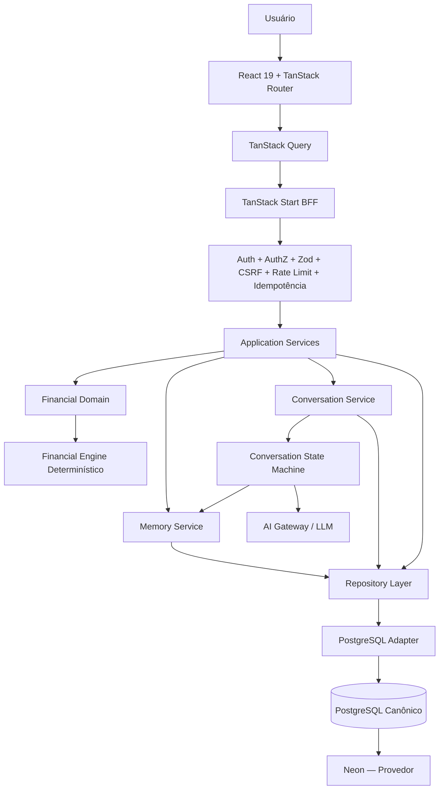
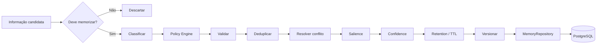
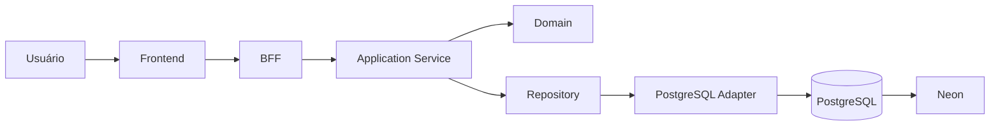
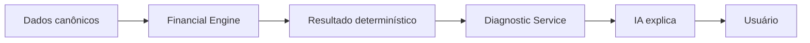
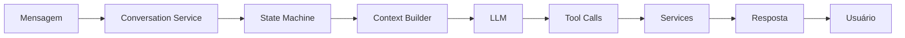
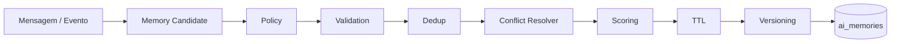
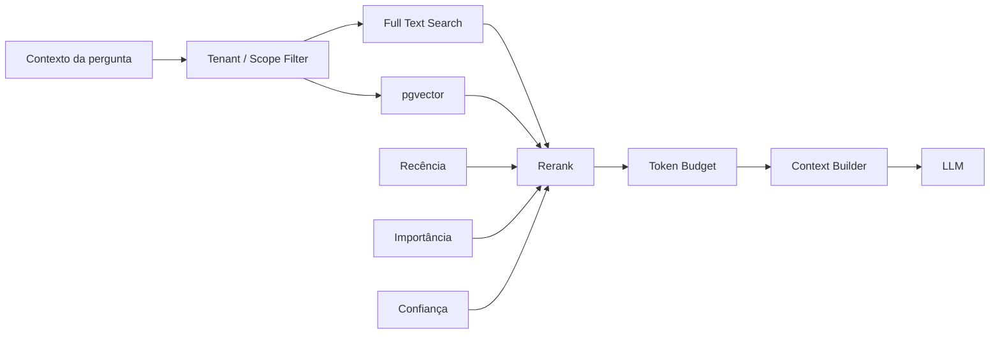

# Preço que Dá Lucro — Arquitetura Consolidada do Sistema

**Documento:** Arquitetura Descritiva Consolidada  
**Versão:** 2.0  
**Data:** 08/08/2026  
**Idioma:** Português do Brasil  
**Status:** Arquitetura-alvo aprovada para orientar as próximas otimizações  
**Banco canônico:** PostgreSQL  
**Provedor PostgreSQL inicial:** Neon  
**Princípio de infraestrutura:** Provider-independent  
**Paradigma principal:** Monólito modular full-stack com BFF, domínio determinístico, persistência controlada e IA governada pelo backend

---

# 1. Visão executiva

O **Preço que Dá Lucro** é concebido como uma plataforma SaaS financeira assistida por inteligência artificial, voltada exclusivamente ao setor de alimentação, para apoiar empreendedores e gestores de negócios de alimentos e bebidas na estruturação de custos, precificação, margem de contribuição, ponto de equilíbrio, despesas, vendas, simulações e diagnósticos financeiros.

A arquitetura consolidada separa explicitamente cinco responsabilidades críticas:

1. **PostgreSQL mantém a verdade persistente do sistema.**
2. **Neon fornece a infraestrutura PostgreSQL nesta fase do produto.**
3. **O domínio mantém as regras e invariantes de negócio.**
4. **O Financial Engine mantém a matemática financeira determinística.**
5. **A inteligência artificial interpreta contexto, conversa, orienta e explica, sem se tornar fonte de verdade financeira.**

Essa separação é obrigatória para evitar que decisões financeiras, memória de IA, persistência e lógica de apresentação se misturem.

A arquitetura deve permitir que o produto evolua de uma operação inicial de baixo custo para uma plataforma de produção robusta sem reescrever o núcleo do sistema.

---

# 2. Princípios arquiteturais fundamentais

## 2.1 PostgreSQL é o banco canônico

O sistema adota **PostgreSQL** como tecnologia canônica de persistência.

Isso significa que:

- produtos;
- ingredientes;
- embalagens;
- taxas;
- despesas;
- vendas;
- preços;
- simulações;
- snapshots;
- conversas;
- memórias;
- auditorias;
- eventos;
- estados persistentes;

devem ser representados em estruturas persistentes controladas pelo PostgreSQL.

O domínio da aplicação não deve depender conceitualmente do provedor Neon.

---

## 2.2 Neon é o provedor inicial

O **Neon** hospeda o PostgreSQL durante a trajetória inicial do produto.

A aplicação deve considerar Neon uma implementação de infraestrutura, e não um componente de domínio.

A regra conceitual é:

```text
PostgreSQL = banco de dados
Neon       = provedor da infraestrutura PostgreSQL
```

Essa distinção permite futura migração para:

- AWS RDS PostgreSQL;
- Aurora PostgreSQL;
- Google Cloud SQL PostgreSQL;
- Azure Database for PostgreSQL;
- PostgreSQL autogerenciado;
- outro provedor compatível.

---

## 2.3 O frontend não acessa o banco diretamente

Nenhuma tela React deve realizar acesso operacional direto às tabelas PostgreSQL.

Fluxo obrigatório:

```text
Frontend
   ↓
TanStack Start BFF
   ↓
Application Services
   ↓
Repositories
   ↓
PostgreSQL Adapter
   ↓
PostgreSQL
```

O frontend conhece contratos de API, não SQL.

---

## 2.4 A IA não acessa PostgreSQL diretamente

O modelo de IA:

- não executa SQL;
- não recebe `DATABASE_URL`;
- não recebe credenciais do Neon;
- não grava diretamente em tabelas;
- não altera entidades de domínio livremente;
- não executa matemática financeira canônica;
- não decide sozinho o que deve ser persistido como memória.

O modelo produz intenções e chamadas estruturadas.

Essas chamadas atravessam:

```text
LLM
 ↓
Tool Schema
 ↓
Validação Zod
 ↓
Autorização
 ↓
Application Service
 ↓
Repository
 ↓
PostgreSQL
```

---

## 2.5 A memória não duplica a verdade financeira

A memória persistente da IA serve para contexto, continuidade, preferências, decisões, relações e estado cognitivo autorizado.

Ela não deve ser usada como fonte definitiva para:

- preço atual;
- custo atual;
- quantidade;
- faturamento;
- margem;
- despesa;
- imposto;
- taxa;
- volume;
- venda;
- resultado financeiro.

Exemplo incorreto:

```text
Memória:
"O chocolate custa R$ 42,90/kg."
```

Exemplo correto:

```text
Memória:
"O usuário acompanha com frequência o custo do chocolate."

Referência:
ingredient_id = <UUID>
```

O preço atual deve ser consultado em uma tabela financeira canônica.

---

# 3. Visão arquitetural de alto nível



---

# 4. Camada de experiência — Frontend

## 4.1 Tecnologias

A camada de experiência utiliza:

- React 19;
- TanStack Router;
- TanStack Query;
- componentes reutilizáveis;
- design system;
- validação de UX;
- acessibilidade;
- estados de loading;
- estados de erro;
- cache e invalidação controlados.

---

## 4.2 Módulos funcionais

A arquitetura prevê os seguintes módulos principais:

### Dashboard

Responsável por apresentar:

- visão geral do negócio;
- indicadores consolidados;
- alertas;
- dados de vendas;
- desempenho de produtos;
- despesas;
- margem;
- ponto de equilíbrio;
- indicadores de qualidade dos dados.

O dashboard não deve calcular métricas críticas independentemente.

Ele deve consumir resultados produzidos pelo backend e pelo Financial Engine.

### Produtos

Responsável por:

- listar produtos;
- criar;
- editar;
- arquivar;
- acompanhar completude;
- visualizar ficha financeira.

### Preços

Responsável por:

- preços de compra;
- histórico;
- vigência;
- fornecedores;
- atualização;
- comparação temporal.

### Despesas

Responsável por:

- despesas fixas;
- despesas variáveis;
- periodicidade;
- categorização;
- histórico.

### Vendas

Responsável por:

- registro de vendas;
- volume;
- itens;
- períodos;
- mix de vendas;
- receita canônica.

### Ponto de equilíbrio

Responsável por apresentar resultados do Financial Engine.

### Simulações

Responsável por:

- preço;
- volume;
- custos;
- margem;
- cenários;
- persistência;
- comparação de resultados.

### Diagnóstico

Responsável por análises financeiras derivadas dos dados canônicos.

### Assistente IA

Responsável por:

- onboarding conversacional;
- criação guiada;
- explicações;
- diagnóstico assistido;
- suporte contextual;
- recuperação de memória autorizada.

### Central de Memória

Responsável pela governança transparente das memórias persistentes.

O usuário poderá:

- visualizar;
- corrigir;
- excluir;
- exportar;
- revisar memórias.

---

# 5. TanStack Start BFF

O **Backend for Frontend** é a única interface suportada entre o frontend e o domínio.

## 5.1 Responsabilidades

O BFF deve realizar:

- autenticação;
- autorização;
- validação;
- normalização de entrada;
- CSRF;
- rate limiting;
- idempotência;
- correlation ID;
- rastreamento;
- tratamento consistente de erros;
- controle de acesso a services.

---

## 5.2 Fluxo padrão

```text
Requisição
   ↓
Autenticação
   ↓
Autorização
   ↓
Validação Zod
   ↓
CSRF
   ↓
Rate Limit
   ↓
Idempotência
   ↓
Correlation ID
   ↓
Application Service
```

---

# 6. Application Services

A camada de aplicação orquestra casos de uso.

Ela não deve concentrar SQL e não deve concentrar fórmulas financeiras.

## 6.1 Product Service

Responsável por:

- criação de produtos;
- atualização;
- status;
- completude;
- ingredientes;
- embalagens;
- taxas;
- arquivamento.

---

## 6.2 Pricing Service

Responsável por:

- histórico de custo;
- preços de compra;
- preços de mercado;
- vigência;
- integração com o Financial Engine;
- regras de precificação.

---

## 6.3 Expense Service

Responsável por:

- despesas;
- periodicidade;
- normalização mensal;
- categorias;
- validação.

---

## 6.4 Sales Service

Responsável por:

- vendas;
- itens de venda;
- volume real;
- receita real;
- mix de vendas.

Esse serviço elimina a necessidade de estimativas fictícias para métricas reais.

---

## 6.5 Simulation Service

Responsável por:

- criar cenários;
- persistir parâmetros;
- gerar resultados;
- comparar cenários;
- registrar versão do Financial Engine.

---

## 6.6 Diagnostic Service

Responsável por:

- obter dados canônicos;
- solicitar cálculos;
- classificar alertas;
- expor explicações estruturadas.

---

## 6.7 Conversation Service

Responsável por:

- sessões;
- mensagens;
- estado conversacional;
- workflow;
- chamadas à IA;
- ferramentas;
- integração com Memory Service.

---

## 6.8 Memory Service

Responsável por toda operação de memória persistente.

O modelo não grava memória diretamente.

---

## 6.9 Audit Service

Responsável por registrar ações importantes.

---

## 6.10 Domain Event Service

Responsável pelo processamento de eventos de domínio e integração com o outbox.

---

# 7. Domínio financeiro

O domínio financeiro deve ser independente de UI, banco e modelo de IA.

## 7.1 Componentes

- Product Domain;
- Product Completeness;
- Money;
- Decimal;
- Unit Conversion;
- Cost Engine;
- Variable Costs;
- Contribution Margin;
- Break-even;
- Target Profit;
- Sales Mix;
- Scenario Engine.

---

# 8. Financial Engine

O Financial Engine é o núcleo matemático do sistema.

## 8.1 Características

Deve ser:

- determinístico;
- puro sempre que possível;
- testável;
- versionado;
- independente de IA;
- independente de PostgreSQL;
- independente do frontend.

---

## 8.2 Unknown é diferente de zero

Regra:

```text
0    = valor conhecido igual a zero
NULL = valor desconhecido
```

Nunca transformar dado desconhecido em zero silenciosamente.

---

## 8.3 Decimal exato

Valores monetários não devem depender de ponto flutuante binário para decisões financeiras.

No banco, utilizar tipos adequados como `NUMERIC`.

No domínio, utilizar política explícita de decimal.

---

## 8.4 Arredondamento

O sistema deve possuir política documentada para:

- preço;
- moeda;
- percentual;
- quantidade;
- unidades discretas.

---

## 8.5 Ponto de equilíbrio

Resultados em unidades discretas devem utilizar arredondamento adequado para o mínimo necessário.

Exemplo:

```text
1000,2 unidades necessárias
→ 1001 unidades
```

---

## 8.6 Snapshots de cálculo

Cálculos críticos podem produzir snapshots contendo:

- entradas;
- saídas;
- timestamp;
- versão do motor;
- produto;
- usuário;
- parâmetros relevantes.

Isso permite reproduzir resultados históricos.

---

# 9. Orquestração conversacional

A IA deve ser coordenada por uma máquina de estados persistente.

## 9.1 Fluxo

```text
Mensagem
   ↓
Conversation Service
   ↓
Conversation State Machine
   ↓
Intent Parser
   ↓
Context Builder
   ↓
AI Gateway
   ↓
Tool Calls estruturadas
   ↓
Validação
   ↓
Application Services
   ↓
Resposta
```

---

## 9.2 Estado persistente

O estado não pode depender exclusivamente de memória React.

Exemplo de informações persistentes:

- conversation_id;
- current_state;
- current_intent;
- active_product_id;
- active_simulation_id;
- workflow_version;
- status;
- timestamps.

---

# 10. Regras da inteligência artificial

A IA deve obedecer às seguintes invariantes:

1. não executar SQL;
2. não acessar PostgreSQL;
3. não conhecer credenciais;
4. não executar cálculos financeiros finais;
5. não substituir o Financial Engine;
6. não gravar memória diretamente;
7. não completar dados desconhecidos arbitrariamente;
8. não transformar ausência de dados em zero;
9. não alterar entidades sem tool autorizada;
10. não atuar fora do workflow permitido.

---

# 11. Tool Executor

Toda ferramenta da IA deve possuir:

- nome;
- descrição;
- schema Zod;
- autorização;
- idempotência quando aplicável;
- logs;
- timeout;
- resultado estruturado;
- tratamento de erro.

Fluxo:

```text
LLM Tool Call
    ↓
Schema Zod
    ↓
Authorization
    ↓
Tool Executor
    ↓
Service
    ↓
Repository
    ↓
PostgreSQL
```

---

# 12. Memória persistente da IA

A memória é um subsistema independente e governado.

## 12.1 Objetivos

- continuidade;
- personalização;
- contexto;
- redução de repetição;
- manutenção de decisões;
- suporte a workflows;
- recuperação de informações relevantes.

---

# 13. Taxonomia de memória

## L0 — Working Memory

Memória temporária da requisição atual.

Não precisa ser persistida como memória longa.

---

## L1 — Session Memory

Estado de sessão ou fluxo.

Exemplo:

- etapa atual;
- produto ativo;
- intenção atual.

---

## L2 — Episodic Memory

Eventos passados relevantes.

Exemplo:

- usuário revisou custos;
- usuário concluiu onboarding;
- usuário mudou estratégia.

---

## L3 — Semantic Memory

Conhecimento estável sobre contexto do usuário ou negócio.

Exemplo:

- principal categoria de produtos;
- preferência de análise;
- objetivo recorrente.

---

## L4 — Domain References

Memórias que apontam para entidades canônicas.

Exemplo:

```text
subject_type = ingredient
subject_id   = <UUID>
```

---

## L5 — Procedural Memory

Políticas e procedimentos do sistema.

Deve ser controlada e versionada pela aplicação.

Não deve ser livremente reescrita pelo usuário ou modelo.

---

# 14. Pipeline de gravação de memória



---

# 15. Memory Classifier

Classifica candidatos em:

- session;
- episodic;
- semantic;
- domain reference;
- não memorizar.

O classificador não possui autorização final para persistir.

---

# 16. Memory Policy Engine

Decide se a memória pode ou deve existir.

Critérios:

- utilidade futura;
- estabilidade;
- escopo;
- privacidade;
- sensibilidade;
- duplicidade;
- política de retenção;
- consentimento quando aplicável.

---

# 17. Deduplicação

Memórias equivalentes não devem crescer indefinidamente.

O sistema deve identificar:

- duplicata exata;
- duplicata semântica;
- informação equivalente;
- atualização real.

---

# 18. Resolução de conflitos

Exemplo:

```text
Memória antiga:
meta = 30%

Nova declaração:
"Agora minha meta é 40%."
```

A arquitetura não deve manter duas verdades ativas.

Deve:

1. detectar conflito;
2. avaliar fonte;
3. avaliar recência;
4. avaliar confiança;
5. superseder memória anterior quando apropriado;
6. pedir confirmação quando necessário.

---

# 19. Versionamento de memória

Atualizações relevantes devem preservar histórico.

Estados sugeridos:

- active;
- superseded;
- expired;
- deleted;
- rejected.

---

# 20. Proveniência

Toda memória persistente deve possuir rastreabilidade.

Fontes possíveis:

- explicit_user_statement;
- domain_event;
- conversation_inference;
- tool_result;
- system_generated;
- manual_user_edit.

Relacionamentos possíveis:

- conversation_id;
- message_id;
- tool_execution_id;
- domain_event_id.

---

# 21. Recuperação de memória

A recuperação deve ser híbrida.

Não depender exclusivamente de embeddings.

## 21.1 Componentes

- filtro de tenant;
- filtro de usuário;
- namespace;
- escopo;
- status;
- TTL;
- busca textual;
- busca vetorial;
- recência;
- importância;
- confiança;
- reranking;
- orçamento de tokens.

---

# 22. Busca textual

PostgreSQL pode utilizar:

- `tsvector`;
- `tsquery`;
- índice GIN;
- full-text search.

A busca textual é útil para:

- termos exatos;
- nomes;
- entidades;
- categorias;
- códigos;
- palavras-chave.

---

# 23. Busca vetorial

A arquitetura permite `pgvector`.

Uso:

- embeddings de memória;
- similaridade semântica;
- recuperação contextual.

Inicialmente, a busca vetorial pode ser exata.

Índices aproximados como HNSW somente devem ser adicionados após:

- crescimento;
- benchmark;
- medição de latência;
- necessidade real.

---

# 24. Memory Ranking

A recuperação pode combinar sinais como:

```text
similaridade semântica
+
relevância lexical
+
importância
+
confiança
+
recência
+
adequação ao escopo
```

Os pesos devem ser calibrados empiricamente.

Nunca tratar pesos iniciais como regra definitiva.

---

# 25. Context Builder

O Context Builder reúne apenas informação necessária para a requisição.

Fontes:

- estado atual;
- dados de domínio;
- memória relevante;
- resultados de ferramentas;
- políticas do sistema;
- instruções do agente.

O Context Builder deve respeitar orçamento de tokens.

---

# 26. Separação entre histórico e memória

`ai_messages` representa histórico conversacional.

`ai_memories` representa conhecimento persistente filtrado.

Não enviar todo o histórico indefinidamente ao modelo.

---

# 27. Modelo de persistência do negócio

## Tabelas propostas

### users

Identidades de aplicação ou referências ao sistema de identidade.

### products

Campos indicativos:

- id;
- tenant_id;
- user_id;
- name;
- status;
- yield_qty;
- yield_unit;
- current_price;
- tax_rate;
- tax_regime;
- notes;
- created_at;
- updated_at.

### product_ingredients

- id;
- tenant_id;
- product_id;
- name;
- used_qty;
- used_unit;
- created_at;
- updated_at.

### product_packaging

- id;
- tenant_id;
- product_id;
- name;
- units_per_package;
- created_at;
- updated_at.

### sales_fees

- id;
- tenant_id;
- product_id;
- name;
- percentage.

### purchase_price_history

- id;
- tenant_id;
- subject_type;
- subject_id;
- price;
- quantity;
- unit;
- supplier_id opcional;
- valid_from;
- recorded_at.

### market_price_history

- id;
- tenant_id;
- product_id;
- min_price;
- avg_price;
- max_price;
- source;
- region;
- valid_from;
- valid_until;
- created_at.

### expenses

- id;
- tenant_id;
- category;
- amount;
- periodicity;
- expense_type;
- notes;
- created_at.

### sales

- id;
- tenant_id;
- occurred_at;
- gross_amount;
- net_amount;
- channel;
- created_at.

### sales_items

- id;
- tenant_id;
- sale_id;
- product_id;
- quantity;
- unit_price;
- total_amount.

### simulations

- id;
- tenant_id;
- product_id;
- name;
- params;
- result;
- engine_version;
- created_at.

### calculation_snapshots

- id;
- tenant_id;
- entity_type;
- entity_id;
- calculation_type;
- inputs;
- outputs;
- engine_version;
- created_at.

---

# 28. Modelo de persistência da IA

## ai_conversations

Campos sugeridos:

- id;
- tenant_id;
- user_id;
- status;
- current_intent;
- current_state;
- active_product_id;
- active_simulation_id;
- workflow_version;
- created_at;
- updated_at.

---

## ai_messages

- id;
- tenant_id;
- conversation_id;
- role;
- content;
- metadata;
- created_at.

---

## ai_memories

- id;
- tenant_id;
- user_id;
- memory_type;
- namespace;
- subject_type;
- subject_id;
- content;
- normalized_value JSONB;
- importance_score;
- confidence_score;
- status;
- valid_from;
- valid_until;
- expires_at;
- source_type;
- created_at;
- updated_at;
- superseded_at.

---

## ai_memory_sources

- id;
- memory_id;
- source_type;
- source_id;
- conversation_id;
- message_id;
- tool_execution_id;
- domain_event_id;
- source_timestamp.

---

## ai_memory_versions

- id;
- memory_id;
- version_number;
- previous_value;
- new_value;
- change_reason;
- created_at.

---

## ai_memory_conflicts

- id;
- memory_id;
- conflicting_memory_id;
- conflict_type;
- resolution;
- status;
- created_at;
- resolved_at.

---

## ai_memory_embeddings

- id;
- memory_id;
- embedding_model;
- embedding_version;
- embedding;
- created_at.

---

## ai_memory_access_log

Registra recuperação e uso.

- id;
- tenant_id;
- memory_id;
- conversation_id;
- retrieval_score;
- used_in_context;
- created_at.

---

## ai_memory_policies

Políticas versionadas de memória.

---

## ai_tool_executions

- id;
- tenant_id;
- conversation_id;
- tool_name;
- arguments;
- result;
- status;
- idempotency_key;
- started_at;
- completed_at;
- error_metadata.

---

# 29. Governança

## audit_log

Registra ações importantes:

- ator;
- tenant;
- ação;
- entidade;
- entidade_id;
- before;
- after;
- correlation_id;
- timestamp.

---

## outbox_events

Implementa padrão Transactional Outbox.

Permite publicar eventos após confirmação transacional.

---

## idempotency_keys

Controla operações repetidas.

Útil para:

- criação;
- pagamento;
- tool call;
- importação;
- processamento de eventos.

---

# 30. Repository Layer

A aplicação depende de interfaces internas.

## Repositórios previstos

- ProductRepository;
- IngredientRepository;
- PackagingRepository;
- PriceRepository;
- MarketPriceRepository;
- ExpenseRepository;
- SalesRepository;
- SimulationRepository;
- ConversationRepository;
- MemoryRepository;
- CalculationSnapshotRepository;
- AuditRepository;
- EventRepository.

---

# 31. Data Access

A camada de acesso PostgreSQL deve incluir:

- PostgreSQL Adapter;
- SQL parametrizado;
- Transaction Manager;
- Connection Pool;
- Migration Runner.

Nenhuma regra de negócio deve viver no adapter.

---

# 32. Integridade PostgreSQL

O banco deve atuar como camada final de defesa das invariantes.

## Mecanismos

- Foreign Keys;
- chaves compostas por tenant;
- CHECK constraints;
- UNIQUE constraints;
- NOT NULL;
- NUMERIC;
- transações ACID;
- controle de concorrência.

---

# 33. Integridade de tenant

Uma entidade filha não pode referenciar entidade pertencente a outro tenant.

Exemplo conceitual:

```text
(tenant_id, product_id)
→ products(tenant_id, id)
```

Isso reduz riscos de cross-tenant access mesmo diante de erro de aplicação.

---

# 34. Row-Level Security

RLS pode ser utilizada como defesa adicional.

Mesmo com backend centralizado, RLS cria uma barreira extra.

A política de autorização principal continua no backend.

---

# 35. Segurança

## Princípios

- least privilege;
- segredo fora do código;
- credenciais rotacionáveis;
- conexão TLS;
- queries parametrizadas;
- validação;
- rate limit;
- autorização explícita;
- tenant isolation;
- logging seguro;
- minimização de dados;
- retenção controlada.

---

# 36. Segredos

Exemplos:

- `DATABASE_URL`;
- credencial de IA;
- session secret;
- chaves externas.

Devem existir exclusivamente no backend.

---

# 37. Segurança da IA

Defesas necessárias:

- tool allowlist;
- schema validation;
- prompt injection resistance;
- autorização após tool call;
- limite de passos;
- limite de tokens;
- quota;
- timeout;
- retry controlado;
- tracing;
- custo por requisição;
- auditoria.

---

# 38. XSS

Conteúdo produzido por IA nunca deve ser inserido como HTML não sanitizado.

Preferir:

- renderização Markdown segura;
- escaping;
- componentes permitidos;
- sanitização quando HTML for necessário.

---

# 39. Idempotência

Operações críticas devem aceitar idempotency key.

Especialmente:

- criação por IA;
- gravações repetíveis;
- eventos;
- importações;
- pagamentos futuramente.

---

# 40. Transaction Manager

Operações que modificam múltiplas entidades relacionadas devem ser transacionais.

Exemplo:

```text
criar produto
+ ingredientes
+ embalagem
+ preço
+ evento
```

ou tudo confirma, ou tudo é revertido.

---

# 41. Transactional Outbox

Em vez de:

```text
commit banco
→ tentar publicar evento
```

utilizar:

```text
mesma transação:
  atualizar domínio
  inserir outbox_event
commit
```

Posteriormente o evento é processado com segurança.

---

# 42. Observabilidade

## Logs estruturados

Cada requisição deve possuir correlation ID.

Campos possíveis:

- timestamp;
- environment;
- request_id;
- correlation_id;
- user_id seguro;
- tenant_id;
- route;
- service;
- duration;
- result;
- error_code.

Evitar dados sensíveis desnecessários.

---

# 43. Métricas

## Aplicação

- requests;
- latência;
- erros;
- cache hit;
- taxa de sucesso.

## Banco

- connections;
- query latency;
- slow queries;
- locks;
- storage;
- erros.

## IA

- chamadas;
- tokens;
- custo;
- timeout;
- tool calls;
- falhas;
- passos por conversa.

## Memória

- candidatos;
- gravações;
- rejeições;
- conflitos;
- retrieval latency;
- memórias recuperadas;
- memórias efetivamente usadas;
- correções do usuário;
- expirações.

## Finance Engine

- cálculos;
- falhas de validação;
- dados incompletos;
- versão utilizada;
- duração.

---

# 44. Indicadores de qualidade da memória

A memória deve ser avaliada por utilidade, não por volume.

Indicadores:

- precision de retrieval;
- proporção de memórias usadas;
- taxa de correção pelo usuário;
- taxa de conflito;
- taxa de duplicação;
- impacto em tokens;
- latência.

---

# 45. Neon

Neon é a infraestrutura PostgreSQL inicial.

## Capacidades aproveitáveis

- PostgreSQL;
- connection pooling;
- compute;
- storage;
- branching;
- WAL;
- backup/PITR conforme plano/configuração.

A aplicação não deve depender de recursos proprietários em regras de domínio.

---

# 46. Database Branching

Branching pode apoiar desenvolvimento.

Modelo:

```text
production
   ↓
develop
   ↓
PR database branch
```

Cada PR de schema pode ser validado isoladamente.

---

# 47. Ambientes

## Local

PostgreSQL local ou ambiente de desenvolvimento isolado.

## Test

Banco efêmero.

## Develop

Branch de desenvolvimento.

## PR Preview

Branch temporária do PostgreSQL.

## Staging

Ambiente similar à produção.

## Production

Banco canônico de produção.

---

# 48. Migrations

Migrations devem ser:

- versionadas;
- reproduzíveis;
- revisáveis;
- testadas;
- preferencialmente portáveis entre provedores PostgreSQL.

Evitar alterações manuais não registradas.

---

# 49. CI/CD

Fluxo:

```text
develop
   ↓
Pull Request
   ↓
CI
   ↓
main
   ↓
deploy
```

---

# 50. Gates de qualidade

CI deve validar:

- instalação;
- formatação;
- lint;
- typecheck;
- unit tests;
- integration tests;
- Finance Engine tests;
- AI/Memory tests;
- migration tests;
- build;
- bundle;
- E2E;
- auditoria de dependências.

---

# 51. Testes do Financial Engine

Devem incluir:

- casos normais;
- zero;
- NULL;
- unidade incompatível;
- conversões;
- arredondamento;
- margem negativa;
- margem zero;
- ponto de equilíbrio;
- meta de lucro;
- cenários;
- propriedades matemáticas.

---

# 52. Testes da memória

Devem incluir:

- candidato rejeitado;
- memória aceita;
- duplicata;
- conflito;
- supersede;
- TTL;
- isolamento de tenant;
- retrieval lexical;
- retrieval vetorial;
- ranking;
- orçamento de contexto;
- exclusão;
- exportação.

---

# 53. Testes da IA

A IA deve ser testada como componente não determinístico governado.

Testar:

- ferramenta proibida;
- argumentos inválidos;
- tentativa de SQL;
- tool fora de sequência;
- prompt injection;
- ausência de dado;
- dado contraditório;
- memória conflitante;
- timeout;
- excesso de chamadas.

---

# 54. Portabilidade

A regra é:

```text
Domain
  ↓
Repository interface
  ↓
PostgreSQL Adapter
  ↓
Provider
```

Trocar provider não deve alterar o domínio.

---

# 55. Portabilidade futura

Possíveis destinos:

```text
Neon PostgreSQL
      ↓
AWS RDS PostgreSQL
Aurora PostgreSQL
Google Cloud SQL PostgreSQL
Azure PostgreSQL
PostgreSQL próprio
```

---

# 56. Fluxo principal de dados



---

# 57. Fluxo financeiro



Regra:

> A IA explica resultados. O Financial Engine calcula.

---

# 58. Fluxo da conversa



---

# 59. Fluxo da memória



---

# 60. Fluxo de recuperação



---

# 61. Fluxo de persistência

```text
Application Service
      ↓
Repository
      ↓
PostgreSQL Adapter
      ↓
Transaction Manager
      ↓
Connection Pool
      ↓
PostgreSQL
      ↓
Neon
```

---

# 62. Fonte de verdade

A arquitetura possui três classes de estado.

## Classe A — Dados canônicos

Persistidos no PostgreSQL em tabelas de domínio.

Exemplos:

- preço;
- custo;
- venda;
- despesa;
- produto.

## Classe B — Memória persistente

Persistida em tabelas de IA.

Exemplos:

- preferência;
- contexto;
- evento relevante;
- referência de domínio.

## Classe C — Working context

Estado temporário usado durante a requisição.

Não representa verdade persistente.

---

# 63. Central de Memória

A aplicação deverá futuramente fornecer interface para:

- visualizar memórias;
- identificar tipo;
- visualizar fonte;
- visualizar confiança;
- corrigir;
- excluir;
- exportar.

Essa capacidade melhora:

- transparência;
- governança;
- conformidade;
- confiança do usuário.

---

# 64. Retenção

Nem toda memória precisa ser eterna.

Tipos:

- permanente enquanto válida;
- temporal;
- expira por TTL;
- vinculada a sessão;
- vinculada a workflow.

---

# 65. Exclusão

Ao excluir uma memória:

- não reutilizar no retrieval;
- registrar auditoria apropriada;
- respeitar políticas de retenção legais aplicáveis;
- remover embeddings correspondentes quando necessário.

---

# 66. Dados sensíveis

O Memory Policy Engine deve classificar informações que não devem ser automaticamente memorizadas.

Políticas devem ser explícitas e revisáveis.

---

# 67. Estados de produto

Sugestão:

```text
draft
   ↓
incomplete
   ↓
ready
   ↓
active
   ↓
archived
```

O sistema não deve declarar produto financeiramente saudável se faltarem dados essenciais.

---

# 68. Data Completeness

O Financial Engine deve receber ou produzir informação de completude.

Exemplo:

```json
{
  "complete": false,
  "missing": ["tax_rate", "sales_volume"]
}
```

A aplicação deve mostrar incerteza em vez de fabricar um resultado.

---

# 69. Histórico de preços

Atualizações de preço não devem apagar o passado.

Utilizar tabelas históricas.

Exemplo:

```text
produto/ingrediente
      ↓
price history
      ├── janeiro
      ├── fevereiro
      └── março
```

---

# 70. Vendas reais

Métricas como:

- faturamento;
- volume;
- mix;
- margem consolidada;
- ponto de equilíbrio multiproduto;

precisam de dados de vendas reais ou de uma simulação explicitamente marcada.

Nunca misturar:

```text
real
```

com:

```text
simulado
```

---

# 71. Simulações

Toda simulação deve registrar:

- parâmetros;
- período;
- produto;
- resultado;
- versão do motor;
- origem;
- data.

---

# 72. Diagnóstico

O diagnóstico deve diferenciar:

- fato;
- cálculo;
- estimativa;
- simulação;
- ausência de dados;
- explicação da IA.

---

# 73. Tratamento de erros

Erro de banco não deve se transformar silenciosamente em lista vazia.

Categorias sugeridas:

- validation_error;
- authentication_error;
- authorization_error;
- not_found;
- conflict;
- database_error;
- dependency_error;
- ai_error;
- rate_limit_error;
- timeout_error.

---

# 74. Contratos de API

Os contratos devem ser:

- tipados;
- versionáveis quando necessário;
- validados;
- independentes de tabelas internas.

A UI não deve receber detalhes desnecessários de infraestrutura.

---

# 75. Estratégia de implementação

A arquitetura não exige reescrever o produto de uma só vez.

A migração deve ser incremental.

---

# 76. Fase P0 — Segurança e correção

Prioridades:

1. eliminar XSS;
2. impedir unknown → zero;
3. impedir NaN/Infinity → zero;
4. remover volume fictício;
5. remover markup arbitrário;
6. validar tools com Zod;
7. persistir estado da conversa;
8. persistir tool executions;
9. adicionar timeout/quota/idempotência à IA.

---

# 77. Fase P1 — Arquitetura

Prioridades:

1. BFF como API única;
2. Services;
3. Repositories;
4. remover queries diretas do frontend;
5. eliminar N+1;
6. produto com status/completude;
7. modelo de vendas;
8. histórico de preços;
9. simulações persistentes;
10. decimal exato;
11. constraints fortes.

---

# 78. Fase P1.5 — PostgreSQL/Neon

1. migrations reproduzíveis;
2. adapter PostgreSQL independente;
3. schema fortalecido;
4. testes de migrations;
5. branching de banco;
6. transferência dos dados;
7. validação;
8. cutover;
9. remoção das dependências específicas do Supabase que não forem necessárias.

---

# 79. Fase P2 — Memória persistente avançada

1. `ai_conversations`;
2. `ai_messages`;
3. `ai_memories`;
4. fontes;
5. versionamento;
6. conflitos;
7. políticas;
8. embeddings;
9. full-text search;
10. pgvector;
11. retrieval híbrido;
12. Memory Service;
13. observabilidade;
14. Central de Memória.

---

# 80. Fase P3 — Resiliência e escala

Possíveis evoluções:

- read replicas;
- caching;
- filas;
- workers;
- otimização de pool;
- particionamento;
- HNSW;
- observabilidade avançada;
- disaster recovery;
- migração de provider quando justificada.

---

# 81. Estrutura de código proposta

```text
src/
├── features/
│   ├── products/
│   ├── pricing/
│   ├── expenses/
│   ├── sales/
│   ├── simulations/
│   ├── diagnostics/
│   ├── conversations/
│   └── memory/
│
├── domain/
│   ├── finance/
│   │   ├── cost/
│   │   ├── margin/
│   │   ├── break-even/
│   │   ├── scenarios/
│   │   └── snapshots/
│   │
│   ├── money/
│   ├── units/
│   ├── products/
│   └── memory/
│       ├── memory-types.ts
│       ├── memory-policy.ts
│       ├── memory-score.ts
│       ├── memory-conflict.ts
│       └── memory-retention.ts
│
├── server/
│   ├── middleware/
│   │   ├── auth.ts
│   │   ├── authorization.ts
│   │   ├── csrf.ts
│   │   ├── rate-limit.ts
│   │   ├── idempotency.ts
│   │   └── correlation.ts
│   │
│   ├── services/
│   │   ├── product.service.ts
│   │   ├── pricing.service.ts
│   │   ├── expense.service.ts
│   │   ├── sales.service.ts
│   │   ├── simulation.service.ts
│   │   ├── diagnostic.service.ts
│   │   ├── conversation.service.ts
│   │   ├── memory.service.ts
│   │   ├── audit.service.ts
│   │   └── event.service.ts
│   │
│   ├── repositories/
│   │   ├── product.repository.ts
│   │   ├── ingredient.repository.ts
│   │   ├── packaging.repository.ts
│   │   ├── price.repository.ts
│   │   ├── market-price.repository.ts
│   │   ├── expense.repository.ts
│   │   ├── sales.repository.ts
│   │   ├── simulation.repository.ts
│   │   ├── conversation.repository.ts
│   │   ├── memory.repository.ts
│   │   ├── calculation-snapshot.repository.ts
│   │   ├── audit.repository.ts
│   │   └── event.repository.ts
│   │
│   ├── jobs/
│   │   ├── outbox.job.ts
│   │   ├── memory-embedding.job.ts
│   │   ├── memory-expiration.job.ts
│   │   └── memory-consolidation.job.ts
│   │
│   ├── observability/
│   └── security/
│
├── integrations/
│   ├── postgres/
│   │   ├── client.ts
│   │   ├── transaction.ts
│   │   ├── migrations/
│   │   └── pgvector.ts
│   │
│   ├── neon/
│   │   └── infrastructure.ts
│   │
│   └── ai/
│       ├── gateway.ts
│       ├── embeddings.ts
│       ├── schemas.ts
│       └── tracing.ts
│
└── routes/
```

---

# 82. Decisões arquiteturais — ADRs recomendados

## ADR-001 — PostgreSQL como banco canônico

**Decisão:** PostgreSQL é a tecnologia de persistência oficial.

---

## ADR-002 — Neon como provedor inicial

**Decisão:** Neon hospeda PostgreSQL na fase inicial.

---

## ADR-003 — Provider Independence

**Decisão:** nenhuma regra de domínio depende do Neon.

---

## ADR-004 — BFF como única API suportada

**Decisão:** frontend não acessa banco diretamente.

---

## ADR-005 — Repository Pattern

**Decisão:** persistência de domínio atravessa repositories.

---

## ADR-006 — Financial Engine determinístico

**Decisão:** cálculos financeiros não pertencem à IA.

---

## ADR-007 — Unknown ≠ Zero

**Decisão:** ausência não é convertida em valor zero.

---

## ADR-008 — IA sem SQL

**Decisão:** modelo não recebe capacidade de acesso SQL.

---

## ADR-009 — Conversation State Machine

**Decisão:** workflows da IA são controlados pelo backend.

---

## ADR-010 — Memória governada

**Decisão:** IA propõe; backend decide persistência.

---

## ADR-011 — Memória não duplica domínio financeiro

**Decisão:** dados financeiros são referenciados e não copiados como verdade da memória.

---

## ADR-012 — Hybrid Memory Retrieval

**Decisão:** full-text + metadata + pgvector + ranking.

---

## ADR-013 — Auditabilidade

**Decisão:** alterações importantes devem ser rastreáveis.

---

## ADR-014 — Transactional Outbox

**Decisão:** eventos críticos são persistidos atomicamente com alterações de domínio.

---

## ADR-015 — Versionamento do Financial Engine

**Decisão:** resultados relevantes registram versão do motor.

---

# 83. Requisitos não funcionais

## Segurança

- isolamento de tenant;
- least privilege;
- validação;
- secrets;
- auditabilidade.

## Confiabilidade

- transações;
- backups;
- migrations;
- recuperação.

## Performance

- pooling;
- eliminação de N+1;
- índices;
- medição antes de otimização.

## Manutenibilidade

- separação de responsabilidades;
- contratos explícitos;
- testes.

## Portabilidade

- PostgreSQL;
- adapter independente;
- domínio sem provider-specific code.

## Observabilidade

- logs;
- métricas;
- traces;
- auditoria.

---

# 84. Invariantes essenciais

As seguintes regras nunca devem ser quebradas:

```text
1. Frontend não acessa PostgreSQL diretamente.
2. IA não executa SQL.
3. IA não calcula valor financeiro canônico.
4. Memória não é fonte de verdade financeira.
5. Unknown não vira zero.
6. Produto incompleto não é declarado saudável.
7. Dados cross-tenant são proibidos.
8. Operações multi-entidade relevantes são transacionais.
9. Repositories são a fronteira de persistência.
10. Neon é substituível.
```

---

# 85. Resultado arquitetural esperado

Ao final da evolução, o sistema deve apresentar o seguinte fluxo:

```text
Usuário
   ↓
React
   ↓
TanStack Query
   ↓
TanStack Start BFF
   ↓
Security Pipeline
   ↓
Application Services
   ├──────── Financial Domain
   │             ↓
   │       Financial Engine
   │
   ├──────── Conversation Service
   │             ↓
   │       Conversation FSM
   │        ↙          ↘
   │   Memory Service    AI Gateway
   │
   └──────── Repositories
                 ↓
          PostgreSQL Adapter
                 ↓
            PostgreSQL
                 ↓
               Neon
```

---

# 86. Relação entre banco e memória

A arquitetura harmoniza banco e IA da seguinte forma:

```text
POSTGRESQL
│
├── Dados canônicos do negócio
│      ├── produtos
│      ├── preços
│      ├── vendas
│      ├── despesas
│      └── cálculos
│
├── Estado canônico da IA
│      ├── conversas
│      ├── mensagens
│      ├── ferramentas
│      └── estado
│
├── Memória persistente
│      ├── semântica
│      ├── episódica
│      ├── sessão
│      ├── referências
│      ├── embeddings
│      ├── versões
│      └── conflitos
│
└── Governança
       ├── auditoria
       ├── outbox
       └── idempotência
```

O PostgreSQL mantém todas essas classes de persistência, porém com responsabilidades explicitamente separadas.

---

# 87. Princípio final

> **PostgreSQL mantém a verdade. Neon fornece a infraestrutura. O domínio mantém as regras. O Financial Engine mantém a matemática. O Memory Service mantém contexto persistente governado. A máquina de estados mantém o controle do workflow. A inteligência artificial interpreta, orienta e explica sem governar diretamente dados ou cálculos.**

Essa combinação cria uma base sólida para transformar o **Preço que Dá Lucro** em um SaaS financeiro assistido por IA com segurança, auditabilidade, portabilidade e capacidade real de evolução.

---

# 88. Status da decisão

| Área                  | Decisão                         |
| --------------------- | ------------------------------- |
| Banco                 | PostgreSQL                      |
| Provedor inicial      | Neon                            |
| Acesso frontend → DB  | Proibido                        |
| API                   | TanStack Start BFF              |
| Persistência          | Repository Layer                |
| Matemática            | Financial Engine                |
| IA                    | Orquestração controlada         |
| Estado conversacional | Persistente                     |
| Memória               | Persistent Memory Engine        |
| Busca de memória      | Metadata + FTS + pgvector       |
| Fonte financeira      | Tabelas canônicas               |
| Auditoria             | Obrigatória para ações críticas |
| Portabilidade         | Provider-independent            |
| CI                    | GitHub Actions                  |
| Estratégia de banco   | Migrations + branching + testes |

---

# 89. Próxima etapa recomendada

Com esta arquitetura documentada, as primeiras implementações devem respeitar a seguinte ordem:

```text
P0 Segurança e correção
        ↓
BFF único
        ↓
Services
        ↓
Repositories
        ↓
PostgreSQL Adapter
        ↓
Schema PostgreSQL fortalecido
        ↓
Migração para Neon
        ↓
Conversation State
        ↓
Persistent Memory Engine
        ↓
Hybrid Retrieval
        ↓
Observabilidade avançada
```

Esse sequenciamento reduz risco, evita reescritas desnecessárias e estabelece as fundações corretas antes de adicionar inteligência persistente mais sofisticada.

---

**Fim do documento.**
