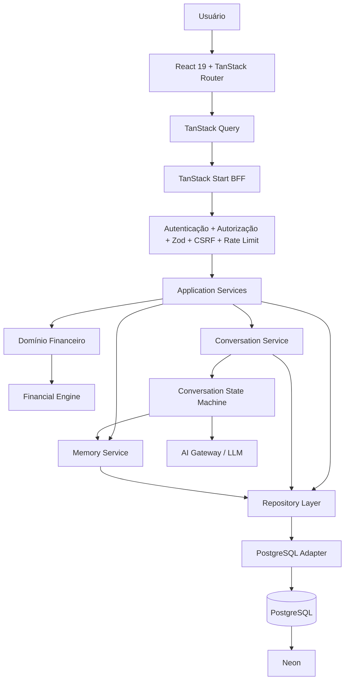
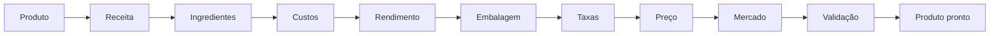
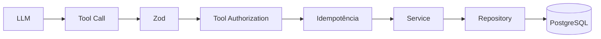
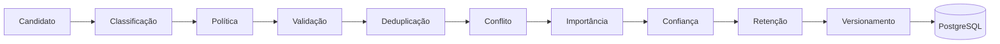
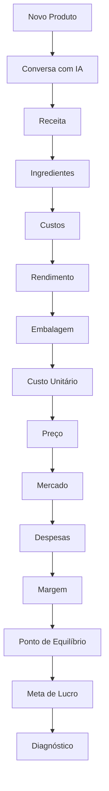

# Preço que Dá Lucro

## Diretriz Consolidada de Produto, Arquitetura e Engenharia

| Campo                | Definição                                                                              |
| -------------------- | -------------------------------------------------------------------------------------- |
| **Documento**        | Diretriz mestra de produto e engenharia                                                |
| **Versão**           | 7.0 — shadcn/ui + Base UI sincronizados com documentação oficial                       |
| **Idioma**           | Português do Brasil                                                                    |
| **Status**           | Arquitetura-alvo autenticada documentalmente e diretriz de implementação               |
| **Banco canônico**   | PostgreSQL                                                                             |
| **Provedor inicial** | Neon                                                                                   |
| **Arquitetura**      | Monólito modular full-stack com BFF                                                    |
| **Frontend**         | React 19 + TanStack Router + TanStack Query + shadcn/ui + Base UI + Tailwind CSS v4    |
| **Backend**          | TanStack Start BFF + Application Services                                              |
| **Persistência**     | Repository Layer + PostgreSQL Adapter                                                  |
| **Motor financeiro** | Determinístico, versionado e independente de IA                                        |
| **IA**               | Orquestração controlada pelo backend                                                   |
| **Memória**          | Persistente, governada, versionada e auditável                                         |
| **Objetivo**         | Evoluir o produto para um SaaS financeiro seguro, confiável, performático e explicável |

---

---

# Autenticação documental — metodologia e resultado

## Escopo da autenticação

Esta versão foi confrontada com **fontes primárias ou institucionais correspondentes aos assuntos técnicos e empresariais presentes na diretriz**. A validação foi realizada sobre os seguintes domínios:

- React;
- TanStack Start;
- TanStack Query;
- Zod;
- Playwright;
- PostgreSQL;
- Neon;
- pgvector;
- OWASP;
- OpenTelemetry;
- Core Web Vitals;
- GitHub Actions e segurança de supply chain;
- tributação do MEI/SIMEI;
- precificação, margem de contribuição, mercado e ponto de equilíbrio segundo o Sebrae.

A autenticação não transforma decisões internas de arquitetura em “fatos externos”. Cada item é classificado como:

| Classificação               | Significado                                                                         |
| --------------------------- | ----------------------------------------------------------------------------------- |
| **CONFIRMADO**              | A fonte primária sustenta diretamente a afirmação                                   |
| **CONFIRMADO COM RESSALVA** | O princípio está correto, mas a fonte exige uma condição ou limitação               |
| **DECISÃO ARQUITETURAL**    | Escolha deliberada do produto, compatível com as fontes, mas não prescrita por elas |
| **REGRA DE DOMÍNIO**        | Convenção matemática/financeira interna que precisa ser testada e versionada        |
| **CONDICIONAL A MÉTRICA**   | Só deve ser adotada quando benchmark ou telemetria justificarem                     |
| **CONDICIONAL AO PLANO**    | Recurso pode depender do plano/conta do fornecedor                                  |
| **REGRA FISCAL VERSIONADA** | Informação tributária sujeita a competência, legislação e atualização periódica     |

## Resultado executivo

A arquitetura permanece tecnicamente coerente, porém esta autenticação introduz **nove endurecimentos obrigatórios**:

1. TanStack Start deve possuir **gate de atualização**, pois a documentação oficial ainda o classifica como _Release Candidate_.
2. Autorização de dados deve ocorrer em **cada server function/server route privada**, independentemente de `beforeLoad`.
3. Se existir `src/start.ts`, a aplicação deve verificar a instalação explícita de `createCsrfMiddleware()` para server functions.
4. O runtime PostgreSQL deve utilizar **role SQL dedicada de menor privilégio**, e não a role padrão criada pelo Console/API do Neon.
5. Valores monetários devem usar `NUMERIC(precision, scale)` definido conscientemente e possuir constraints que **proíbam `NaN` e infinitos** no domínio financeiro canônico.
6. RLS deve ser considerada **defesa em profundidade**, nunca substituto de autorização; owner/BYPASSRLS e verificações de integridade exigem atenção.
7. A observabilidade OpenTelemetry deve começar prioritariamente no servidor; instrumentação de navegador ainda é experimental.
8. Limite de gasto com IA deixa de ser apenas otimização de custo e passa a ser **controle de segurança e proteção de margem bruta**.
9. Conteúdo tributário deve ser **versionado por competência**, nunca hard-coded como regra eterna.

---

# Matriz de autenticação massiva

| ID      | Assunto                       | Afirmação autenticada                                                                                                            | Status                  | Consequência para o sistema                                      |
| ------- | ----------------------------- | -------------------------------------------------------------------------------------------------------------------------------- | ----------------------- | ---------------------------------------------------------------- |
| AUT-001 | React                         | React 19 é estável; a documentação atual aponta React 19.2 como major/minor corrente                                             | CONFIRMADO              | Manter React 19.x; upgrades passam pelo CI                       |
| AUT-002 | TanStack Start                | Start continua classificado como Release Candidate                                                                               | CONFIRMADO              | Fixar versão e criar lane de upgrade controlado                  |
| AUT-003 | TanStack Start                | Server functions executam no servidor e viram RPCs para o cliente                                                                | CONFIRMADO              | BFF por server functions é tecnicamente coerente                 |
| AUT-004 | TanStack Start                | Server functions devem ser same-origin e há `createCsrfMiddleware()` oficial                                                     | CONFIRMADO              | Criar teste de configuração CSRF                                 |
| AUT-005 | TanStack Start                | `beforeLoad` é UX; a fronteira de dados precisa autorizar no endpoint                                                            | CONFIRMADO              | AuthN/AuthZ em toda função privada                               |
| AUT-006 | Sessão                        | Cookies HTTP-only são recomendados para sessão                                                                                   | CONFIRMADO              | Migrar sessão para modelo server-driven                          |
| AUT-007 | Sessão                        | Tokens/JWT/refresh token não devem ficar em `localStorage`/`sessionStorage`                                                      | CONFIRMADO              | P0 de segurança                                                  |
| AUT-008 | Zod                           | Zod executa validação em runtime e infere tipos TypeScript                                                                       | CONFIRMADO              | Zod em server inputs e tools da IA                               |
| AUT-009 | TanStack Query                | Query keys precisam representar todas as variáveis que alteram os dados buscados                                                 | CONFIRMADO              | Criar query-key factories                                        |
| AUT-010 | TanStack Query                | Invalidation direcionada é padrão suportado                                                                                      | CONFIRMADO              | Evitar invalidar cache inteiro                                   |
| AUT-011 | TanStack Query                | Prefetch pode reduzir waterfalls                                                                                                 | CONFIRMADO              | Prefetch apenas em navegações previsíveis                        |
| AUT-012 | TanStack Query                | Queries são stale por padrão; `staleTime` reduz refetches desnecessários                                                         | CONFIRMADO              | Definir política por natureza do dado                            |
| AUT-013 | TanStack Query                | Query functions recebem `AbortSignal`                                                                                            | CONFIRMADO              | Propagar cancelamento para BFF/fetch                             |
| AUT-014 | Playwright                    | Auto-waiting e web-first assertions são recursos centrais                                                                        | CONFIRMADO              | Proibir sleeps arbitrários nos E2E                               |
| AUT-015 | Playwright                    | Retries existem, mas testes independentes são preferíveis                                                                        | CONFIRMADO COM RESSALVA | Retry não deve esconder flakiness                                |
| AUT-016 | PostgreSQL                    | `NUMERIC` é exato e especialmente recomendado para valores monetários                                                            | CONFIRMADO              | Persistência monetária em `NUMERIC`                              |
| AUT-017 | PostgreSQL                    | `NUMERIC` não restrito pode aceitar `Infinity`, `-Infinity` e `NaN`                                                              | CONFIRMADO              | Proibir especiais via tipo/precision/constraints                 |
| AUT-018 | PostgreSQL                    | Precisão e escala explícitas aumentam previsibilidade/portabilidade                                                              | CONFIRMADO              | Definir escala por classe de valor                               |
| AUT-019 | PostgreSQL RLS                | RLS sem policy aplicável opera em default-deny                                                                                   | CONFIRMADO              | Boa defesa adicional                                             |
| AUT-020 | PostgreSQL RLS                | Table owner normalmente contorna RLS                                                                                             | CONFIRMADO              | Runtime role não pode ser owner                                  |
| AUT-021 | PostgreSQL                    | `READ COMMITTED` é o isolamento comum/default; `SERIALIZABLE` pode abortar                                                       | CONFIRMADO              | Isolamento por caso de uso                                       |
| AUT-022 | PostgreSQL                    | Serialization failure requer retry da transação completa                                                                         | CONFIRMADO              | Criar transaction retry policy limitada                          |
| AUT-023 | PostgreSQL                    | `EXPLAIN (ANALYZE, BUFFERS)` mede plano e I/O real                                                                               | CONFIRMADO              | Evidence file para otimizações críticas                          |
| AUT-024 | PostgreSQL                    | Índices devem ser avaliados contra workload real e estatísticas                                                                  | CONFIRMADO              | `ANALYZE` + benchmark antes/depois                               |
| AUT-025 | PostgreSQL                    | `pg_stat_statements` rastreia planejamento/execução SQL                                                                          | CONFIRMADO              | Observação de hot queries                                        |
| AUT-026 | PostgreSQL FTS                | `tsvector`/`tsquery` são tipos nativos de full-text search                                                                       | CONFIRMADO              | Memory FTS pode permanecer no PostgreSQL                         |
| AUT-027 | PostgreSQL FTS                | GIN possui classe nativa para `tsvector`                                                                                         | CONFIRMADO              | GIN quando volume/query justificar                               |
| AUT-028 | Neon                          | Endpoint pooled utiliza PgBouncer em `transaction` mode                                                                          | CONFIRMADO              | Runtime pooled                                                   |
| AUT-029 | Neon                          | Estado de sessão não persiste entre transações no pooler e certos recursos de sessão não funcionam                               | CONFIRMADO              | Não depender de `SET`, LISTEN ou session locks no runtime pooled |
| AUT-030 | Neon                          | Branches podem ser automatizadas por GitHub Actions para PRs e schema diff                                                       | CONFIRMADO              | Branch-per-PR é aderente ao fornecedor                           |
| AUT-031 | Neon                          | Roles criadas por Console/API recebem membership em `neon_superuser`; roles SQL comuns não                                       | CONFIRMADO              | Criar role de aplicação via SQL, least privilege                 |
| AUT-032 | Neon                          | Postgres 18.2 é suportado em 2026                                                                                                | CONFIRMADO              | Fixar major por ADR; não seguir default implicitamente           |
| AUT-033 | Neon/pgvector                 | Neon suporta pgvector 0.8.1 em PostgreSQL 18                                                                                     | CONFIRMADO              | Viabiliza memória vetorial sem DB separado                       |
| AUT-034 | pgvector                      | Busca vetorial é exata por padrão                                                                                                | CONFIRMADO              | Começar exact search                                             |
| AUT-035 | pgvector                      | HNSW troca mais memória/build por melhor speed-recall frente a IVFFlat                                                           | CONFIRMADO              | HNSW somente após benchmark                                      |
| AUT-036 | pgvector                      | ANN troca recall por velocidade                                                                                                  | CONFIRMADO              | Criar benchmark de recall antes de promoção                      |
| AUT-037 | OWASP XSS                     | Preferir safe sinks; HTML necessário deve ser sanitizado                                                                         | CONFIRMADO              | Remover `dangerouslySetInnerHTML` inseguro                       |
| AUT-038 | OWASP CSP                     | `Report-Only` é adequado como fase anterior ao enforcement                                                                       | CONFIRMADO              | Rollout CSP em duas fases                                        |
| AUT-039 | OWASP CSRF                    | SameSite é defesa em profundidade e não substitui mitigação adequada em todos os cenários                                        | CONFIRMADO              | CSRF middleware + Origin/Fetch Metadata                          |
| AUT-040 | OWASP CSRF                    | Métodos seguros não devem realizar mutações                                                                                      | CONFIRMADO              | Auditoria de GET handlers                                        |
| AUT-041 | OWASP SQLi                    | Prepared/parameterized queries são defesa primária                                                                               | CONFIRMADO              | SQL parametrizado obrigatório                                    |
| AUT-042 | OWASP SQLi                    | Least privilege reduz impacto de comprometimento                                                                                 | CONFIRMADO              | Role runtime mínima                                              |
| AUT-043 | OWASP Logging                 | Tokens, sessões, senhas, connection strings e secrets não devem ser logados diretamente                                          | CONFIRMADO              | Redaction centralizada                                           |
| AUT-044 | OWASP API                     | Timeouts, paginação/limites, rate limit e limites de gastos de terceiros são controles de segurança                              | CONFIRMADO              | IA budget + page limits como security controls                   |
| AUT-045 | OWASP API                     | Dados vindos de APIs de terceiros devem ser tratados como não confiáveis e possuir timeout/validação                             | CONFIRMADO              | Validar respostas de IA e integrações externas                   |
| AUT-046 | OpenTelemetry JS              | Traces e Metrics estão estáveis; Logs permanecem em Development                                                                  | CONFIRMADO              | Traces/metrics primeiro; logger próprio                          |
| AUT-047 | OpenTelemetry Web             | Instrumentação no browser ainda é experimental                                                                                   | CONFIRMADO              | Não fazer OTel browser gate de produção                          |
| AUT-048 | Web Vitals                    | LCP ≤ 2,5 s, INP ≤ 200 ms, CLS ≤ 0,1 em p75                                                                                      | CONFIRMADO              | Metas UX oficiais                                                |
| AUT-049 | GitHub Actions                | Pin por SHA completo é a forma imutável de referenciar Action                                                                    | CONFIRMADO              | Preservar pinning                                                |
| AUT-050 | GitHub                        | Dependency Review detecta dependências vulneráveis introduzidas em PRs                                                           | CONFIRMADO COM RESSALVA | Recurso depende do tipo/plano do repositório                     |
| AUT-051 | GitHub                        | Dependabot pode abrir PRs de security/version update                                                                             | CONFIRMADO              | Automatizar manutenção com revisão                               |
| AUT-052 | MEI                           | DAS-MEI é contribuição mensal e seus componentes são publicados oficialmente por competência                                     | CONFIRMADO              | Tributação deve ser versionada                                   |
| AUT-053 | MEI                           | Portal do Empreendedor informa que impostos do MEI são fixos dentro do limite anual e podem entrar no controle de despesas fixas | CONFIRMADO              | Modelagem de DAS-MEI como despesa operacional/fixa é defensável  |
| AUT-054 | Sebrae                        | Formação de preço deve considerar custos/gastos, margem e ponto de equilíbrio                                                    | CONFIRMADO              | Sustenta o núcleo funcional                                      |
| AUT-055 | Sebrae                        | Mercado/concorrência deve ser observado, mas não como critério isolado                                                           | CONFIRMADO              | Mercado é referência, não “verdade do preço”                     |
| AUT-056 | Sebrae                        | Margem de contribuição é a sobra da venda após gastos variáveis e contribui para cobrir fixos antes do lucro                     | CONFIRMADO              | Terminologia do produto está alinhada                            |
| AUT-057 | Sebrae                        | Ponto de equilíbrio é referência gerencial, não sentença absoluta                                                                | CONFIRMADO              | UX deve expressar contexto e incerteza                           |
| AUT-058 | Fórmulas unitárias do produto | Fórmulas exatas, regras de arredondamento e snapshots pertencem ao domínio do produto                                            | REGRA DE DOMÍNIO        | Manter versionamento e testes matemáticos                        |
| AUT-059 | BFF único                     | Usar BFF como única fronteira de dados é escolha de arquitetura, não obrigação do framework                                      | DECISÃO ARQUITETURAL    | Mantém segurança e portabilidade                                 |
| AUT-060 | Repository Pattern            | Repositories são escolha interna para desacoplamento de persistência                                                             | DECISÃO ARQUITETURAL    | Preservar provider independence                                  |
| AUT-061 | Memory FSM                    | Taxonomia L0–L5 e pipeline de memória são desenho interno                                                                        | DECISÃO ARQUITETURAL    | Benchmark e governança próprios                                  |
| AUT-062 | SLO API                       | p95 < 500/800 ms não é padrão universal oficial                                                                                  | DECISÃO ARQUITETURAL    | Tratar como target inicial, recalibrar com RUM/APM               |

| AUT-063 | shadcn/Base UI | Base UI é o padrão de novos projetos shadcn/ui desde julho de 2026 | CONFIRMADO | Stack obrigatório acompanha o default atual |
| AUT-064 | shadcn/Base UI | shadcn mantém abstração consistente sobre diferentes primitive bases | CONFIRMADO | `components/ui` funciona como facade estável |
| AUT-065 | shadcn | Componentes são adicionados como código-fonte ao projeto | CONFIRMADO | Componentes UI são source interno versionado |
| AUT-066 | shadcn | CLI suporta `--base base` | CONFIRMADO | Base deve ser fixada na configuração |
| AUT-067 | Base UI | Biblioteca é headless/unstyled e compatível com Tailwind | CONFIRMADO | Tailwind permanece styling engine |
| AUT-068 | Base UI | Acessibilidade e WAI-ARIA são foco nativo, mas styling de foco/contraste continua responsabilidade da aplicação | CONFIRMADO | Suite a11y permanece obrigatória |
| AUT-069 | Base UI | Composição usa `render`; componente custom precisa preservar ref e props | CONFIRMADO | Wrappers incorretos são falhas funcionais/a11y |
| AUT-070 | shadcn | CSS variables são recomendadas para theming | CONFIRMADO | Tokens semânticos tornam-se padrão |
| AUT-071 | shadcn/Tailwind | Tailwind v4 e React 19 possuem suporte integral no shadcn | CONFIRMADO | Stack visual permanece coerente |
| AUT-072 | shadcn | `data-slot` existe nos primitives atuais para styling/identificação | CONFIRMADO | Preferir hooks semânticos a seletores frágeis |
| AUT-073 | shadcn | CLI pode sobrescrever componentes durante updates | CONFIRMADO COM RESSALVA | Update deve ocorrer com commit/diff review |
| AUT-074 | shadcn | Documentação de composição foi adicionada para reduzir nesting inválido, inclusive por coding agents | CONFIRMADO | Usar trees de composição nos agents |

| AUT-075 | shadcn/TanStack | Existe guia oficial específico para instalação shadcn em TanStack Start | CONFIRMADO | Seguir template/start e aliases documentados |
| AUT-076 | components.json | `style` não pode ser simplesmente alterado após inicialização | CONFIRMADO | Mudança de style exige migração |
| AUT-077 | components.json | CSS variables são recomendadas e a escolha também não é troca trivial pós-init | CONFIRMADO | Manter cssVariables como decisão estrutural |
| AUT-078 | Tailwind v4 | `tailwind.config` deve ficar vazio no components.json | CONFIRMADO | Não aplicar convenção v3 ao v4 |
| AUT-079 | shadcn CLI | `add` oferece `--dry-run`, `--diff` e `--view` | CONFIRMADO | Preview obrigatório em update sensível |
| AUT-080 | shadcn CLI | `docs --base base` consulta docs da primitive correta | CONFIRMADO | Agentes devem consultar docs Base UI |
| AUT-081 | shadcn CLI | `info --json` expõe contexto resolvido do projeto | CONFIRMADO | Gate canônico de sincronização |
| AUT-082 | shadcn migration | Migração Radix→Base UI é progressiva e behavior changes são sinalizadas | CONFIRMADO | Um componente por vez |
| AUT-083 | Base UI | `render` exige ref + spread de props no custom component | CONFIRMADO | Composition contract obrigatório |
| AUT-084 | Base UI | State styling é suportado por data attributes e CSS variables | CONFIRMADO | Evitar DOM selectors frágeis |
| AUT-085 | shadcn Forms | RHF + Zod + Field é fluxo oficialmente documentado | CONFIRMADO | Preservar stack de forms |
| AUT-086 | shadcn Drawer | Base UI Drawer requer atenção ao body posicionado no iOS Safari | CONFIRMADO | Exceção global documentada/testada |
| AUT-087 | shadcn Registry | Registries são validáveis/inspecionáveis antes da instalação | CONFIRMADO | Registry trust boundary |
| AUT-088 | shadcn Skills | Skill lê contexto do projeto via `shadcn info --json` | CONFIRMADO | Reduz geração incompatível por agentes |
| AUT-089 | shadcn MCP | MCP oficial integra assistentes com registries | CONFIRMADO | Integração opcional controlada |
| AUT-090 | shadcn Monorepo | Cada workspace precisa de components.json e aliases coerentes | CONFIRMADO | Aplicar somente se monorepo for adotado |

---

# Correções e amadurecimentos decorrentes das fontes

## 1. TanStack Start: introduzir política explícita de maturidade

A arquitetura permanece baseada em TanStack Start, mas o documento deve reconhecer que o framework ainda está em **Release Candidate**.

### Nova regra

```text
FRAMEWORK_RC_POLICY
=
versões fixadas
+ revisão de changelog
+ upgrade em PR dedicado
+ regressão completa
+ rollback simples
```

### Consequência empresarial

O benefício é preservar a produtividade do stack moderno sem transformar a evolução do framework em risco silencioso de operação.

---

## 2. CSRF: transformar configuração em teste de arquitetura

TanStack Start fornece `createCsrfMiddleware()` e o comportamento depende da existência de `src/start.ts`.

### Gate recomendado

```text
Se src/start.ts NÃO existe
→ confirmar middleware automático

Se src/start.ts existe
→ confirmar createCsrfMiddleware explicitamente
```

Adicionar teste de integração para requisição cross-site simulada.

---

## 3. Cache autenticado: impedir vazamento cross-tenant por infraestrutura

Server functions autenticadas jamais devem emitir cache compartilhável como `public`.

### Regra

```text
resposta dependente de:
sessão
usuário
tenant
role

→ Cache-Control: private/no-store conforme semântica
```

Essa regra entra no checklist de review do BFF.

---

## 4. PostgreSQL NUMERIC: exatidão não elimina valores especiais

`NUMERIC` é a escolha correta para dinheiro, porém PostgreSQL também possui `NaN` e infinitos.

### Diretriz revisada

Para colunas financeiras canônicas:

```text
NUMERIC(precision, scale)
+
CHECK de domínio
+
Result Type na aplicação
```

### Recomendação

Não escolher uma escala única para todo o sistema.

Separar, por exemplo:

| Classe                       | Necessidade      |
| ---------------------------- | ---------------- |
| Valor monetário apresentado  | escala monetária |
| Custo unitário intermediário | maior precisão   |
| Taxa percentual              | precisão própria |
| Quantidade física            | precisão própria |

A escala final deve ser definida no ADR financeiro e testada contra os casos reais do produto.

---

## 5. PostgreSQL RLS: reforçar role e mensagens de erro

RLS permanece recomendada, porém não deve ser tratada como mecanismo absoluto.

### Nova composição

```text
AuthZ no Service/BFF
+
tenant predicate no Repository
+
FK composta
+
RLS
+
runtime role não-owner
+
erros genéricos em violações sensíveis
```

Essa composição diminui o risco de acesso cross-tenant e de vazamento lateral por mensagens de integridade.

---

## 6. Neon: role de runtime criada via SQL

A documentação do Neon informa que roles criadas pelo Console, CLI ou API recebem membership em `neon_superuser`, enquanto roles criadas via SQL são roles comuns.

### Regra

Criar role específica:

```text
app_runtime
```

via SQL, com apenas:

- `CONNECT`;
- `USAGE` nos schemas necessários;
- DML estritamente necessário;
- permissões compatíveis com RLS.

Separar de:

```text
migration_role
admin_role
```

### Valor empresarial

Um vazamento da credencial da aplicação terá raio de impacto menor.

---

## 7. Neon pooled/direct: tratar como duas classes operacionais

| Classe        | Endpoint | Operações                                      |
| ------------- | -------- | ---------------------------------------------- |
| Runtime       | pooled   | queries e transações curtas                    |
| Administração | direct   | migrations, dump, restore, operações de sessão |

### Proibição

Não manter transação de banco aberta enquanto:

- aguarda LLM;
- aguarda API externa;
- aguarda usuário;
- executa processamento demorado.

---

## 8. PostgreSQL major version: decisão explícita

Neon já suporta PostgreSQL 18.2.

Porém:

> suporte do provedor não significa obrigação de upgrade.

Adicionar:

```text
ADR-PG-MAJOR
```

com:

- major selecionado;
- extensões requeridas;
- compatibilidade do driver;
- migration tool;
- benchmark;
- rollback.

---

## 9. pgvector: estabelecer um “Vector Promotion Gate”

A diretriz “exact primeiro, HNSW depois” foi confirmada.

### Gate

HNSW somente entra quando existir evidência:

| Métrica                      | Deve ser registrada |
| ---------------------------- | ------------------- |
| Número de memórias vetoriais | Sim                 |
| p50/p95 exact search         | Sim                 |
| Recall exact baseline        | Sim                 |
| Recall HNSW                  | Sim                 |
| Memória do índice            | Sim                 |
| Build time                   | Sim                 |
| Custo operacional            | Sim                 |

---

## 10. OpenTelemetry: servidor primeiro

OpenTelemetry JS apresenta:

```text
Traces  = Stable
Metrics = Stable
Logs    = Development
Browser = Experimental
```

### Decisão

Fase inicial:

- traces no BFF/backend;
- metrics no backend;
- logger estruturado existente;
- Core Web Vitals/RUM para experiência do browser.

Instrumentação OTel completa no browser fica fora do gate inicial de produção.

---

## 11. TanStack Query: política de cache por classe de dado

Os defaults oficiais são úteis, mas não são necessariamente adequados para toda informação financeira.

Criar matriz:

| Classe de dado              | Política sugerida                 |
| --------------------------- | --------------------------------- |
| Saldo/indicador operacional | staleTime curto                   |
| Produto em edição           | curto/moderado                    |
| Histórico imutável          | longo                             |
| Configuração estável        | longo                             |
| Permissões da sessão        | estável até invalidação explícita |
| Simulação recém-criada      | atualização direcionada           |

Retry também deve ser explícito em chamadas onde repetição possa ser indesejada.

---

## 12. Playwright: retry não pode mascarar teste instável

A documentação suporta retries, mas recomenda testes independentes.

### Regra CI

Classificar:

```text
passed
flaky
failed
```

Um teste que passa apenas em retry gera telemetria e dívida de estabilidade.

Não normalizar “flaky” como verde silencioso.

---

## 13. IA: orçamento é segurança e margem bruta

OWASP trata limites de consumo e limites de gasto com terceiros como controles contra abuso de recursos.

### Nova classificação

```text
AI Budget
=
Security Control
+
FinOps Control
+
Gross Margin Guardrail
```

Monitorar:

- custo por tenant;
- custo por conversa;
- custo por produto cadastrado;
- custo por usuário ativo;
- custo de IA / MRR;
- abuso bloqueado.

---

## 14. IA: respostas de terceiros também são dados não confiáveis

OWASP API10 orienta tratar APIs integradas como não confiáveis.

Portanto:

```text
LLM response
tool arguments
embedding response
market integration
payment/webhook future

→ validate
→ limit
→ timeout
→ sanitize
```

A marca do fornecedor não reduz a necessidade de validação.

---

## 15. Tributação: criar “Tax Knowledge Boundary”

Informação tributária deve ter origem, competência e validade.

### Estrutura conceitual

```text
tax_reference
├── jurisdiction
├── regime
├── competence
├── source
├── effective_from
├── effective_until
└── verified_at
```

### Regra

A IA não calcula alíquota tributária brasileira “por conhecimento”.

Ela pode:

1. pedir ao usuário a alíquota efetiva;
2. consultar um módulo fiscal autenticado quando existir;
3. marcar como desconhecido.

---

## 16. MEI: modelagem gerencial mais forte

O Portal do Empreendedor informa que os impostos do MEI são fixos dentro do limite anual e sugere o controle como despesa fixa.

Assim, para o MVP:

```text
MEI DAS
→ despesa operacional mensal/fixa
```

é uma modelagem gerencial coerente.

Ainda assim:

- valor muda por competência;
- atividade altera ICMS/ISS;
- situações especiais existem;
- o produto deve informar que não substitui orientação contábil/fiscal.

---

## 17. Precificação: transformar “mercado” em camada de contexto

O Sebrae reforça que concorrência/mercado importa, mas não deve ser critério isolado.

### Arquitetura de decisão

```text
Preço sustentável interno
        +
Margem alvo
        +
Mercado
        +
Posicionamento
        +
Estratégia
        ↓
Faixa de decisão
```

O sistema não deve produzir a mensagem:

```text
"O preço correto é R$ X"
```

Preferir:

```text
"Com os dados informados, R$ X atende à margem-alvo;
o mercado informado está entre A e B;
avalie posicionamento e proposta de valor."
```

---

# Insights empresariais derivados da autenticação

> Os itens desta seção são **inferências estratégicas**, construídas a partir das fontes e da arquitetura. Não são afirmações textuais dos fornecedores.

## INS-01 — Auditabilidade financeira pode se tornar diferencial comercial

`calculation_snapshots` + `engine_version` permitem que o produto responda:

> “Por que este resultado era R$ X naquele dia?”

Isso não é somente engenharia. Pode sustentar:

- confiança;
- suporte premium;
- relatórios;
- auditoria;
- planos B2B;
- comparação histórica.

---

## INS-02 — Separar memória de verdade financeira cria qualidade defensável

Sistemas que simplesmente enviam histórico ao LLM tendem a confundir:

- contexto;
- fato;
- cálculo;
- dado antigo.

Ao separar memória semântica de dados canônicos, o produto cria um ativo técnico difícil de copiar apenas com um chatbot genérico.

---

## INS-03 — Provider independence também é poder de negociação

PostgreSQL canônico + Repository Layer reduz custo de troca futura.

Isso gera:

- maior poder de negociação com provedor;
- menor risco de aumento de preço;
- flexibilidade de região;
- opção de RDS/Aurora/Cloud SQL no crescimento.

---

## INS-04 — Neon branching reduz custo de erro de schema

Branch-per-PR transforma mudança de banco em ativo testável antes do merge.

O ganho empresarial esperado é:

- menos incidentes;
- menor custo de rollback;
- maior velocidade de desenvolvimento;
- menor medo de evolução de schema.

---

## INS-05 — AI Budget deve acompanhar unit economics

Além de “tokens por usuário”, acompanhar:

```text
AI Cost / Produto cadastrado
AI Cost / Diagnóstico concluído
AI Cost / Conversa bem-sucedida
AI Cost / MRR
```

Isso liga engenharia ao modelo econômico do SaaS.

---

## INS-06 — “Real vs Simulação vs Estimativa” pode ser um diferencial de confiança

A distinção visual prevista no produto reduz ambiguidade.

Pode se tornar parte da marca:

> **O Preço que Dá Lucro mostra de onde cada número veio.**

Isso tem valor comercial maior do que apenas “usar IA”.

---

## INS-07 — Exact-first em pgvector protege caixa e complexidade

Não adotar ANN prematuramente evita:

- memória extra;
- tuning;
- recall degradado;
- índices caros;
- manutenção antes de PMF.

A arquitetura compra complexidade somente quando o uso real pagar por ela.

---

## INS-08 — RLS + tenant FK prepara terreno para B2B

Mesmo em um SaaS pequeno, isolamento forte facilita futuramente:

- equipes;
- filiais;
- contadores;
- consultores;
- franquias;
- organizações.

O investimento em tenant integrity hoje reduz custo de entrada no B2B amanhã.

---

## INS-09 — A camada tributária deve ser produto separado do motor de preços

Tributação muda por regime, competência e legislação.

Arquiteturalmente, é melhor pensar:

```text
Financial Engine
← Tax Input Contract
← Tax Knowledge Module
```

do que embutir conhecimento tributário no LLM ou espalhar regras tributárias pelo motor.

---

## INS-10 — Performance deve ser medida em valor percebido

Além de p95 técnico, medir:

```text
tempo para cadastrar primeiro produto
tempo para obter primeiro custo confiável
tempo para completar dados faltantes
tempo para primeira simulação
taxa de abandono por etapa
```

Essas métricas conectam performance de software a conversão e retenção.

---

# Novos requisitos incorporados ao backlog

| Código            | Prioridade | Requisito                                                  |
| ----------------- | ---------: | ---------------------------------------------------------- |
| `FRAMEWORK-RC-01` |      P0/P1 | Fixar TanStack Start e criar upgrade gate                  |
| `CSRF-CONFIG-01`  |         P0 | Verificar `createCsrfMiddleware()` conforme `src/start.ts` |
| `AUTH-CACHE-01`   |         P0 | Impedir cache público de respostas autenticadas            |
| `DB-NUMERIC-01`   |      P0/P1 | Definir precision/scale por classe financeira              |
| `DB-NUMERIC-02`   |      P0/P1 | Proibir NaN/Infinity em valores financeiros canônicos      |
| `DB-ROLE-01`      |      P0/P1 | Criar `app_runtime` via SQL com least privilege            |
| `DB-RLS-01`       |         P1 | Garantir runtime non-owner e sem BYPASSRLS                 |
| `DB-RLS-02`       |         P1 | Testar efeitos de FK/constraints em cenários cross-tenant  |
| `NEON-CONN-01`    |         P1 | Separar pooled/direct em configuração                      |
| `PG-MAJOR-01`     |         P1 | ADR para major PostgreSQL                                  |
| `VECTOR-GATE-01`  |         P2 | HNSW somente após benchmark de recall/latência             |
| `OTEL-SERVER-01`  |      P1/P2 | Traces + metrics server-first                              |
| `OTEL-WEB-01`     |      DEFER | Browser OTel não é gate inicial                            |
| `QUERY-POLICY-01` |         P1 | staleTime/retry por classe de dado                         |
| `E2E-FLAKY-01`    |         P1 | Registrar flaky tests separadamente                        |
| `AI-BUDGET-01`    |         P0 | Limites de gasto de IA por tenant/período                  |
| `AI-TRUST-01`     |         P0 | Validar respostas de APIs externas/LLM                     |
| `TAX-BOUNDARY-01` |         P1 | Criar contrato de conhecimento tributário                  |
| `TAX-VERSION-01`  |         P1 | Referências fiscais versionadas por competência            |
| `BUS-KPI-01`      |      P1/P2 | Métricas de time-to-value e abandono                       |

---

# Catálogo de fontes primárias/institucionais

## React

- React — Versions: https://react.dev/versions
- React 19 Stable: https://react.dev/blog/2024/12/05/react-19

## TanStack Start

- Overview: https://tanstack.com/start/latest/docs/framework/react/overview
- Server Functions: https://tanstack.com/start/latest/docs/framework/react/guide/server-functions
- Authentication Overview: https://tanstack.com/start/v0/docs/framework/react/guide/authentication-overview
- Authentication Server Primitives: https://tanstack.com/start/v0/docs/framework/react/guide/authentication-server-primitives

## TanStack Query

- Query Keys: https://tanstack.com/query/latest/docs/framework/react/guides/query-keys
- Query Invalidation: https://tanstack.com/query/latest/docs/framework/react/guides/query-invalidation
- Prefetching: https://tanstack.com/query/latest/docs/framework/react/guides/prefetching
- Important Defaults: https://tanstack.com/query/latest/docs/framework/react/guides/important-defaults
- Query Cancellation: https://tanstack.com/query/latest/docs/framework/react/guides/query-cancellation
- Request Waterfalls: https://tanstack.com/query/latest/docs/framework/react/guides/request-waterfalls

## Zod

- Zod Documentation: https://zod.dev/
- Zod Basics: https://zod.dev/basics

## Playwright

- Auto-waiting: https://playwright.dev/docs/actionability
- Assertions: https://playwright.dev/docs/test-assertions
- Retries: https://playwright.dev/docs/test-retries
- Best Practices: https://playwright.dev/docs/best-practices

## Tailwind CSS

- Installation/CLI: https://tailwindcss.com/docs/installation/tailwind-cli

## PostgreSQL

- Numeric Types: https://www.postgresql.org/docs/18/datatype-numeric.html
- Row Security Policies: https://www.postgresql.org/docs/current/ddl-rowsecurity.html
- Transaction Isolation: https://www.postgresql.org/docs/current/transaction-iso.html
- EXPLAIN: https://www.postgresql.org/docs/18/sql-explain.html
- Examining Index Usage: https://www.postgresql.org/docs/18/indexes-examine.html
- Planner Statistics: https://www.postgresql.org/docs/18/planner-stats.html
- pg_stat_statements: https://www.postgresql.org/docs/18/pgstatstatements.html
- Text Search Types: https://www.postgresql.org/docs/current/datatype-textsearch.html
- Text Search Controls: https://www.postgresql.org/docs/current/textsearch-controls.html
- GIN: https://www.postgresql.org/docs/current/gin.html

## Neon

- Connection Pooling: https://neon.com/docs/connect/connection-pooling
- PostgreSQL Compatibility: https://neon.com/docs/reference/compatibility
- Branching Workflow: https://neon.com/docs/get-started-with-neon/workflow-primer
- GitHub Actions Branching: https://neon.com/docs/guides/branching-github-actions
- PostgreSQL 18.2 Update: https://neon.com/docs/changelog/2026-02-27
- pgvector on PostgreSQL 18: https://neon.com/docs/changelog/2025-10-10

## pgvector

- Official README: https://github.com/pgvector/pgvector/blob/master/README.md

## OWASP

- XSS Prevention: https://cheatsheetseries.owasp.org/cheatsheets/Cross_Site_Scripting_Prevention_Cheat_Sheet.html
- Session Management: https://cheatsheetseries.owasp.org/cheatsheets/Session_Management_Cheat_Sheet.html
- CSRF Prevention: https://cheatsheetseries.owasp.org/cheatsheets/Cross-Site_Request_Forgery_Prevention_Cheat_Sheet.html
- SQL Injection Prevention: https://cheatsheetseries.owasp.org/cheatsheets/SQL_Injection_Prevention_Cheat_Sheet.html
- Logging: https://cheatsheetseries.owasp.org/cheatsheets/Logging_Cheat_Sheet.html
- Content Security Policy: https://cheatsheetseries.owasp.org/cheatsheets/Content_Security_Policy_Cheat_Sheet.html
- API4 Resource Consumption: https://owasp.org/API-Security/editions/2023/en/0xa4-unrestricted-resource-consumption/
- API10 Unsafe Consumption: https://owasp.org/API-Security/editions/2023/en/0xaa-unsafe-consumption-of-apis/

## OpenTelemetry

- JavaScript: https://opentelemetry.io/docs/languages/js/
- Browser: https://opentelemetry.io/docs/languages/js/getting-started/browser/

## Core Web Vitals

- Web Vitals: https://web.dev/articles/vitals?hl=pt-BR

## GitHub

- Secure Use of GitHub Actions: https://docs.github.com/en/actions/reference/security/secure-use
- Dependency Review: https://docs.github.com/en/enterprise-cloud@latest/code-security/concepts/supply-chain-security/dependency-review
- Dependabot Security Updates: https://docs.github.com/en/code-security/concepts/supply-chain-security/dependabot-security-updates

## shadcn/ui + Base UI

- Base UI como padrão: https://ui.shadcn.com/docs/changelog/2026-07-base-ui-default
- Documentação Base UI no shadcn: https://ui.shadcn.com/docs/changelog/2026-01-base-ui
- shadcn create / bases: https://ui.shadcn.com/docs/changelog/2025-12-shadcn-create
- CLI: https://ui.shadcn.com/docs/cli
- Theming: https://ui.shadcn.com/docs/theming
- Tailwind v4: https://ui.shadcn.com/docs/tailwind-v4
- Component Composition: https://ui.shadcn.com/docs/changelog/2026-04-component-composition
- components.json: https://ui.shadcn.com/docs/components-json
- Base UI — About: https://base-ui.com/react/overview/about
- Base UI — Accessibility: https://base-ui.com/react/overview/accessibility
- Base UI — Styling: https://base-ui.com/react/handbook/styling
- Base UI — Composition: https://base-ui.com/react/handbook/composition

## Fiscal — Brasil

- DAS-MEI 2026: https://www.gov.br/empresas-e-negocios/pt-br/empreendedor/perguntas-frequentes/pagamento-da-contribuicao-mensal-carne-mensal/qual-o-valor-das-contribuicoes
- Pagamento da contribuição mensal MEI: https://www.gov.br/empresas-e-negocios/pt-br/empreendedor/servicos-para-mei/pagamento-de-contribuicao-mensal
- Serviço oficial DAS-MEI: https://www.gov.br/pt-br/servicos/emitir-das-para-pagamento-de-tributos-do-mei
- Serviço oficial DAS Simples Nacional: https://www.gov.br/pt-br/servicos/emitir-das-para-pagamento-de-tributos-do-simples-nacional

## Gestão e precificação — Sebrae

- Como definir preço de venda: https://es.loja.sebrae.com.br/como-definir-o-preco-de-venda-1-371440103446
- Precificação — custos, consumidor e concorrência: https://sebrae.com.br/sites/PortalSebrae/artigos/voce-sabe-precificar-seu-produto-ou-servico%2C6e41cb4a5d3a2810VgnVCM100000d701210aRCRD
- Margem de contribuição: https://meuatendimento.sebrae.com.br/sites/PortalSebrae/artigos/o-que-e-a-margem-de-contribuicao-e-como-utiliza-la-na-black-friday%2Cb8517485764b3810VgnVCM100000d701210aRCRD
- Ponto de equilíbrio: https://sebrae.com.br/sites/PortalSebrae/artigos/saiba-a-quantidade-que-e-preciso-vender-na-pascoa-para-registrar-lucro%2Cac1be1314bbc6810VgnVCM1000001b00320aRCRD
- Alimentação fora do lar: https://ac.loja.sebrae.com.br/preco-de-vendas-para-alimentac-o-fora-do-lar-1-372000069338

---

# Política de manutenção das evidências

Esta autenticação não deve ser considerada eterna.

Classificar fontes por cadência:

| Categoria                   | Revisão sugerida                                         |
| --------------------------- | -------------------------------------------------------- |
| Frameworks/libraries        | Em todo upgrade e trimestralmente                        |
| shadcn/Base UI              | Em toda atualização de CLI/componentes e trimestralmente |
| Neon                        | Em mudança de plano/feature e trimestralmente            |
| PostgreSQL major            | Em cada upgrade major/minor relevante                    |
| OWASP                       | Anualmente ou nova edição relevante                      |
| Web Vitals                  | Semestralmente                                           |
| GitHub Actions/security     | Trimestralmente                                          |
| Tributação brasileira       | Por competência/ano e mudança legal                      |
| Sebrae/conceitos gerenciais | Anualmente                                               |
| Regras internas             | Em cada mudança de engine version                        |

Adicionar ao processo:

```text
source_verified_at
source_url
source_scope
source_version
review_due_at
```

para decisões que dependam de informação externa.

# Sumário

1. [Visão executiva](#1-visão-executiva)
2. [Objetivos do produto](#2-objetivos-do-produto)
3. [Princípios arquiteturais](#3-princípios-arquiteturais)
4. [Arquitetura de alto nível](#4-arquitetura-de-alto-nível)
5. [Frontend e experiência do usuário](#5-frontend-e-experiência-do-usuário)
6. [BFF, autenticação e autorização](#6-bff-autenticação-e-autorização)
7. [Application Services e Repository Layer](#7-application-services-e-repository-layer)
8. [Domínio financeiro e Financial Engine](#8-domínio-financeiro-e-financial-engine)
9. [Cadastro de produtos e ficha técnica](#9-cadastro-de-produtos-e-ficha-técnica)
10. [Precificação, margem e diagnóstico](#10-precificação-margem-e-diagnóstico)
11. [Vendas, faturamento e simulações](#11-vendas-faturamento-e-simulações)
12. [PostgreSQL e Neon](#12-postgresql-e-neon)
13. [Modelo de dados](#13-modelo-de-dados)
14. [IA conversacional](#14-ia-conversacional)
15. [Memória persistente](#15-memória-persistente)
16. [Segurança](#16-segurança)
17. [Observabilidade e estabilidade](#17-observabilidade-e-estabilidade)
18. [Performance](#18-performance)
19. [CI/CD, migrations e ambientes](#19-cicd-migrations-e-ambientes)
20. [Estratégia de testes](#20-estratégia-de-testes)
21. [SLOs e indicadores de engenharia](#21-slos-e-indicadores-de-engenharia)
22. [Roadmap e prioridades](#22-roadmap-e-prioridades)
23. [Definition of Done e gates](#23-definition-of-done-e-gates)
24. [ADRs obrigatórios](#24-adrs-obrigatórios)
25. [Invariantes do sistema](#25-invariantes-do-sistema)
26. [Estrutura de código alvo](#26-estrutura-de-código-alvo)
27. [MVP funcional](#27-mvp-funcional)
28. [Itens deliberadamente adiados](#28-itens-deliberadamente-adiados)
29. [Glossário](#29-glossário)

---

> **Autenticação externa:** revisão massiva realizada em 09/08/2026 com documentação oficial/primária e fontes institucionais listadas neste documento. Informações temporais, especialmente framework, provedor e tributação, devem ser revalidadas conforme a política de manutenção das evidências.

# 1. Visão executiva

O **Preço que Dá Lucro** é uma aplicação web responsiva, em português do Brasil, voltada inicialmente a pequenos empreendedores, especialmente negócios de alimentação.

O principal diferencial é permitir que o usuário estruture financeiramente seus produtos por meio de uma conversa natural com inteligência artificial, sem a sensação de estar preenchendo uma planilha complexa.

O sistema deve transformar informações simples, fornecidas na linguagem do usuário, em dados estruturados e verificáveis. A inteligência artificial interpreta e explica; os cálculos permanecem sob responsabilidade de funções determinísticas do sistema.

## 1.1 Princípio central

> **A IA interpreta. O sistema valida. O Financial Engine calcula. O PostgreSQL mantém a verdade.**

## 1.2 Responsabilidades principais

| Camada                   | Responsabilidade principal                          |
| ------------------------ | --------------------------------------------------- |
| **Frontend**             | Apresentação, interação, feedback e experiência     |
| **BFF**                  | Fronteira segura entre cliente e aplicação          |
| **Application Services** | Orquestração dos casos de uso                       |
| **Domínio**              | Regras e invariantes de negócio                     |
| **Financial Engine**     | Matemática financeira determinística                |
| **Conversation Service** | Estado e fluxo da conversa                          |
| **Memory Service**       | Memória persistente governada                       |
| **Repositories**         | Contrato de persistência                            |
| **PostgreSQL**           | Fonte canônica de dados                             |
| **Neon**                 | Provedor da infraestrutura PostgreSQL               |
| **LLM**                  | Interpretação de linguagem e geração de explicações |

---

# 2. Objetivos do produto

## 2.1 Objetivos funcionais

O produto deve permitir ao usuário:

| Área          | Capacidade                                          |
| ------------- | --------------------------------------------------- |
| Produto       | Cadastrar e manter produtos                         |
| Receita       | Informar ingredientes em linguagem natural          |
| Ingredientes  | Registrar quantidades e unidades                    |
| Custos        | Calcular custo de ingredientes e materiais          |
| Rendimento    | Informar quantidade produzida                       |
| Embalagem     | Registrar embalagens e materiais                    |
| Tributação    | Registrar regime e alíquota conhecida               |
| Taxas         | Registrar cartão, delivery, marketplace e comissões |
| Precificação  | Calcular preço sustentável                          |
| Mercado       | Comparar preço próprio com referências informadas   |
| Despesas      | Registrar despesas fixas e variáveis                |
| Margem        | Calcular margem de contribuição                     |
| Break-even    | Calcular ponto de equilíbrio                        |
| Meta de lucro | Calcular vendas necessárias                         |
| Vendas        | Registrar faturamento e volume reais                |
| Simulações    | Comparar cenários                                   |
| Diagnóstico   | Gerar alertas e interpretações                      |
| IA            | Conduzir cadastro e explicar resultados             |
| Memória       | Preservar contexto útil entre sessões               |

## 2.2 Público-alvo inicial

| Prioridade | Segmento                        |
| ---------: | ------------------------------- |
|          1 | Confeitaria                     |
|          2 | Doces e sobremesas              |
|          3 | Pequenos restaurantes           |
|          4 | Lanchonetes                     |
|          5 | Produção artesanal de alimentos |
|          6 | Cozinhas de produção            |
|          7 | Microempreendedores             |
|          8 | Pequeno comércio de alimentos   |

A arquitetura deve permitir expansão futura para serviços, moda, estética, artesanato, comércio e pequenas manufaturas sem reescrever o núcleo financeiro.

---

# 3. Princípios arquiteturais

| Código    | Princípio                 | Regra                                                       |
| --------- | ------------------------- | ----------------------------------------------------------- |
| **PA-01** | Banco canônico            | PostgreSQL é a fonte persistente de verdade                 |
| **PA-02** | Provider independence     | Neon é provedor, não dependência de domínio                 |
| **PA-03** | BFF obrigatório           | Frontend não acessa tabelas diretamente                     |
| **PA-04** | Domínio isolado           | Regras de negócio não dependem da UI                        |
| **PA-05** | Matemática determinística | IA não calcula resultados financeiros canônicos             |
| **PA-06** | Unknown ≠ Zero            | Ausência de dado nunca é convertida silenciosamente em zero |
| **PA-07** | IA governada              | LLM não executa SQL nem grava livremente                    |
| **PA-08** | Memória governada         | IA propõe; backend decide o que persistir                   |
| **PA-09** | Tenant isolation          | Dados de tenants diferentes nunca se misturam               |
| **PA-10** | Auditabilidade            | Alterações críticas são rastreáveis                         |
| **PA-11** | Idempotência              | Mutação repetida não duplica efeitos                        |
| **PA-12** | Observabilidade           | Falhas e degradações devem ser mensuráveis                  |
| **PA-13** | Evolução incremental      | Não reescrever o sistema sem necessidade                    |
| **PA-14** | Performance por evidência | Otimizações exigem medição antes/depois                     |

---

# 4. Arquitetura de alto nível



## 4.1 Fluxos arquiteturais

| Fluxo                   | Sequência                                             |
| ----------------------- | ----------------------------------------------------- |
| **Requisição comum**    | UI → BFF → Service → Repository → PostgreSQL          |
| **Cálculo financeiro**  | Service → Financial Engine → Result Type              |
| **Conversa**            | Conversation Service → FSM → Context Builder → LLM    |
| **Tool Call**           | LLM → Zod → Tool Authorization → Service → Repository |
| **Memória**             | Candidato → Policy → Validation → MemoryRepository    |
| **Consulta de memória** | Tenant Filter → FTS/Vector → Rerank → Context Builder |
| **Auditoria**           | Service → AuditService → audit_log                    |
| **Evento**              | Service → outbox_events → worker                      |

---

# Reforma obrigatória do Frontend — shadcn/ui + Base UI

## Decisão canônica

A camada de interface do **Preço que Dá Lucro** adota obrigatoriamente:

```text
React 19
  ↓
TanStack Router / TanStack Query
  ↓
shadcn/ui
  ↓
Base UI
  ↓
Tailwind CSS v4 + CSS Variables
  ↓
DOM / Browser
```

A decisão não significa que shadcn/ui ou Base UI substituem React, TanStack ou Tailwind. Cada tecnologia ocupa uma responsabilidade distinta.

| Camada               | Tecnologia      | Responsabilidade                                     |
| -------------------- | --------------- | ---------------------------------------------------- |
| Framework de UI      | React 19        | Renderização e composição                            |
| Roteamento           | TanStack Router | Navegação e route lifecycle                          |
| Server state         | TanStack Query  | Cache, sincronização e invalidação                   |
| Design-system facade | shadcn/ui       | Componentes locais e API visual interna              |
| Headless primitives  | Base UI         | Semântica, acessibilidade e comportamento interativo |
| Styling              | Tailwind CSS v4 | Layout, tokens e apresentação                        |
| Theming              | CSS Variables   | Tokens semânticos do produto                         |

## Status documental da decisão

A documentação oficial do shadcn/ui passou a oferecer Base UI como opção completa no final de 2025, publicou documentação integral dos componentes Base UI em janeiro de 2026 e, em julho de 2026, tornou **Base UI o padrão para novos projetos**.

A documentação do Base UI o define como uma biblioteca React headless, sem CSS embutido, orientada a acessibilidade, performance e composição.

Portanto, a decisão arquitetural está alinhada ao estado atual do ecossistema, porém permanece uma **decisão obrigatória do produto**, independentemente de outras bases continuarem suportadas pelo shadcn/ui.

## Regra de encapsulamento

Features, páginas e rotas **não devem importar Base UI diretamente**.

Fluxo obrigatório:

```text
Feature / Route
     ↓
@/components/ui/*
     ↓
Base UI primitive
     ↓
DOM
```

Exemplo permitido:

```ts
import { Dialog, DialogContent } from "@/components/ui/dialog";
```

Exemplo proibido em feature code:

```ts
import { Dialog } from "@base-ui/react/dialog";
```

Exceções somente dentro de:

```text
components/ui/
components/primitives/
```

ou adaptação explicitamente aprovada por ADR/review.

### Objetivos desse encapsulamento

- preservar uma API de UI interna;
- reduzir acoplamento a detalhes do primitive provider;
- facilitar testes;
- impedir variantes de comportamento divergentes;
- centralizar acessibilidade;
- centralizar tokens;
- permitir evolução futura sem contaminar regras de negócio.

## Política de Base UI

Base UI é a primitive layer obrigatória.

| Regra                                    | Estado                                  |
| ---------------------------------------- | --------------------------------------- |
| Base padrão do shadcn                    | `base`                                  |
| Import direto em feature                 | Proibido                                |
| Radix em código novo                     | Proibido                                |
| React Aria em código novo                | Proibido sem ADR                        |
| Primitive custom fora do design system   | Proibido sem justificativa              |
| Base UI em `components/ui`               | Permitido/esperado                      |
| Coexistência temporária durante migração | Permitida somente como dívida rastreada |

O objetivo final da reforma é:

```text
feature imports from Radix = 0
feature imports from Base UI = 0
UI facade imports = "@/components/ui/*"
```

## shadcn/ui como código do projeto

shadcn/ui adiciona o código-fonte dos componentes diretamente ao projeto. Esses arquivos são considerados **source code interno**, não caixa-preta externa.

Consequências:

1. alterações locais são responsabilidade do projeto;
2. componentes modificados devem possuir testes;
3. atualizações do CLI precisam ser revisadas por diff;
4. comandos com `--overwrite` não podem ser executados cegamente;
5. mudanças em primitives precisam passar por regressão de acessibilidade e E2E.

## Protocolo de atualização de componentes

```text
estado atual
  ↓
commit limpo
  ↓
executar shadcn add/apply em branch dedicada
  ↓
inspecionar diff
  ↓
reaplicar customizações necessárias
  ↓
unit/component tests
  ↓
a11y tests
  ↓
E2E
  ↓
merge
```

## `components.json` e estado resolvido do projeto

O arquivo `components.json` deve ser versionado e tratado como parte do contrato de geração do shadcn CLI.

**Correção documental importante:** a documentação oficial atual não define um campo simples `"base": "base"` como fonte canônica no `components.json`. A primitive base é escolhida pelo CLI (`--base base`) e deve ser verificada no estado resolvido do projeto com:

```bash
npx shadcn@latest info --json
```

Portanto, o gate correto é:

```text
components.json válido
+
style compatível com Base UI
+
aliases corretos
+
Tailwind v4
+
CSS variables
+
shadcn info --json => base = Base UI
```

Requisitos:

- inicialização/migração explicitamente orientada a Base UI;
- `shadcn info --json` confirmando a base resolvida esperada;
- aliases coerentes com o `tsconfig`/package imports;
- Tailwind CSS v4;
- `tailwind.config` vazio no `components.json` para Tailwind v4;
- CSS variables habilitadas;
- caminhos de componentes estáveis;
- `style`, `iconLibrary` e `baseColor` governados como configuração;
- mudanças sujeitas a revisão arquitetural.

### Style não é tema livremente mutável

A documentação oficial informa que o campo `style` não pode ser simplesmente trocado após a inicialização.

Logo:

```text
primitive base = decisão arquitetural
style          = decisão estrutural do design system
theme/tokens   = camada evolutiva
```

É permitido evoluir cores, tokens, fontes e tema.  
Não é permitido tratar a troca de `style` como alteração trivial de configuração. Mudanças de estilo-base exigem plano de migração e regressão.

## Tailwind CSS v4 e tokens

O styling nativo permanece Tailwind CSS v4.

A arquitetura deve utilizar tokens semânticos via CSS variables para evitar cores e dimensões hard-coded em features.

Exemplos:

```text
--background
--foreground
--primary
--primary-foreground
--muted
--destructive
--border
--ring
--radius
```

As features utilizam:

```text
bg-background
text-foreground
border-border
ring-ring
```

e não valores visuais arbitrários repetidos.

## `data-slot` e state hooks

Os componentes shadcn atuais expõem `data-slot` para styling e identificação estrutural.

Base UI também expõe:

- `data-*` attributes para estado;
- CSS variables;
- callbacks/props dependentes de estado.

Diretriz:

```text
semantic token
+
data-slot
+
Base UI state attributes
=
camada padrão de styling
```

Evitar seletores frágeis baseados em estrutura DOM incidental.

## Composição Base UI

Base UI utiliza `render` para composição de componentes customizados.

Todo wrapper usado via `render` deve:

- encaminhar `ref`;
- espalhar props recebidas;
- preservar handlers;
- preservar atributos ARIA;
- preservar keyboard behavior.

Composição incorreta deve ser considerada bug de acessibilidade, não apenas bug visual.

## Acessibilidade

Base UI implementa grande parte dos comportamentos complexos de acessibilidade:

- ARIA;
- roles;
- keyboard navigation;
- pointer interactions;
- focus management.

Porém, a aplicação continua responsável por:

- contraste visual;
- foco visível;
- labels;
- texto alternativo;
- ordem semântica;
- mensagens de erro;
- conteúdo;
- motion/reduced-motion;
- testes de uso real.

### Regra

> **Base UI fornece primitives acessíveis; o produto continua responsável por uma experiência acessível completa.**

## UI Composition Contract

Cada componente relevante deve documentar sua árvore de composição quando possuir múltiplas partes.

Exemplo:

```text
Card
├── CardHeader
│   ├── CardTitle
│   ├── CardDescription
│   └── CardAction
├── CardContent
└── CardFooter
```

Isso reduz:

- nesting inválido;
- wrappers ausentes;
- composição inconsistente;
- erros de coding agents.

## Design-system boundaries

Estrutura recomendada:

```text
src/
├── components/
│   ├── ui/                 # shadcn + Base UI
│   ├── financial/          # composição sem regra de cálculo
│   ├── ai/                 # chat/prompt/memory UI
│   └── layout/
│
├── features/
│   ├── products/
│   ├── pricing/
│   ├── expenses/
│   └── ...
```

`components/ui`:

- conhece shadcn;
- conhece Base UI;
- conhece tokens.

`features`:

- conhece `components/ui`;
- não conhece primitive provider.

`domain`:

- não conhece nenhuma biblioteca de UI.

## Componentes financeiros

Criar componentes compostos próprios sobre shadcn/Base UI, por exemplo:

```text
MoneyInput
PercentageInput
QuantityInput
UnitSelect
FinancialMetric
DataCompletenessBadge
ScenarioBadge
CalculationExplanation
CurrencyField
PriceComparison
```

Eles não executam a matemática canônica.

Responsabilidade:

```text
receber estado tipado
+
capturar entrada
+
renderizar resultado
```

Financial Engine continua fora da UI.

## Componentes da IA

Criar camada específica para:

```text
ChatMessage
AssistantMessage
UserMessage
ToolStatus
MemoryDisclosure
StreamingIndicator
ConversationStep
DataConfirmation
```

O renderer deve continuar seguro e não aceitar HTML arbitrário.

## Performance do design system

A reforma não deve levar a:

- barrel imports excessivamente amplos;
- componente client-only desnecessário;
- carregamento global de overlays pesados;
- duplicação de primitive libraries;
- múltiplas implementações do mesmo componente.

Medir:

- bundle por rota;
- chunks compartilhados;
- hydration;
- INP;
- renders;
- overlays/dialogs.

## Testes da UI nativa

Todo componente crítico deve possuir combinação adequada de:

| Camada         | Objetivo                           |
| -------------- | ---------------------------------- |
| Unit/component | Props e estados                    |
| Acessibilidade | Nome, role, foco e teclado         |
| Visual         | Estados críticos quando necessário |
| E2E            | Jornada real                       |
| Mobile         | Layout e interação touch           |
| Regression     | Atualizações shadcn/Base UI        |

### Fluxos prioritários

- Dialog;
- Sheet;
- Drawer;
- Combobox;
- Select;
- Menu;
- Tooltip;
- Popover;
- Form;
- input monetário;
- confirmação de dados;
- chat.

## Regra de coexistência durante migração

Se a reforma partir de uma implementação anterior:

```text
Radix antigo
+
Base UI novo
```

pode coexistir temporariamente.

Mas cada componente antigo precisa de:

```text
migration_status
owner
target_component
deadline/milestone
```

Não aceitar coexistência indefinida.

## Gate de conclusão da reforma

A migração para shadcn + Base UI somente estará concluída quando:

| Gate                          | Resultado esperado                                                               |
| ----------------------------- | -------------------------------------------------------------------------------- |
| Estado shadcn resolvido       | `shadcn info --json` confirma Base UI; `components.json`/style/aliases coerentes |
| Features com import Radix     | 0                                                                                |
| Features com import Base UI   | 0                                                                                |
| `components/ui`               | Fonte oficial da UI base                                                         |
| Tokens semânticos             | Implementados                                                                    |
| Componentes críticos          | Testados                                                                         |
| Keyboard navigation           | Validada                                                                         |
| Focus visible                 | Validado                                                                         |
| E2E                           | Verde                                                                            |
| Bundle                        | Dentro do orçamento                                                              |
| Web Vitals                    | Sem regressão material                                                           |
| Duplicidade de primitive libs | Eliminada ou justificada                                                         |
| Documentação                  | Atualizada                                                                       |

## ADR obrigatório

Adicionar:

```text
ADR-018 — shadcn/ui + Base UI como stack nativo da interface
```

Decisão:

> shadcn/ui é a fachada de componentes e design system local; Base UI é a primitive layer obrigatória; Tailwind CSS v4 e CSS variables constituem a camada nativa de styling. Features não dependem diretamente de Base UI.

## Novas invariantes

```text
INV-016 Feature não importa @base-ui/react diretamente.
INV-017 Feature não importa Radix diretamente.
INV-018 components/ui é a fronteira oficial do design system.
INV-019 Componente interativo preserva semântica, ref, props e ARIA.
INV-020 Atualização shadcn exige revisão de diff e regressão.
INV-021 Tokens semânticos prevalecem sobre styling hard-coded.
INV-022 Primitive provider não contém regra financeira.
```

## Novos itens do backlog

| Código              | Prioridade | Entrega                                                                 |
| ------------------- | ---------: | ----------------------------------------------------------------------- |
| `UI-BASE-01`        |         P0 | Inicializar/migrar com `--base base` e validar via `shadcn info --json` |
| `UI-FACADE-01`      |         P0 | Proibir imports diretos em features                                     |
| `UI-MIGRATION-01`   |      P0/P1 | Inventário de Radix/primitive legado                                    |
| `UI-TOKENS-01`      |         P1 | Consolidar tokens semânticos                                            |
| `UI-A11Y-01`        |         P1 | Suite de keyboard/focus/ARIA                                            |
| `UI-COMPOSITION-01` |         P1 | Documentar trees de composição                                          |
| `UI-UPDATE-01`      |         P1 | Workflow seguro de atualização shadcn                                   |
| `UI-PERF-01`        |         P1 | Bundle/hydration baseline pós-reforma                                   |
| `UI-FINANCIAL-01`   |         P1 | Componentes financeiros compostos                                       |
| `UI-AI-01`          |         P1 | Componentes nativos do chat/streaming                                   |
| `UI-LEGACY-01`      |         P1 | Remover primitive libs legadas                                          |
| `ADR-018`           |         P0 | Formalizar stack obrigatório                                            |

| `UI-SYNC-01` | P0 | Adicionar gate `shadcn info --json` |
| `UI-DOCS-01` | P0 | Exigir `shadcn docs --base base` em mudanças de componente |
| `UI-STYLE-LOCK-01` | P0 | Registrar style atual como decisão estrutural |
| `UI-DRYRUN-01` | P1 | Usar `add --dry-run/--diff` antes de updates sensíveis |
| `UI-DRAWER-IOS-01` | P1 | Validar requisito global do Drawer em iOS Safari |
| `UI-FORM-01` | P1 | Padronizar RHF + Zod + Field |
| `UI-REGISTRY-01` | P1 | Criar política de trust para registries |
| `UI-AGENT-01` | P1 | Integrar skill/docs oficiais no workflow dos coding agents |
| `UI-LOCK-01` | P1 | Criar `docs/frontend-stack-lock.md` |
| `UI-SYNC-PR-01` | P1 | Separar PRs de sincronização de dependências das features |

---

# Protocolo canônico de sincronização shadcn/ui + Base UI

## Objetivo

Eliminar discordâncias entre:

- implementação local;
- shadcn CLI;
- documentação oficial;
- Base UI;
- Tailwind CSS v4;
- React 19;
- TanStack Start;
- React Hook Form;
- Zod;
- Playwright;
- coding agents.

A regra central passa a ser:

> **Nenhum agente deve gerar ou migrar um componente shadcn/Base UI a partir de memória genérica quando a documentação oficial do componente pode ser consultada.**

## Ordem oficial de descoberta antes de alterar UI

Para qualquer componente novo ou migrado:

```text
1. shadcn info --json
2. shadcn docs <componente> --base base
3. shadcn view <componente>
4. shadcn add <componente> --dry-run
5. revisar diff esperado
6. implementar em branch
7. typecheck
8. testes de componente/a11y
9. E2E
10. bundle/Web Vitals quando material
```

### Comandos canônicos

```bash
# Estado real do projeto
npx shadcn@latest info --json

# Documentação correspondente à Base UI
npx shadcn@latest docs dialog --base base

# Inspecionar item antes da instalação
npx shadcn@latest view dialog

# Pré-visualizar alteração sem escrita
npx shadcn@latest add dialog --dry-run

# Ver diff durante a operação de add
npx shadcn@latest add dialog --diff
```

O nome do componente deve ser substituído pelo item realmente em análise.

## Matriz de compatibilidade oficial

| Stack           | Integração autenticada                                              | Regra do projeto                                     |
| --------------- | ------------------------------------------------------------------- | ---------------------------------------------------- |
| React 19        | shadcn possui suporte atual a React 19                              | Permanecer em React 19.x com upgrade controlado      |
| TanStack Start  | Existe guia oficial específico do shadcn                            | Usar instalação/configuração específica para `start` |
| TanStack Router | Guia oficial usa `createFileRoute` + imports de `@/components/ui/*` | Rotas consomem a facade shadcn                       |
| TanStack Query  | Independente da primitive UI                                        | Server state não entra em components/ui              |
| shadcn/ui       | Código-fonte gerado/copiado para o projeto                          | Tratar como source interno                           |
| Base UI         | Base padrão atual para novos projetos shadcn                        | Primitive layer obrigatória                          |
| Tailwind CSS v4 | Suportado oficialmente                                              | Styling engine canônico                              |
| CSS Variables   | Recomendadas pelo shadcn para theming                               | Obrigatórias para tokens semânticos                  |
| React Hook Form | Guia oficial do shadcn disponível                                   | Form state canônico atual do produto                 |
| Zod             | Integração documentada com RHF                                      | Schema compartilhável; servidor revalida             |
| Playwright      | Testa a aplicação, não a primitive diretamente                      | Preferir role/label e comportamento real             |

## TanStack Start + shadcn: integração sem ruptura

A documentação oficial para TanStack Start determina que projetos novos ou existentes precisam de:

- Tailwind CSS configurado;
- alias `@/*` ou equivalente corretamente resolvido;
- `shadcn init` para configurar o projeto;
- componentes importados por `@/components/ui/*`.

Para projeto existente, a sequência segura é:

```text
AUDITAR
↓
NÃO reinicializar cegamente
↓
shadcn info --json
↓
comparar components.json
↓
comparar aliases
↓
comparar CSS global
↓
comparar dependências
↓
migrar/adicionar componente por componente
```

`shadcn init` não deve ser executado automaticamente sobre a aplicação existente sem revisão da configuração e do diff esperado.

## Base UI como default, não como suposição implícita

Em julho de 2026, Base UI tornou-se o default de novos projetos shadcn.

Entretanto, o projeto deve continuar explícito.

Novas inicializações auxiliares devem utilizar:

```bash
npx shadcn@latest init --base base
```

ou o equivalente gerado por `shadcn/create`.

Não depender exclusivamente do default do CLI, porque defaults podem mudar em versões futuras.

## Regra de `style`

A documentação atual usa styles como `base-nova` em exemplos Base UI.

O projeto deve registrar o style escolhido e não alterá-lo casualmente.

```text
style atual
↓
LOCK ARQUITETURAL
↓
tokens e tema podem evoluir
↓
mudança de style = migração
```

## Tailwind CSS v4

Para Tailwind CSS v4:

```json
{
  "tailwind": {
    "config": "",
    "css": "src/styles/globals.css",
    "baseColor": "neutral",
    "cssVariables": true
  }
}
```

O caminho real do CSS deve seguir a estrutura do projeto.

Regras:

- não criar `tailwind.config.*` apenas para satisfazer convenção antiga;
- preservar `@theme`/`@theme inline` quando usados;
- utilizar tokens semânticos;
- evitar hard-code repetido em feature code;
- revisar browser compatibility conforme a política do Tailwind v4.

## CSS global como infraestrutura

O CSS global é considerado arquivo de infraestrutura do design system.

Mudanças devem passar por revisão porque podem afetar toda a aplicação.

Itens a auditar:

- import do Tailwind;
- import de animações;
- import de estilos shadcn quando aplicável;
- `@custom-variant dark`;
- `@theme inline`;
- tokens de `:root`;
- tokens `.dark`;
- border/ring defaults;
- regras globais específicas de componentes.

## Exceções específicas de componentes

Nem todo componente é drop-in.

Criar `docs/ui-integration-exceptions.md` ou seção equivalente.

### Drawer

A documentação do Drawer Base UI no shadcn alerta que, no iOS Safari, o overlay precisa de `body` posicionado para cobrir o viewport após scroll.

Regra documentada:

```css
body {
  position: relative;
}
```

Essa regra deve ser validada contra o CSS global existente antes de ser adicionada.

### Componentes com Portal

Dialog, Popover, Tooltip, Select, Menu, Drawer e similares devem ser testados para:

- stacking context;
- z-index;
- clipping;
- scroll lock;
- focus trap;
- mobile viewport;
- SSR/hydration.

## Migração Radix → Base UI

A migração não será tratada como rename global.

A documentação oficial do shadcn recomenda migração progressiva e reconhece diferenças de comportamento.

### Processo

```text
inventário
↓
selecionar 1 componente
↓
documentação Base UI
↓
migrar componente
↓
migrar usages
↓
typecheck/build
↓
teste manual
↓
E2E
↓
commit
↓
próximo componente
```

### Diferenças mecânicas conhecidas

Exemplo documentado:

```text
Radix: asChild
Base UI: render
```

Mas diferenças comportamentais devem ser explicitamente revisadas e nunca “corrigidas” silenciosamente por agente.

### Skill oficial

Quando coding agents forem utilizados, a skill oficial pode ser instalada:

```bash
npx skills add shadcn/ui
```

Ela consulta o contexto do projeto e utiliza informações resolvidas do `components.json`/CLI.

A adoção dessa skill deve ser preferencial para migrações shadcn, mas não substitui:

- code review;
- testes;
- validação manual de comportamento;
- políticas do repositório.

## Base UI Composition Contract

Base UI usa `render` para composição.

Componente passado a `render` precisa:

1. aceitar props recebidas;
2. encaminhar todas as props relevantes ao DOM;
3. encaminhar `ref`;
4. preservar handlers;
5. preservar ARIA e semântica.

Padrão conceitual:

```tsx
const MyButton = React.forwardRef<HTMLButtonElement, Props>((props, ref) => (
  <button ref={ref} {...props} />
));
```

A implementação concreta deve seguir a versão do React e o padrão local do projeto.

Se props/ref forem perdidos, podem quebrar:

- keyboard navigation;
- focus;
- accessibility;
- event handling;
- positioning;
- overlays.

## Forms: React Hook Form + Zod + Field

O guia oficial atual do shadcn oferece React Hook Form e Zod com componentes `Field`.

Arquitetura:

```text
Zod Schema
  ↓
React Hook Form
  ↓
Controller
  ↓
Field
  ├── FieldLabel
  ├── Input / Select / Switch / ...
  ├── FieldDescription
  └── FieldError
```

### Regra de validação

Validação client-side melhora UX.

Ela **não substitui validação server-side** no BFF.

```text
mesmo contrato conceitual
client validate
+
server validate
```

### Acessibilidade de formulário

Inputs inválidos devem refletir estado semanticamente:

- `aria-invalid`;
- `data-invalid` no wrapper apropriado;
- erro associado ao campo;
- label conectado ao input.

## Formas financeiras especializadas

Componentes como:

```text
MoneyInput
PercentageInput
QuantityInput
UnitSelect
TaxRateInput
YieldInput
```

devem separar:

```text
display value
≠
domain value
```

Exemplo conceitual:

```text
UI: "R$ 1.234,56"
Domain: decimal canônico
```

Nunca fazer matemática financeira a partir de string formatada.

## shadcn `data-slot`

Os componentes atuais do shadcn utilizam `data-slot`.

Usos permitidos:

- styling interno;
- testes estruturais quando role/label não forem suficientes;
- integração com componentes compostos.

Nos E2E, preferência continua sendo:

```text
role
label
text/accessible name
```

`data-slot` não deve substituir semântica acessível.

## Base UI state attributes

Base UI expõe `data-*` attributes e CSS variables de estado.

Prioridade:

```text
Tailwind semantic classes
+
state data attributes
+
Base UI CSS variables
```

Evitar:

- query DOM por estrutura incidental;
- seletores `nth-child` frágeis;
- dependência de markup interno não documentado.

## Component Composition Docs como regra para agentes

Antes de gerar componentes compostos, coding agents devem consultar:

```bash
npx shadcn@latest docs <component> --base base
```

A documentação atual fornece árvores de composição para reduzir wrappers ausentes e nesting inválido.

Exemplo conceitual:

```text
Card
├── CardHeader
│   ├── CardTitle
│   ├── CardDescription
│   └── CardAction
├── CardContent
└── CardFooter
```

## Registry Trust Boundary

O shadcn CLI pode consumir registries públicos, privados e namespaced.

Todo registry adicional é uma nova fronteira de supply chain.

### Política

```text
@shadcn
→ permitido

registry interno aprovado
→ permitido

registry terceiro
→ revisão obrigatória
```

Antes de instalar item de registry desconhecido:

```bash
npx shadcn@latest view @namespace/item
```

Avaliar:

- arquivos;
- dependencies;
- registryDependencies;
- CSS variables;
- configuração;
- variáveis de ambiente.

## Registry interno futuro

Se o design system do produto crescer, pode-se criar registry próprio para:

```text
MoneyInput
FinancialMetric
ScenarioBadge
DataCompletenessBadge
PriceComparison
MemoryDisclosure
ConversationStep
```

Benefícios:

- consistência;
- reutilização;
- versionamento;
- distribuição para futuras aplicações;
- aceleração de agentes.

Isso é uma oportunidade futura, não requisito do MVP.

## MCP e coding agents

O shadcn possui MCP Server oficial para componentes e registries.

Também possui skill oficial para fornecer contexto de:

- framework;
- Tailwind;
- aliases;
- base library;
- icon library;
- componentes instalados;
- paths resolvidos.

### Regra do projeto

Agente de coding que mexer no design system deve, quando a integração estiver disponível:

```text
ler config real
↓
consultar docs reais
↓
inspecionar componente
↓
gerar alteração
```

Nunca:

```text
lembrar API antiga
↓
assumir Radix
↓
gerar asChild
↓
quebrar Base UI
```

## Monorepo — somente se adotado futuramente

O projeto atual não precisa migrar para monorepo apenas por causa do shadcn.

Se um monorepo for adotado no futuro, a documentação oficial exige:

- `components.json` em cada workspace relevante;
- aliases corretos;
- `style`, `iconLibrary` e `baseColor` consistentes;
- Tailwind v4 com config vazio;
- exports/aliases coerentes entre app e pacote UI.

A decisão de monorepo continua separada da decisão shadcn/Base UI.

## Lock de integração do frontend

Criar um artefato versionado de compatibilidade, por exemplo:

```text
docs/frontend-stack-lock.md
```

Conteúdo:

| Chave               | Valor registrado           |
| ------------------- | -------------------------- |
| React               | versão usada               |
| TanStack Start      | versão usada               |
| TanStack Router     | versão usada               |
| TanStack Query      | versão usada               |
| shadcn CLI          | versão validada            |
| shadcn project base | Base UI                    |
| shadcn style        | style real                 |
| Base UI             | versão instalada/resolvida |
| Tailwind            | versão                     |
| RHF                 | versão                     |
| Zod                 | versão                     |
| Playwright          | versão                     |
| icon library        | biblioteca configurada     |
| CSS entry           | caminho real               |
| aliases             | aliases reais              |

O arquivo não substitui lockfile do package manager.  
Ele documenta decisões arquiteturais e versões validadas em conjunto.

## Pipeline de sincronização periódica

```text
1. npm dependency inventory
2. shadcn info --json
3. conferir components.json
4. conferir docs/changelog oficial
5. executar typecheck
6. executar unit tests
7. executar UI/a11y tests
8. executar Playwright
9. bundle check
10. Web Vitals baseline
11. atualizar frontend-stack-lock
12. abrir PR de sincronização
```

Nunca misturar esse PR com feature de negócio.

## Política de atualização

### Patch

Pode entrar por PR normal, mas exige CI.

### Minor

Exige:

- changelog;
- `shadcn info`;
- diff de componentes afetados;
- testes completos da UI relevante.

### Major / mudança de base / style

Exige ADR.

## Anti-break gates

Nenhuma atualização da UI pode ser mergeada se ocorrer:

| Gate                    | Bloqueio                                   |
| ----------------------- | ------------------------------------------ |
| TypeScript              | erro                                       |
| Build                   | erro                                       |
| Unit/component tests    | erro                                       |
| A11y critical           | erro                                       |
| Playwright              | erro                                       |
| Visual behavior crítico | regressão                                  |
| Imports legados         | aumento                                    |
| Bundle                  | regressão acima do orçamento sem aprovação |
| LCP/INP/CLS             | regressão material sem justificativa       |
| `shadcn info`           | base inesperada                            |
| Alias resolution        | divergência                                |
| CSS global              | alteração não revisada                     |

## Checklist obrigatório de PR de UI

- [ ] Consultei `shadcn info --json`.
- [ ] Consultei docs do componente na base `base`.
- [ ] Inspecionei o componente/registry antes de sobrescrever.
- [ ] Não introduzi import direto de Base UI em feature.
- [ ] Não introduzi Radix.
- [ ] Não usei `asChild` por memória de API antiga.
- [ ] Preservei `ref`/props em composições com `render`.
- [ ] Validei keyboard/focus.
- [ ] Validei estados loading/error/disabled.
- [ ] Validei mobile.
- [ ] Executei typecheck/build.
- [ ] Executei testes relevantes.
- [ ] Revisei diff do CSS global.
- [ ] Revisei impacto de bundle se material.
- [ ] Atualizei documentação se houve mudança estrutural.

## Fontes oficiais desta sincronização

### shadcn/ui

- TanStack Start: https://ui.shadcn.com/docs/installation/tanstack
- Base UI default: https://ui.shadcn.com/docs/changelog/2026-07-base-ui-default
- Base UI docs: https://ui.shadcn.com/docs/changelog/2026-01-base-ui
- Component Composition: https://ui.shadcn.com/docs/changelog/2026-04-component-composition
- Tailwind v4: https://ui.shadcn.com/docs/tailwind-v4
- CLI: https://ui.shadcn.com/docs/cli
- components.json: https://ui.shadcn.com/docs/components-json
- Manual Installation: https://ui.shadcn.com/docs/installation/manual
- Forms: https://ui.shadcn.com/docs/forms
- React Hook Form: https://ui.shadcn.com/docs/forms/react-hook-form
- Monorepo: https://ui.shadcn.com/docs/monorepo
- MCP: https://ui.shadcn.com/docs/mcp
- Skills: https://ui.shadcn.com/docs/skills
- Registry: https://ui.shadcn.com/docs/registry
- Registry Namespaces: https://ui.shadcn.com/docs/registry/namespace
- Registry Authentication: https://ui.shadcn.com/docs/registry/authentication

### Base UI

- About: https://base-ui.com/react/overview/about
- Accessibility: https://base-ui.com/react/overview/accessibility
- Composition: https://base-ui.com/react/handbook/composition
- Styling: https://base-ui.com/react/handbook/styling

---

# 5. Frontend e experiência do usuário

## 5.1 Tecnologias

| Componente             | Tecnologia                                                                                               |
| ---------------------- | -------------------------------------------------------------------------------------------------------- |
| UI                     | React 19                                                                                                 |
| Navegação              | TanStack Router                                                                                          |
| Server state           | TanStack Query                                                                                           |
| Backend integrado      | TanStack Start — atualmente Release Candidate; versão deve ser fixada e atualizada por gate de regressão |
| Design System          | shadcn/ui — código-fonte local sob controle do projeto                                                   |
| Primitive layer        | Base UI — base obrigatória dos componentes interativos                                                   |
| Styling engine         | Tailwind CSS v4                                                                                          |
| Theme layer            | CSS variables + tokens semânticos                                                                        |
| Validação de contratos | Zod                                                                                                      |
| Testes E2E             | Playwright                                                                                               |

## 5.1.1 Política de maturidade do stack

| Componente     | Situação autenticada                               | Política                                      |
| -------------- | -------------------------------------------------- | --------------------------------------------- |
| React          | 19.2 é a linha corrente da documentação consultada | Atualização via CI                            |
| TanStack Start | Release Candidate                                  | Pin de versão + PR dedicado de upgrade        |
| Zod            | Zod 4 estável                                      | Runtime validation obrigatória nas fronteiras |
| Playwright     | Auto-waiting/web-first assertions oficiais         | Evitar sleeps e flakiness mascarada           |

Nenhuma atualização estrutural de framework deve ser feita automaticamente em produção sem regressão funcional, financeira e E2E.

## 5.2 Navegação principal

| Rota funcional      | Objetivo                              |
| ------------------- | ------------------------------------- |
| Início              | Resumo financeiro                     |
| Meus Produtos       | Lista e gestão de produtos            |
| Novo Produto        | Cadastro conversacional               |
| Preços              | Atualização e histórico de preços     |
| Minhas Despesas     | Gestão de despesas                    |
| Vendas              | Registro de volume e faturamento      |
| Ponto de Equilíbrio | Análise de break-even                 |
| Simulações          | Comparação de cenários                |
| Diagnóstico         | Análise financeira                    |
| Central de Memória  | Transparência e governança da memória |

## 5.3 Estados obrigatórios de tela

Toda página deve diferenciar claramente:

| Estado    | Comportamento                             |
| --------- | ----------------------------------------- |
| `loading` | Skeleton ou indicador não bloqueante      |
| `empty`   | Orientação para a próxima ação            |
| `partial` | Dados existentes, porém incompletos       |
| `error`   | Mensagem acionável e código de correlação |
| `success` | Conteúdo final                            |
| `stale`   | Conteúdo utilizável em atualização        |

## 5.4 Estados financeiros visuais

| Estado                | Significado                                      |
| --------------------- | ------------------------------------------------ |
| **REAL**              | Baseado em dados reais registrados               |
| **SIMULAÇÃO**         | Cenário hipotético informado                     |
| **ESTIMATIVA**        | Resultado aproximado explicitamente identificado |
| **DADOS INCOMPLETOS** | Cálculo não conclusivo                           |
| **NÃO ATINGÍVEL**     | Ex.: break-even com margem ≤ 0                   |
| **ERRO**              | Entrada ou cálculo inválido                      |

## 5.5 Experiência conversacional

A IA deve:

- fazer uma pergunta por vez;
- aproveitar respostas anteriores;
- evitar repetição;
- confirmar dados críticos;
- apontar inconsistências;
- pedir esclarecimento quando necessário;
- nunca inventar valor ausente;
- explicar conceitos em linguagem simples.

---

# 6. BFF, autenticação e autorização

## 6.1 BFF

O TanStack Start BFF será a única API oficial do frontend.

| Responsabilidade   | Implementação esperada                                                               |
| ------------------ | ------------------------------------------------------------------------------------ |
| Autenticação       | Resolver sessão do usuário                                                           |
| Autorização        | Validar tenant, escopo e permissão                                                   |
| Validação          | Zod em toda entrada                                                                  |
| CSRF               | `createCsrfMiddleware()`/same-origin + Origin/Fetch Metadata; auditar `src/start.ts` |
| Rate limit         | Limites por operação, recursos e custo de terceiros                                  |
| Idempotência       | Evitar efeitos duplicados                                                            |
| Correlation ID     | Rastreamento ponta a ponta                                                           |
| Tratamento de erro | Taxonomia padronizada                                                                |
| Dispatch           | Encaminhamento ao Application Service                                                |

## 6.2 Sessão server-driven

A arquitetura deve evoluir de tokens acessíveis ao JavaScript para sessão server-driven.

| Item                | Diretriz                                                                    |
| ------------------- | --------------------------------------------------------------------------- |
| Cookie              | `HttpOnly`; preferir prefixo `__Host-` quando o desenho de domínio permitir |
| Transporte          | `Secure`                                                                    |
| Política cross-site | `SameSite` adequado ao fluxo                                                |
| Identificador       | Preferencialmente opaco                                                     |
| Rotação             | Login, privilégio, credencial e eventos sensíveis                           |
| Revogação           | Suportada                                                                   |
| Logout global       | Suportado                                                                   |
| `localStorage`      | Não armazenar token sensível                                                |

## 6.3 Autorização

A proteção de rota melhora a experiência, mas não substitui autorização no servidor.

Toda operação privada deve validar:

1. identidade;
2. tenant;
3. permissão;
4. escopo;
5. propriedade da entidade quando aplicável.

---

# 7. Application Services e Repository Layer

## 7.1 Services

| Service               | Responsabilidade                            |
| --------------------- | ------------------------------------------- |
| `ProductService`      | Ciclo de vida do produto                    |
| `PricingService`      | Preços, históricos e cálculo de preço       |
| `ExpenseService`      | Despesas e periodicidade                    |
| `SalesService`        | Vendas, volume e faturamento                |
| `SimulationService`   | Cenários persistidos                        |
| `DiagnosticService`   | Diagnósticos estruturados                   |
| `ConversationService` | Estado e fluxo conversacional               |
| `MemoryService`       | Política, gravação e recuperação de memória |
| `AuditService`        | Registro de ações críticas                  |
| `EventService`        | Eventos de domínio e outbox                 |

## 7.2 Repositories

| Repository                      | Entidades principais   |
| ------------------------------- | ---------------------- |
| `ProductRepository`             | Produtos               |
| `IngredientRepository`          | Ingredientes           |
| `PackagingRepository`           | Embalagens             |
| `PriceRepository`               | Preços de compra       |
| `MarketPriceRepository`         | Referências de mercado |
| `ExpenseRepository`             | Despesas               |
| `SalesRepository`               | Vendas                 |
| `SimulationRepository`          | Simulações             |
| `ConversationRepository`        | Conversas              |
| `MemoryRepository`              | Memórias               |
| `CalculationSnapshotRepository` | Snapshots financeiros  |
| `AuditRepository`               | Auditoria              |
| `EventRepository`               | Outbox/eventos         |

## 7.3 Regra de persistência

```text
Frontend
  ↓
BFF
  ↓
Service
  ↓
Repository
  ↓
PostgreSQL Adapter
  ↓
PostgreSQL
```

Nenhuma regra de negócio deve viver no PostgreSQL Adapter.

---

# 8. Domínio financeiro e Financial Engine

## 8.1 Características

O Financial Engine deve ser:

- determinístico;
- puro sempre que possível;
- versionado;
- independente de IA;
- independente de banco;
- independente de UI;
- coberto por testes de regressão.

## 8.2 Result Type

```ts
type CalculationResult<T> =
  | {
      status: "ok";
      value: T;
      warnings: CalculationWarning[];
    }
  | {
      status: "incomplete";
      missing: MissingField[];
      warnings: CalculationWarning[];
    }
  | {
      status: "invalid";
      errors: CalculationError[];
    };
```

## 8.3 Semântica de dados

| Entrada     | Interpretação                                          |
| ----------- | ------------------------------------------------------ |
| `0`         | Valor conhecido igual a zero                           |
| `null`      | Valor desconhecido                                     |
| `undefined` | Campo não fornecido/erro de contrato conforme contexto |
| `NaN`       | Estado inválido                                        |
| `Infinity`  | Resultado não atingível ou inválido, nunca zero        |

## 8.4 Tipos financeiros

| Conceito         | Regra                                                                                        |
| ---------------- | -------------------------------------------------------------------------------------------- |
| Dinheiro         | Decimal exato                                                                                |
| Persistência     | `NUMERIC(precision, scale)` por classe de valor; proibir `NaN`/infinitos no domínio canônico |
| Percentual       | Representação canônica única                                                                 |
| Quantidade       | Valor + unidade + dimensão                                                                   |
| Arredondamento   | Política explícita                                                                           |
| Unidade discreta | Aplicar `ceil` quando necessário                                                             |
| Snapshot         | Registrar entrada, saída e versão                                                            |

## 8.5 Fórmulas centrais

| Cálculo                   | Fórmula conceitual                                  |
| ------------------------- | --------------------------------------------------- |
| Custo do ingrediente      | preço da embalagem ÷ conteúdo × quantidade usada    |
| Custo total da receita    | soma dos custos dos ingredientes                    |
| Custo por rendimento      | custo total ÷ rendimento                            |
| Custo direto unitário     | ingredientes + embalagem + outros custos diretos    |
| Margem de contribuição    | preço − custos/despesas variáveis                   |
| Margem percentual         | margem ÷ preço                                      |
| Break-even em unidades    | despesas fixas ÷ margem unitária                    |
| Break-even em receita     | despesas fixas ÷ margem percentual                  |
| Meta de lucro em unidades | (despesas fixas + lucro desejado) ÷ margem unitária |

## 8.6 Regras críticas

| Código | Regra                                                |
| ------ | ---------------------------------------------------- |
| FIN-01 | Dado desconhecido não vira zero                      |
| FIN-02 | Rendimento desconhecido não vira 1                   |
| FIN-03 | Alíquota desconhecida não vira 0%                    |
| FIN-04 | Conversão incompatível não vira custo zero           |
| FIN-05 | `NaN` e `Infinity` não são formatados como zero      |
| FIN-06 | Volume fictício não pode representar cenário real    |
| FIN-07 | Não utilizar `custo × 1,5` como preço sugerido       |
| FIN-08 | Break-even discreto utiliza `ceil`                   |
| FIN-09 | Produto incompleto não recebe diagnóstico conclusivo |
| FIN-10 | Cálculos relevantes registram versão do motor        |

---

# 9. Cadastro de produtos e ficha técnica

## 9.1 Estado do produto

| Estado       | Significado                    |
| ------------ | ------------------------------ |
| `draft`      | Produto iniciado               |
| `incomplete` | Faltam dados necessários       |
| `ready`      | Dados suficientes para cálculo |
| `active`     | Produto operacional            |
| `archived`   | Produto arquivado              |

## 9.2 Fluxo de cadastro



## 9.3 Dados de ingrediente

| Campo                   | Obrigatoriedade para cálculo |
| ----------------------- | ---------------------------- |
| Nome                    | Sim                          |
| Quantidade usada        | Sim                          |
| Unidade usada           | Sim                          |
| Preço da embalagem      | Sim                          |
| Quantidade da embalagem | Sim                          |
| Unidade da embalagem    | Sim                          |
| Data do preço           | Recomendado                  |

## 9.4 Unidades

| Dimensão  | Unidades canônicas                  |
| --------- | ----------------------------------- |
| Massa     | mg, g, kg                           |
| Volume    | ml, l                               |
| Contagem  | unidade, dúzia                      |
| Comercial | pacote, caixa, saco, bandeja, outro |

Conversões culinárias dependentes do ingrediente não devem ser universais.

---

# 10. Precificação, margem e diagnóstico

## 10.1 Componentes de preço

O preço sustentável deve considerar:

| Componente         | Fonte                            |
| ------------------ | -------------------------------- |
| Custo direto       | Financial Engine                 |
| Taxas              | Cadastro do usuário              |
| Tributação         | Informação conhecida do usuário  |
| Despesas variáveis | Cadastro                         |
| Margem-alvo        | Preferência explícita            |
| Mercado            | Referência informada             |
| Estratégia         | Interpretação/decisão do usuário |

## 10.1.1 Fronteira de conhecimento tributário

Tributação deve ser tratada como informação **versionada por competência**.

A IA não deve inferir alíquotas brasileiras a partir do próprio conhecimento.

| Situação                        | Comportamento                                                                                                    |
| ------------------------------- | ---------------------------------------------------------------------------------------------------------------- |
| Alíquota fornecida pelo usuário | Registrar origem `user_provided`                                                                                 |
| Referência fiscal autenticada   | Registrar fonte, competência e data de verificação                                                               |
| Alíquota desconhecida           | Manter `null` e cálculo incompleto quando necessária                                                             |
| MEI/SIMEI                       | Tratar DAS como obrigação mensal conforme competência; não convertê-lo automaticamente em percentual por produto |
| Mudança legal                   | Nova versão da referência, nunca overwrite silencioso                                                            |

Para MEI, a fonte oficial vigente em 2026 informa contribuição mensal fixa dentro das regras do regime; valores específicos devem permanecer fora do código de domínio e ser parametrizados/versionados.

## 10.2 Valores a apresentar

| Valor                    | Definição                                                                |
| ------------------------ | ------------------------------------------------------------------------ |
| Custo unitário           | Custo calculado de produzir uma unidade conforme dados e regras vigentes |
| Preço atual              | Preço efetivamente praticado                                             |
| Preço mínimo sustentável | Limite determinado pela estrutura de custos                              |
| Preço para margem-alvo   | Valor calculado para a meta informada                                    |
| Preço de mercado         | Referência externa informada                                             |

## 10.3 Diagnóstico

O diagnóstico deve distinguir:

| Tipo          | Exemplo                                          |
| ------------- | ------------------------------------------------ |
| Fato          | “O preço atual informado é R$ 20,00.”            |
| Cálculo       | “A margem de contribuição calculada é...”        |
| Simulação     | “Se o preço subir para...”                       |
| Estimativa    | Resultado aproximado explicitamente identificado |
| Lacuna        | “A alíquota ainda não foi informada.”            |
| Interpretação | “Vale investigar o impacto das taxas.”           |

## 10.4 Linguagem recomendada

Preferir:

- “Vale investigar”;
- “Pode representar um risco”;
- “Pode ser interessante simular”;
- “Os dados indicam”.

Evitar “bom”, “ruim”, “correto” ou “errado” sem contexto suficiente.

---

# 11. Vendas, faturamento e simulações

## 11.1 Vendas reais

O sistema deverá introduzir:

```text
sales
sales_items
```

Faturamento factual somente pode ser calculado a partir de dados de venda reais.

## 11.2 Fonte do volume

| Valor               | Uso                            |
| ------------------- | ------------------------------ |
| `real`              | KPI factual                    |
| `manual_simulation` | Cenário hipotético             |
| `forecast`          | Projeção                       |
| `unknown`           | Não utilizar como dado factual |

## 11.3 Dashboard

O dashboard não deve:

- somar preços unitários e chamar isso de faturamento;
- utilizar média simples das margens percentuais para consolidar mix;
- incluir produtos incompletos sem sinalização;
- ocultar erro de consulta.

## 11.4 Simulações

Cada simulação deve armazenar:

| Campo           | Descrição                |
| --------------- | ------------------------ |
| Produto         | Entidade analisada       |
| Tipo            | Simulação, previsão etc. |
| Parâmetros      | Entradas utilizadas      |
| Resultado       | Saídas                   |
| Versão do motor | Reprodutibilidade        |
| Timestamp       | Momento da análise       |

---

# 12. PostgreSQL e Neon

## 12.1 Decisão

| Item                           | Escolha                            |
| ------------------------------ | ---------------------------------- |
| Tecnologia de banco            | PostgreSQL                         |
| Provedor inicial               | Neon                               |
| Dependência de domínio do Neon | Proibida                           |
| Provider lock-in               | Evitar                             |
| Migrações                      | PostgreSQL-portáveis quando viável |

## 12.2 URLs de conexão

| Variável              | Uso                                                               |
| --------------------- | ----------------------------------------------------------------- |
| `DATABASE_URL_POOLED` | Runtime e transações curtas; PgBouncer `transaction` mode         |
| `DATABASE_URL_DIRECT` | Migration, dump, restore, admin e operações dependentes de sessão |

## 12.2.1 Roles operacionais

| Role             | Criação                | Finalidade                   |
| ---------------- | ---------------------- | ---------------------------- |
| `app_runtime`    | SQL                    | Runtime com menor privilégio |
| `migration_role` | SQL/admin controlado   | Migrations                   |
| `admin_role`     | Operacional e restrita | Administração excepcional    |

A role padrão criada via Console/API do Neon não deve ser adotada automaticamente como credencial de runtime. A documentação do Neon informa que essas roles recebem membership em `neon_superuser`, enquanto roles criadas via SQL são roles PostgreSQL comuns.

## 12.3 Ambientes

| Ambiente   | Banco                       |
| ---------- | --------------------------- |
| Local      | PostgreSQL local/isolado    |
| Test       | Banco efêmero               |
| Develop    | Neon branch                 |
| PR Preview | Neon branch temporária      |
| Staging    | Ambiente próximo à produção |
| Production | PostgreSQL canônico no Neon |

## 12.4 Integridade

O PostgreSQL deve reforçar invariantes com:

- Foreign Keys;
- chaves compostas de tenant;
- `CHECK`;
- `UNIQUE`;
- `NOT NULL` seletivo;
- `NUMERIC`;
- transações ACID;
- locking quando necessário;
- RLS como defesa adicional;
- role de runtime criada via SQL, não-owner e sem `BYPASSRLS`;
- constraints financeiras para impedir valores especiais não canônicos.

## 12.5 Isolamento transacional

| Caso                           | Estratégia                           |
| ------------------------------ | ------------------------------------ |
| CRUD simples                   | `READ COMMITTED`                     |
| Read-modify-write              | Lock otimista ou `SELECT FOR UPDATE` |
| Invariante concorrente crítica | Avaliar `SERIALIZABLE` + retry       |

---

# 13. Modelo de dados

## 13.1 Entidades de negócio

| Tabela                   | Finalidade                    |
| ------------------------ | ----------------------------- |
| `users`                  | Identidade interna            |
| `products`               | Produtos                      |
| `ingredients`            | Catálogo de ingredientes      |
| `product_ingredients`    | Ingredientes por produto      |
| `packaging`              | Catálogo de embalagens        |
| `product_packaging`      | Embalagens por produto        |
| `other_direct_costs`     | Outros custos diretos         |
| `sales_fees`             | Taxas por venda               |
| `purchase_price_history` | Histórico de preço de compra  |
| `market_price_history`   | Histórico de mercado          |
| `expenses`               | Despesas                      |
| `sales`                  | Vendas                        |
| `sales_items`            | Itens de venda                |
| `simulations`            | Cenários                      |
| `calculation_snapshots`  | Reprodutibilidade de cálculos |

## 13.2 Campos estruturais obrigatórios

Sempre que aplicável:

| Campo        | Finalidade                                  |
| ------------ | ------------------------------------------- |
| `id`         | Identificação                               |
| `tenant_id`  | Isolamento                                  |
| `created_at` | Auditoria temporal                          |
| `updated_at` | Controle de alteração                       |
| `status`     | Estado da entidade                          |
| `version`    | Concorrência/versionamento quando aplicável |

## 13.3 Integridade cross-tenant

Padrão recomendado:

```sql
UNIQUE (tenant_id, id)
```

e referências:

```sql
FOREIGN KEY (tenant_id, product_id)
REFERENCES products (tenant_id, id)
```

---

# 14. IA conversacional

## 14.1 Responsabilidades

| IA pode                   | IA não pode                            |
| ------------------------- | -------------------------------------- |
| Interpretar texto         | Executar SQL                           |
| Organizar dados           | Acessar `DATABASE_URL`                 |
| Solicitar esclarecimentos | Inventar preço                         |
| Explicar cálculos         | Inventar imposto                       |
| Resumir contexto          | Inventar custo                         |
| Propor tool call          | Autorizar a própria tool               |
| Explicar diagnóstico      | Calcular resultado financeiro canônico |
| Propor memória            | Persistir memória diretamente          |

## 14.2 State Machine

```text
START
↓
PRODUCT_IDENTIFICATION
↓
RECIPE_COLLECTION
↓
INGREDIENT_CONFIRMATION
↓
COST_COLLECTION
↓
YIELD_COLLECTION
↓
PACKAGING
↓
TAX_AND_FEES
↓
PRICE
↓
MARKET
↓
VALIDATION
↓
COMPLETE
```

## 14.3 Tool pipeline



## 14.4 Requisitos de tool

| Requisito               | Obrigatório |
| ----------------------- | ----------- |
| Schema Zod              | Sim         |
| Autorização             | Sim         |
| Allowlist por estado    | Sim         |
| Timeout                 | Sim         |
| Idempotência em mutação | Sim         |
| Log estruturado         | Sim         |
| Resultado tipado        | Sim         |
| Correlation ID          | Sim         |

---

# 15. Memória persistente

## 15.1 Princípio

> **Memória da IA representa contexto; não representa a verdade financeira canônica.**

## 15.2 Tipos de memória

| Nível | Tipo             | Persistência         | Exemplo                          |
| ----- | ---------------- | -------------------- | -------------------------------- |
| L0    | Working          | Temporária           | Contexto da resposta atual       |
| L1    | Session          | Persistente/temporal | Etapa atual                      |
| L2    | Episodic         | Persistente          | Evento relevante                 |
| L3    | Semantic         | Persistente          | Preferência estável              |
| L4    | Domain Reference | Persistente          | Referência a produto/ingrediente |
| L5    | Procedural       | Versionada           | Políticas do agente              |

## 15.3 Pipeline de gravação



## 15.4 Tabelas da IA

| Tabela                 | Finalidade             |
| ---------------------- | ---------------------- |
| `ai_conversations`     | Estado conversacional  |
| `ai_messages`          | Histórico              |
| `ai_memories`          | Memórias consolidadas  |
| `ai_memory_sources`    | Proveniência           |
| `ai_memory_versions`   | Histórico de versões   |
| `ai_memory_conflicts`  | Conflitos              |
| `ai_memory_embeddings` | Vetores                |
| `ai_memory_access_log` | Auditoria de retrieval |
| `ai_memory_policies`   | Políticas              |
| `ai_tool_executions`   | Execuções de tools     |

## 15.5 Proveniência

Toda memória deve registrar, quando aplicável:

| Campo             | Exemplo                   |
| ----------------- | ------------------------- |
| Fonte             | `explicit_user_statement` |
| Conversa          | UUID                      |
| Mensagem          | UUID                      |
| Tool              | UUID                      |
| Evento de domínio | UUID                      |
| Timestamp         | Data/hora                 |
| Confiança         | Score                     |
| Status            | active/superseded/etc.    |

## 15.6 Retrieval híbrido

```text
Tenant Filter
  ↓
Scope + Status + TTL
  ↓
FTS + pgvector
  ↓
Recência + Importância + Confiança
  ↓
Reranking
  ↓
Token Budget
  ↓
Context Builder
```

## 15.7 Estratégia vetorial

| Etapa       | Estratégia                |
| ----------- | ------------------------- |
| Inicial     | Busca vetorial exata      |
| Crescimento | Benchmark                 |
| Alto volume | Avaliar HNSW              |
| Critério    | Latência + recall + custo |

---

# 16. Segurança

## 16.1 Matriz de controles

| Risco            | Controle                                              |
| ---------------- | ----------------------------------------------------- |
| XSS              | Renderer seguro + sanitização quando necessária + CSP |
| SQL injection    | SQL parametrizado                                     |
| Auth bypass      | Autorização em todo endpoint                          |
| Cross-tenant     | Tenant scope + FK composta + RLS                      |
| CSRF             | SameSite + proteção server-side                       |
| Replay           | Idempotency keys                                      |
| Abuso de IA      | Rate limit + quota + timeout                          |
| Session theft    | Cookie HttpOnly/Secure                                |
| Secret leak      | Segredos apenas server-side                           |
| Prompt injection | Separação estrutural de contexto                      |
| Tool abuse       | Allowlist + Zod + autorização                         |
| Supply chain     | Actions fixadas + dependency review                   |

## 16.2 XSS

Eliminar renderização de HTML arbitrário do modelo.

Preferir:

```text
Markdown
→ parser
→ AST
→ componentes permitidos
```

## 16.3 Security headers

Avaliar:

| Header                 | Finalidade                   |
| ---------------------- | ---------------------------- |
| CSP                    | Limitar recursos executáveis |
| HSTS                   | Forçar HTTPS                 |
| X-Content-Type-Options | Evitar MIME sniffing         |
| Referrer-Policy        | Limitar referer              |
| Permissions-Policy     | Restringir APIs do navegador |
| `frame-ancestors`      | Controlar embedding          |

## 16.4 Segredos

Nunca registrar ou enviar ao cliente:

- senha;
- token;
- session secret;
- `DATABASE_URL`;
- API key;
- credencial administrativa.

---

# 17. Observabilidade e estabilidade

## 17.1 Pilares

| Pilar          | Implementação                              |
| -------------- | ------------------------------------------ |
| Logs           | Estruturados                               |
| Métricas       | Aplicação, DB, IA, memória e financeiro    |
| Traces         | OpenTelemetry no servidor prioritariamente |
| Error tracking | Correlacionado a request/trace             |

## 17.2 Correlation ID

```text
Browser
↓
BFF
↓
Service
↓
Repository
↓
PostgreSQL
↓
AI
```

## 17.3 Métricas por domínio

| Domínio    | Métricas                                                                        |
| ---------- | ------------------------------------------------------------------------------- |
| Aplicação  | request count, error rate, p50/p95/p99                                          |
| Banco      | query latency, locks, pool wait                                                 |
| Financeiro | cálculos incompletos/inválidos                                                  |
| IA         | tokens, custo, tools, timeout                                                   |
| Memória    | retrieval, conflito, correção                                                   |
| Frontend   | Web Vitals/RUM; OTel browser não é requisito inicial por ainda ser experimental |

## 17.4 Graceful degradation

| Falha                                | Comportamento                               |
| ------------------------------------ | ------------------------------------------- |
| IA indisponível                      | Núcleo financeiro continua funcionando      |
| Busca vetorial indisponível          | Fallback para FTS/contexto                  |
| Observabilidade externa indisponível | Fluxo principal continua                    |
| Consulta não crítica falha           | Mostrar estado parcial, sem falsificar dado |

---

# 18. Performance

## 18.1 Princípio

> **Medir antes, otimizar depois e medir novamente.**

## 18.2 Banco

Pipeline de otimização:

```text
Workload
↓
pg_stat_statements
↓
EXPLAIN
↓
EXPLAIN ANALYZE
↓
Hipótese
↓
Mudança
↓
Benchmark
```

## 18.3 N+1

Substituir consultas por produto por:

- batch;
- joins;
- CTEs;
- agregações;
- consultas específicas de dashboard.

## 18.4 Índices

Nenhum índice deve ser criado apenas por intuição.

Campos prováveis, condicionados ao workload:

| Campo             | Uso comum          |
| ----------------- | ------------------ |
| `tenant_id`       | Isolamento/filtro  |
| `product_id`      | Relacionamentos    |
| `created_at`      | Ordenação temporal |
| `status`          | Filtros            |
| `valid_from`      | Vigência           |
| `conversation_id` | Histórico          |
| `memory_type`     | Retrieval          |

## 18.5 Frontend

| Técnica               | Uso                              |
| --------------------- | -------------------------------- |
| TanStack Query        | Server state                     |
| Query keys            | Cache previsível                 |
| Invalidation seletiva | Evitar refetch amplo             |
| Prefetch              | Navegação previsível             |
| Lazy loading          | Módulos pesados                  |
| Bundle budget         | Impedir crescimento silencioso   |
| Skeleton              | Melhor percepção de carregamento |
| RUM                   | Medir experiência real           |

---

## 18.6 Métricas de performance ligadas ao negócio

Além da latência técnica, medir:

| KPI                             | Pergunta de negócio                              |
| ------------------------------- | ------------------------------------------------ |
| `time_to_first_product`         | Quanto tempo até o primeiro produto estruturado? |
| `time_to_first_trusted_cost`    | Quanto tempo até o primeiro custo confiável?     |
| `completion_rate`               | Quantos usuários concluem a ficha?               |
| `step_abandonment_rate`         | Em qual etapa o usuário abandona?                |
| `time_to_first_simulation`      | Quanto tempo até perceber valor analítico?       |
| `ai_cost_per_completed_product` | Quanto custa a IA por entrega de valor?          |
| `ai_cost_to_mrr`                | A IA preserva margem unitária do SaaS?           |

# 19. CI/CD, migrations e ambientes

## 19.1 Pipeline recomendado

```text
install
↓
format
↓
lint
↓
typecheck
↓
unit tests
↓
finance regression
↓
security tests
↓
migration tests
↓
integration tests
↓
build
↓
bundle check
↓
E2E
↓
dependency review
```

## 19.2 Classificação de migrations

| Classe             | Descrição                           |
| ------------------ | ----------------------------------- |
| `SAFE`             | Baixo risco                         |
| `ONLINE_WITH_CARE` | Compatível, mas exige monitoramento |
| `BREAKING`         | Pode quebrar versão anterior        |
| `DATA_MIGRATION`   | Modifica/converte dados             |

## 19.3 Expand/Contract

```text
Adicionar estrutura nova
↓
Escrever antiga + nova
↓
Backfill
↓
Ler nova
↓
Parar escrita antiga
↓
Remover antiga
```

## 19.4 Neon em PR

| Evento            | Ação                |
| ----------------- | ------------------- |
| Abrir PR          | Criar branch Neon   |
| Migration         | Usar conexão direta |
| Runtime de testes | Usar conexão pooled |
| Testes            | Integration + E2E   |
| Fechar PR         | Remover branch      |

## 19.5 Migração Supabase → Neon

| Fase | Ação                        |
| ---- | --------------------------- |
| 1    | Consolidar BFF/Repositories |
| 2    | Preparar migrations         |
| 3    | Dry run em branch Neon      |
| 4    | Migrar schema               |
| 5    | Migrar dados                |
| 6    | Reconciliar                 |
| 7    | Freeze                      |
| 8    | Sincronização final         |
| 9    | Trocar secret               |
| 10   | Smoke tests                 |
| 11   | Monitoramento               |
| 12   | Janela de rollback          |

---

# 20. Estratégia de testes

## 20.1 Pirâmide

| Tipo           | Objetivo                    |
| -------------- | --------------------------- |
| Unitários      | Regra isolada               |
| Property-based | Propriedades matemáticas    |
| Integração     | DB, repositories e services |
| Contrato       | BFF e schemas               |
| Segurança      | Casos adversariais          |
| E2E            | Jornada real                |
| Migration      | Evolução de schema          |
| IA             | Tool flow e governança      |
| Memória        | Política/retrieval          |

## 20.2 Matriz financeira

| Caso                      | Resultado esperado             |
| ------------------------- | ------------------------------ |
| Preço da embalagem `null` | `incomplete`                   |
| Unidade incompatível      | `incomplete`/`invalid`         |
| Rendimento `null`         | `incomplete`                   |
| Imposto `null`            | `incomplete` quando necessário |
| Margem ≤ 0                | Break-even não atingível       |
| Necessidade 10,1 un.      | 11 un.                         |
| Volume desconhecido       | Nunca classificar como real    |
| `NaN`                     | Nunca renderizar como zero     |
| `Infinity`                | Nunca renderizar como zero     |

## 20.3 Property-based tests

| Propriedade                              | Expectativa                 |
| ---------------------------------------- | --------------------------- |
| Custo aumenta, demais valores constantes | Margem não aumenta          |
| Preço aumenta, custos constantes         | Margem absoluta não diminui |
| Volume aumenta, preço constante          | Receita não diminui         |

## 20.4 Segurança

| Teste                 | Esperado              |
| --------------------- | --------------------- |
| XSS em resposta da IA | Não executa           |
| Endpoint sem sessão   | 401                   |
| Tenant A lê B         | Negado                |
| Tool inválida         | Erro de validação     |
| SQL injection         | Entrada parametrizada |
| CSRF cross-site       | Bloqueado             |
| Replay                | Idempotente           |
| Abuso de IA           | Rate limit/quota      |

---

# 21. SLOs e indicadores de engenharia

## 21.1 Metas iniciais

| Métrica                 | Meta inicial |
| ----------------------- | -----------: |
| API leitura simples p95 |     < 500 ms |
| Mutação simples p95     |     < 800 ms |
| LCP p75                 |      ≤ 2,5 s |
| INP p75                 |     ≤ 200 ms |
| CLS p75                 |        ≤ 0,1 |

Essas metas devem ser recalibradas após baseline e telemetria real.

## 21.2 IA

Medir separadamente:

| Métrica                 | Finalidade              |
| ----------------------- | ----------------------- |
| `time_to_acknowledge`   | Feedback imediato       |
| `time_to_first_content` | Percepção de velocidade |
| `time_to_final`         | Tempo total             |
| Tokens                  | Controle de custo       |
| Tool steps              | Eficiência              |
| Timeout rate            | Estabilidade            |

---

# 22. Roadmap e prioridades

## 22.1 Macro-roadmap

| Fase | Objetivo                        |
| ---: | ------------------------------- |
|   F0 | Baseline e golden tests         |
|   F1 | Segurança e correção financeira |
|   F2 | Autenticação server-driven      |
|   F3 | BFF único                       |
|   F4 | Services + Repositories         |
|   F5 | Financial Engine 2.0            |
|   F6 | PostgreSQL hardening            |
|   F7 | Neon e branching                |
|   F8 | Migração                        |
|   F9 | Conversation FSM                |
|  F10 | Memory Service                  |
|  F11 | Performance                     |
|  F12 | UX                              |
|  F13 | Observabilidade                 |
|  F14 | Hardening                       |

## 22.2 P0

| Ordem | Entrega                         |
| ----: | ------------------------------- |
|     1 | Eliminar XSS                    |
|     2 | Criar Result Type financeiro    |
|     3 | Implementar Unknown ≠ Zero      |
|     4 | Corrigir `NaN`/`Infinity`       |
|     5 | Remover volume fictício         |
|     6 | Remover preço `custo × 1,5`     |
|     7 | Corrigir rendimento default     |
|     8 | Corrigir imposto default        |
|     9 | Validar unidades                |
|    10 | Zod em tools                    |
|    11 | Taxonomia de erros              |
|    12 | Autorização em endpoint         |
|    13 | Sessão server-driven            |
|    14 | Persistir estado conversacional |
|    15 | Auditar tool executions         |
|    16 | Timeout da IA                   |
|    17 | Quota/budget                    |

## 22.3 P1

| Ordem | Entrega                 |
| ----: | ----------------------- |
|     1 | BFF único               |
|     2 | Application Services    |
|     3 | Repository Layer        |
|     4 | Transaction Manager     |
|     5 | Decimal exato           |
|     6 | Modelo de vendas        |
|     7 | Product completeness    |
|     8 | Histórico de preços     |
|     9 | FK composta de tenant   |
|    10 | RLS                     |
|    11 | Simulações persistentes |
|    12 | Remover N+1             |
|    13 | TanStack Query efetivo  |
|    14 | Neon CI                 |
|    15 | Migração                |

## 22.4 P2

| Ordem | Entrega               |
| ----: | --------------------- |
|     1 | Conversation FSM      |
|     2 | Transactional Outbox  |
|     3 | Memory Service        |
|     4 | Full-text Search      |
|     5 | pgvector              |
|     6 | Retrieval híbrido     |
|     7 | Central de Memória    |
|     8 | OpenTelemetry         |
|     9 | CSP enforcement       |
|    10 | Otimizações avançadas |

---

# 23. Definition of Done e gates

## 23.1 Definition of Done geral

Toda mudança crítica deve possuir:

- implementação;
- testes;
- tratamento de erro;
- observabilidade;
- documentação;
- estratégia de rollback;
- CI verde.

## 23.2 DoD por área

| Área        | Critérios adicionais                              |
| ----------- | ------------------------------------------------- |
| Financeiro  | Result Type, precisão, nulls, versão, regressão   |
| Banco       | Migration, constraints, tenant, testes            |
| IA          | Zod, auth, timeout, quota, audit, idempotência    |
| Memória     | Proveniência, dedup, conflito, TTL, delete/export |
| Segurança   | Teste adversarial e ausência de bypass            |
| Performance | Métrica antes/depois                              |

## 23.3 Gate antes de produção

| Gate                       | Obrigatório |
| -------------------------- | ----------- |
| CI verde                   | Sim         |
| P0 encerrado               | Sim         |
| XSS eliminado              | Sim         |
| Sessão server-driven       | Sim         |
| Tenant isolation testado   | Sim         |
| Regressão financeira verde | Sim         |
| Migrations validadas       | Sim         |
| Backup/restore testado     | Sim         |
| Observabilidade ativa      | Sim         |
| Rate limit ativo           | Sim         |
| Timeout de IA              | Sim         |
| Rollback documentado       | Sim         |

---

# 24. ADRs obrigatórios

| ADR     | Decisão                                                       |
| ------- | ------------------------------------------------------------- |
| ADR-001 | PostgreSQL é o banco canônico                                 |
| ADR-002 | Neon é o provedor inicial                                     |
| ADR-003 | Provider independence                                         |
| ADR-004 | BFF como API única                                            |
| ADR-005 | Repository Pattern                                            |
| ADR-006 | Financial Engine determinístico                               |
| ADR-007 | Unknown ≠ Zero                                                |
| ADR-008 | IA sem SQL                                                    |
| ADR-009 | Conversation FSM                                              |
| ADR-010 | Memória persistente governada                                 |
| ADR-011 | Memória não duplica finanças                                  |
| ADR-012 | Retrieval híbrido                                             |
| ADR-013 | Auditabilidade                                                |
| ADR-014 | Transactional Outbox                                          |
| ADR-015 | Versionamento do Financial Engine                             |
| ADR-016 | Sessão server-driven                                          |
| ADR-017 | Neon pooled/direct                                            |
| ADR-018 | shadcn/ui + Base UI como stack nativo obrigatório do frontend |

---

# 25. Invariantes do sistema

| Código  | Invariante                                               |
| ------- | -------------------------------------------------------- |
| INV-001 | Frontend não acessa PostgreSQL                           |
| INV-002 | Endpoint privado sempre autoriza                         |
| INV-003 | IA não executa SQL                                       |
| INV-004 | IA não calcula finanças canônicas                        |
| INV-005 | Memória não é verdade financeira                         |
| INV-006 | Unknown não é zero                                       |
| INV-007 | NaN/Infinity não viram zero                              |
| INV-008 | Tenant A não acessa Tenant B                             |
| INV-009 | Mutação crítica é atômica ou idempotente                 |
| INV-010 | Runtime usa least privilege                              |
| INV-011 | Neon é substituível                                      |
| INV-012 | Migrations são reproduzíveis                             |
| INV-013 | Erro de DB não vira sucesso                              |
| INV-014 | Tool possui validação runtime                            |
| INV-015 | Cálculo relevante registra versão                        |
| INV-016 | Feature não importa Base UI diretamente                  |
| INV-017 | Feature não importa Radix diretamente                    |
| INV-018 | `components/ui` é a fronteira oficial do design system   |
| INV-019 | Composição Base UI preserva refs, props, ARIA e handlers |
| INV-020 | Atualização shadcn exige diff review e regressão         |
| INV-021 | Tokens semânticos prevalecem sobre styling hard-coded    |
| INV-022 | Primitive provider não contém regra financeira           |

---

# 26. Estrutura de código alvo

```text
src/
├── components/
│   ├── ui/                 # shadcn/ui sobre Base UI
│   ├── financial/          # componentes financeiros compostos
│   ├── ai/                 # componentes conversacionais
│   └── layout/
│
├── features/
│   ├── products/
│   ├── pricing/
│   ├── expenses/
│   ├── sales/
│   ├── simulations/
│   ├── diagnostics/
│   ├── conversations/
│   └── memory/
│
├── domain/
│   ├── finance/
│   │   ├── cost/
│   │   ├── margin/
│   │   ├── break-even/
│   │   ├── scenarios/
│   │   └── snapshots/
│   ├── money/
│   ├── units/
│   ├── products/
│   └── memory/
│
├── server/
│   ├── middleware/
│   ├── services/
│   ├── repositories/
│   ├── jobs/
│   ├── observability/
│   └── security/
│
├── integrations/
│   ├── postgres/
│   ├── neon/
│   └── ai/
│
└── routes/
```

---

# 27. MVP funcional

## 27.1 Fluxo prioritário



## 27.2 Requisitos originais preservados

| Módulo            | Requisito principal                  |
| ----------------- | ------------------------------------ |
| Novo Produto      | Cadastro por conversa natural        |
| Ingredientes      | Identificação e confirmação          |
| Custos            | Um ingrediente por vez               |
| Rendimento        | Quantidade produzida                 |
| Embalagem         | Múltiplos materiais                  |
| Formação de preço | Custos + taxas + tributação + margem |
| Mercado           | Referência informada pelo usuário    |
| Despesas          | Fixas e variáveis                    |
| Break-even        | Unidades e faturamento               |
| Meta              | Lucro desejado                       |
| Simulação         | Comparação de cenários               |
| Diagnóstico       | Alertas e explicações                |
| Dados demo        | Claramente separados de dados reais  |

---

# 28. Itens deliberadamente adiados

| Item                    | Motivo                        |
| ----------------------- | ----------------------------- |
| Estoque completo        | Não é essencial ao MVP        |
| Fluxo de caixa completo | Expansão futura               |
| DRE completa            | Expansão futura               |
| WhatsApp                | Integração posterior          |
| Marketplace             | Complexidade prematura        |
| Microservices           | Monólito modular é suficiente |
| Kafka                   | Sem necessidade atual         |
| Kubernetes              | Sem necessidade operacional   |
| Read replicas           | Exigir métricas de escala     |
| HNSW imediato           | Busca exata primeiro          |
| Multi-region write      | Complexidade prematura        |

---

# 29. Glossário

| Termo                   | Significado                                  |
| ----------------------- | -------------------------------------------- |
| **BFF**                 | Backend for Frontend                         |
| **Financial Engine**    | Motor determinístico de cálculos financeiros |
| **Application Service** | Orquestra um caso de uso                     |
| **Repository**          | Contrato de persistência                     |
| **PostgreSQL Adapter**  | Implementação de acesso ao PostgreSQL        |
| **Neon**                | Provedor gerenciado de PostgreSQL            |
| **Tenant**              | Unidade de isolamento lógico de dados        |
| **RLS**                 | Row-Level Security                           |
| **FSM**                 | Finite State Machine / máquina de estados    |
| **Tool Call**           | Chamada estruturada solicitada pelo modelo   |
| **Idempotência**        | Repetir uma operação sem duplicar efeito     |
| **Outbox**              | Padrão de publicação confiável de eventos    |
| **FTS**                 | Full-text search                             |
| **pgvector**            | Extensão PostgreSQL para vetores             |
| **Snapshot**            | Registro reprodutível de cálculo             |
| **SLO**                 | Objetivo de nível de serviço                 |
| **LCP**                 | Largest Contentful Paint                     |
| **INP**                 | Interaction to Next Paint                    |
| **CLS**                 | Cumulative Layout Shift                      |

---

# 30. Princípio de encerramento

> **PostgreSQL mantém a verdade. Neon fornece a infraestrutura. O BFF protege a fronteira. Os Application Services governam os casos de uso. Os Repositories governam a persistência. O Financial Engine governa a matemática. O Memory Service governa o contexto persistente. A máquina de estados governa o workflow. A IA interpreta, conduz e explica.**

A arquitetura deve permanecer suficientemente simples para o estágio atual do produto, mas suficientemente disciplinada para permitir crescimento, auditoria, segurança e evolução sem reconstrução do núcleo.

---

# Apêndice A — Matriz funcional detalhada

| Etapa         | Entrada do usuário   | Estrutura persistida     | Processamento     | Saída                 |
| ------------- | -------------------- | ------------------------ | ----------------- | --------------------- |
| Identificação | Nome do produto      | `products`               | Normalização      | Produto draft         |
| Receita       | Texto livre          | Itens candidatos         | IA estrutura      | Lista de ingredientes |
| Confirmação   | Correções            | `product_ingredients`    | Validação         | Receita estruturada   |
| Custos        | Preço e embalagem    | `purchase_price_history` | Conversão/cálculo | Custo por ingrediente |
| Rendimento    | Quantidade produzida | `products.yield_*`       | Cálculo unitário  | Custo unitário        |
| Embalagem     | Materiais            | `product_packaging`      | Cálculo           | Custo direto          |
| Tributação    | Regime/alíquota      | Produto/configuração     | Validação         | Custo variável        |
| Taxas         | Percentuais          | `sales_fees`             | Cálculo           | Margem                |
| Mercado       | Referências          | `market_price_history`   | Comparação        | Posição relativa      |
| Despesas      | Valores              | `expenses`               | Normalização      | Despesa mensal        |
| Vendas        | Quantidade/valor     | `sales` + `sales_items`  | Agregação         | Faturamento real      |
| Break-even    | Dados existentes     | Snapshot                 | Financial Engine  | Unidades/receita      |
| Meta de lucro | Valor desejado       | Simulação/snapshot       | Financial Engine  | Volume necessário     |
| Simulação     | Alterações           | `simulations`            | Financial Engine  | Comparação            |
| Diagnóstico   | Dados canônicos      | Snapshot/resultado       | Regras + IA       | Explicação            |

---

# Apêndice B — Taxonomia de erros

| Código                 | Significado              |                       HTTP típico |
| ---------------------- | ------------------------ | --------------------------------: |
| `VALIDATION_ERROR`     | Entrada inválida         |                           400/422 |
| `AUTHENTICATION_ERROR` | Sessão ausente/inválida  |                               401 |
| `AUTHORIZATION_ERROR`  | Sem permissão            |                               403 |
| `NOT_FOUND`            | Entidade não encontrada  |                               404 |
| `CONFLICT`             | Conflito de estado       |                               409 |
| `RATE_LIMIT`           | Limite excedido          |                               429 |
| `DATABASE_ERROR`       | Falha de persistência    |                           500/503 |
| `DEPENDENCY_ERROR`     | Dependência externa      |                           502/503 |
| `AI_TIMEOUT`           | Timeout do modelo        |                               504 |
| `AI_QUOTA`             | Orçamento de IA excedido | 429/402 conforme contrato interno |

---

# Apêndice C — Estados de memória

| Status       | Significado                         |
| ------------ | ----------------------------------- |
| `active`     | Memória válida                      |
| `superseded` | Substituída por versão mais recente |
| `expired`    | Fora da validade                    |
| `deleted`    | Removida conforme política          |
| `rejected`   | Candidato não aceito                |

---

# Apêndice D — Sequência dos primeiros lotes

| Lote | Entrega                     |
| ---: | --------------------------- |
|   01 | Baseline e golden tests     |
|   02 | Renderer seguro do chat     |
|   03 | Result Type financeiro      |
|   04 | Política Unknown ≠ Zero     |
|   05 | Política NaN/Infinity       |
|   06 | Remoção do volume fictício  |
|   07 | Remoção do preço arbitrário |
|   08 | Units                       |
|   09 | Rounding                    |
|   10 | Taxonomia de erros          |
|   11 | Validação Zod das tools     |
|   12 | Auth boundary               |
|   13 | Sessão server-driven        |
|   14 | Conversation state          |
|   15 | Tool execution audit        |
|   16 | AI timeout/budget           |
|   17 | BFF de produto              |
|   18 | ProductService              |
|   19 | ProductRepository           |
|   20 | BFF de despesas             |
|   21 | ExpenseService              |
|   22 | ExpenseRepository           |
|   23 | Sales domain                |
|   24 | DashboardService            |
|   25 | Financial Engine 2.0        |
|   26 | PostgreSQL hardening        |
|   27 | Neon develop                |
|   28 | Neon PR CI                  |
|   29 | Migration dry run           |
|   30 | Production cutover          |
|   31 | Conversation FSM            |
|   32 | Memory core                 |
|   33 | Memory FTS                  |
|   34 | Memory vector               |
|   35 | Hybrid retrieval            |
|   36 | Observability               |
|   37 | Frontend performance        |
|   38 | Production hardening        |

---

**Fim da Diretriz Consolidada — Versão 7.0 — Stack de UI sincronizado com documentação oficial**
