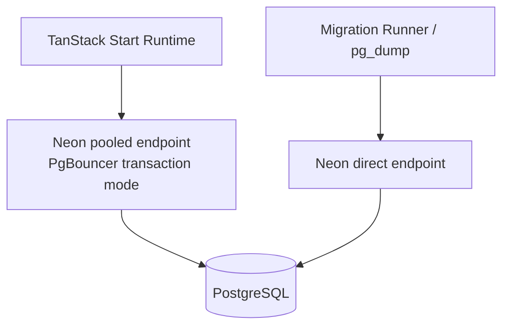
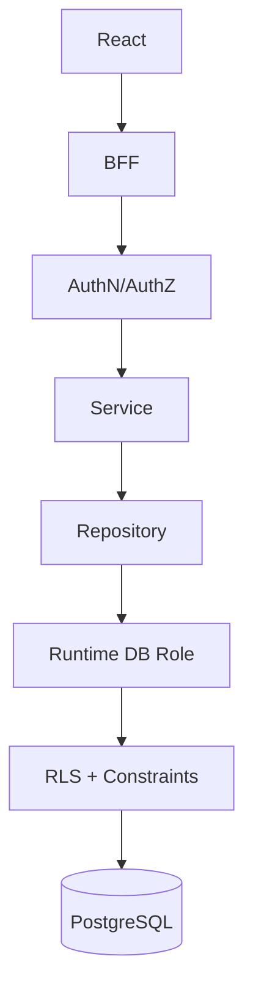
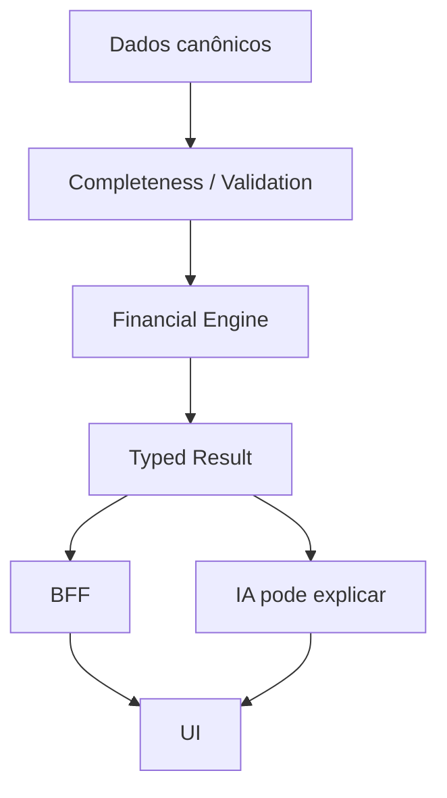
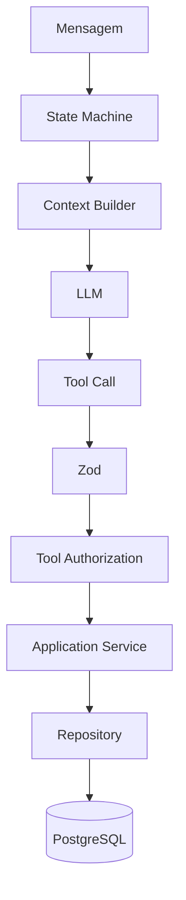
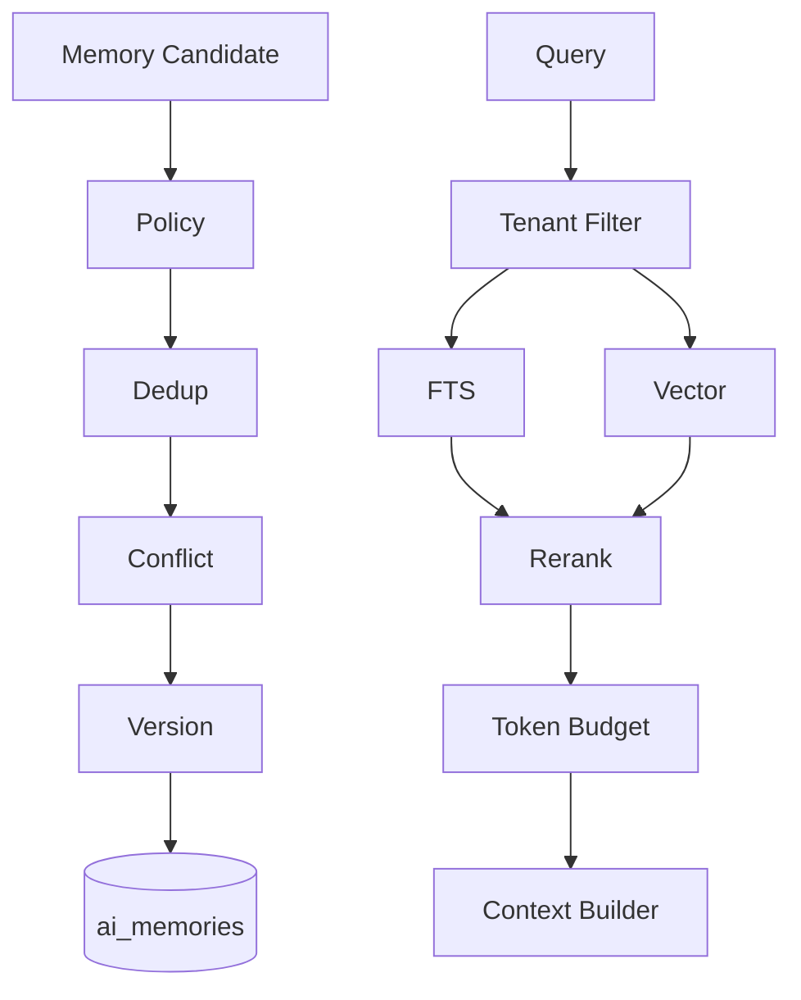

# Preço que Dá Lucro — Plano Mestre de Otimizações e Correções Validado

**Documento:** Plano de execução técnico derivado do PRD + SDD  
**Versão:** 2.0 — Revisada e validada com documentação oficial  
**Data:** 08/08/2026  
**Banco canônico:** PostgreSQL  
**Provedor inicial:** Neon  
**Framework full-stack:** TanStack Start + React  
**Status:** Implementação em andamento — programa de fechamento SDD v5 (ledger: `EXECUTION-STATE-PROGRAM.md`; auditoria: `docs/auditoria-ambiental-2026-08-26.md`)  
**Objetivo:** elevar segurança, integridade financeira, estabilidade, performance, observabilidade e fluidez da experiência sem introduzir complexidade prematura.

> **Alinhamento (2026-08-09):** este plano foi realinhado à Diretriz V7 (`DIRETRIZ_PRECIFICA_PRECO_QUE_DA_LUCRO_V7_SHADCN_BASEUI_SINCRONIZADO_OFICIAL.md`), que prevalece em divergências. Renumeração de fases, P0 canônico, invariantes estendidas e itens adiados constam em `docs/REALINHAMENTO_OPERACIONAL_V7_PLANO.md`.
>
> **Registro de execução (2026-08-27):** o fix `csf_58b444f152e35ba899b5381e` (CWE-770, `resource-exhaustion.ai-budget-race`) está **MERGEADO** em `develop` (PR #21, `12c90a1`) e `main` (PR #22, `55cb550`), com CI verde no tip publicado (UI stack run `33037007387`). Evidência do fix: `docs/evidence/csf-58b444f-final-2026-08-27.md`; readiness da release develop→main: `docs/evidence/release-readiness-develop-main-2026-08-27.md`; mapeamento V7↔Plano Mestre: `docs/MAPA_CRUZADO_DIRETRIZ_PLANO_PRECO_QUE_DA_LUCRO.md` + `docs/REALINHAMENTO_OPERACIONAL_V7_PLANO.md`.

---

# 1. Resumo executivo

Este plano substitui a abordagem de “otimizar telas e código” por um programa de engenharia orientado a invariantes.

A ordem correta é:

```text
CORREÇÃO MATEMÁTICA
        ↓
SEGURANÇA
        ↓
INTEGRIDADE DOS DADOS
        ↓
FRONTEIRAS ARQUITETURAIS
        ↓
ESTABILIDADE
        ↓
OBSERVABILIDADE
        ↓
PERFORMANCE
        ↓
EXPERIÊNCIA
        ↓
ESCALA
```

Nenhuma otimização de performance deverá mascarar um cálculo incorreto, uma falha de autorização ou um erro silencioso.

---

# 2. Evidências externas que alteram ou reforçam o plano

## 2.1 TanStack Start: rota protegida não é fronteira de segurança

A documentação atual do TanStack Start estabelece que `beforeLoad` é controle de navegação/UX, não uma barreira de autorização de dados.

Portanto:

```text
beforeLoad
=
UX / redirect / evitar trabalho inútil
```

e:

```text
server function / server route
=
fronteira real de autorização
```

**Decisão:** toda função/rota que leia ou modifique dados privados deve autenticar e autorizar no servidor.

Fonte oficial:  
<https://tanstack.com/start/latest/docs/framework/react/guide/server-functions>  
<https://tanstack.com/start/latest/docs/framework/react/guide/authentication-overview>

---

## 2.2 TanStack Start continua em Release Candidate

A documentação atual classifica TanStack Start como **Release Candidate**.

Isso não impede seu uso, mas exige:

- pinning de versões;
- changelog review;
- testes de regressão;
- gate de upgrade;
- evitar dependências desnecessárias de APIs internas.

Fonte oficial:  
<https://tanstack.com/start/latest/docs/framework/react/overview>

---

## 2.3 Sessões não devem ficar em localStorage

A documentação OWASP alerta que um XSS consegue acessar tokens armazenados em `localStorage`.

A documentação do próprio TanStack Start recomenda sessão server-driven e cookies com:

- `HttpOnly`;
- `Secure`;
- `SameSite`;
- prefixo `__Host-` quando aplicável.

**Nova prioridade:** retirar credenciais/sessões sensíveis do armazenamento acessível a JavaScript.

Fontes:  
<https://cheatsheetseries.owasp.org/cheatsheets/HTML5_Security_Cheat_Sheet.html>  
<https://cheatsheetseries.owasp.org/cheatsheets/Session_Management_Cheat_Sheet.html>  
<https://tanstack.com/start/v0/docs/framework/react/guide/authentication-server-primitives>

---

## 2.4 Neon: runtime pooled, migrations direct

O Neon utiliza PgBouncer em modo `transaction` no endpoint pooled.

Esse modo possui limitações para funcionalidades dependentes de sessão.

A própria documentação recomenda conexão direta para:

- migrations;
- `pg_dump`;
- ferramentas de schema quando o ORM não suporta corretamente pooling transacional.

**Decisão arquitetural:**

```text
DATABASE_URL_POOLED
→ runtime da aplicação

DATABASE_URL_DIRECT
→ migrations / admin / dump / restore
```

Fonte oficial:  
<https://neon.com/docs/connect/connection-pooling>

---

## 2.5 Branching do Neon é apropriado para PRs e testes

Branches do Neon são isolados e possuem string de conexão própria.

Isso permite:

```text
develop
→ database branch de desenvolvimento

PR
→ branch temporária isolada

main
→ production
```

Fonte oficial:  
<https://neon.com/docs/get-started-with-neon/workflow-primer>  
<https://neon.com/docs/guides/branching-github-actions>

---

## 2.6 PostgreSQL NUMERIC para dinheiro

PostgreSQL define `numeric`/`decimal` como tipos exatos e os recomenda para valores monetários e outros valores onde exatidão é necessária.

**Decisão:** evitar `double precision` como representação canônica de dinheiro.

Fonte oficial:  
<https://www.postgresql.org/docs/18/datatype-numeric.html>

---

## 2.7 RLS é defesa adicional, não substituto de autorização

Quando RLS é habilitado e não existe política aplicável, PostgreSQL adota `default deny`.

Entretanto, o owner da tabela normalmente não é submetido a RLS.

**Decisão:**

- role de runtime não deve ser owner;
- não conceder `BYPASSRLS`;
- autorização continua no backend;
- RLS funciona como defesa em profundidade.

Fonte oficial:  
<https://www.postgresql.org/docs/current/ddl-rowsecurity.html>

---

## 2.8 Não usar SERIALIZABLE em tudo

PostgreSQL fornece níveis de isolamento diferentes.

`SERIALIZABLE` oferece maior garantia, mas aplicações devem estar preparadas para serialization failures e retry da transação.

**Decisão:** selecionar isolamento por caso de uso.

Fonte oficial:  
<https://www.postgresql.org/docs/current/transaction-iso.html>

---

## 2.9 Full-text e vector search podem coexistir

PostgreSQL oferece `tsvector`, `tsquery` e GIN para full-text search.

`pgvector` executa busca exata por padrão e oferece HNSW/IVFFlat para busca aproximada.

**Decisão:** memória usa retrieval híbrido; HNSW somente após benchmark.

Fontes:  
<https://www.postgresql.org/docs/current/textsearch.html>  
<https://www.postgresql.org/docs/current/gin.html>  
<https://github.com/pgvector/pgvector/blob/master/README.md>

---

## 2.10 Índices devem ser guiados por dados

A documentação PostgreSQL deixa claro que índices aceleram leitura, mas geram overhead.

O plano de execução deve ser validado por `EXPLAIN` e `EXPLAIN ANALYZE`.

**Decisão:** nenhum índice composto novo será considerado “otimização concluída” sem evidência de workload ou plano.

Fontes:  
<https://www.postgresql.org/docs/18/indexes.html>  
<https://www.postgresql.org/docs/18/using-explain.html>

---

## 2.11 Segurança de supply chain do GitHub

GitHub permite exigir Actions fixadas por SHA completo e disponibiliza Dependency Review/Dependabot.

O workflow atual já fixa Actions por SHA; isso deve permanecer como regra.

Fontes:  
<https://docs.github.com/en/actions/reference/security/secure-use>  
<https://docs.github.com/en/code-security/how-tos/secure-your-supply-chain/manage-your-dependency-security/configure-dependency-review-action>

---

# 3. Princípios não negociáveis

> Alinhado à V7 §25 em 2026-08-09: INV-001..015 equivalem às da V7 (INV-009 prevalece na redação "atômica ou idempotente", com compensação como mecanismo aceitável registrado no realinhamento); INV-016..022 incorporadas da V7 (fronteira do design system).

```text
INV-001 Frontend não acessa PostgreSQL diretamente.
INV-002 Nenhuma server function privada confia apenas em beforeLoad.
INV-003 IA não executa SQL.
INV-004 IA não calcula valor financeiro canônico.
INV-005 Memória de IA não substitui dado financeiro.
INV-006 Unknown não é zero.
INV-007 NaN/Infinity não são formatados como zero.
INV-008 Tenant A jamais referencia entidade de Tenant B.
INV-009 Toda mutação crítica é atômica ou idempotente (compensação explícita quando nenhuma for possível).
INV-010 Runtime usa usuário PostgreSQL de menor privilégio.
INV-011 Neon é substituível.
INV-012 Migrations são reproduzíveis.
INV-013 Erros de DB não são transformados em sucesso vazio.
INV-014 Toda tool da IA possui validação runtime.
INV-015 Resultados financeiros relevantes registram versão do motor.
INV-016 Feature não importa Base UI diretamente.
INV-017 Feature não importa Radix diretamente.
INV-018 components/ui é a fronteira oficial do design system.
INV-019 Composição Base UI preserva refs, props, ARIA e handlers.
INV-020 Atualização shadcn exige diff review e regressão.
INV-021 Tokens semânticos prevalecem sobre styling hard-coded.
INV-022 Primitive provider não contém regra financeira.
```

---

# 4. Macro-roadmap

> A numeração canônica de fases é a da V7 §22.1 (F0–F14). Este plano mantém F0–F15 como especificação expandida; a correspondência está em `docs/REALINHAMENTO_OPERACIONAL_V7_PLANO.md` §2 (F11+F12→F11, F13→F12, F14→F13, F15→F14).

```text
F0  Baseline e observabilidade
F1  P0 financeiro e segurança imediata
F2  Autenticação e sessão server-driven
F3  BFF como fronteira única
F4  Services + Repositories
F5  Financial Engine 2.0
F6  PostgreSQL schema hardening
F7  Preparação Neon
F8  Migração Supabase → PostgreSQL/Neon
F9  Orquestração de IA
F10 Memória persistente
F11 Performance backend
F12 Performance frontend
F13 UX e explicabilidade
F14 Resiliência e SLOs
F15 Hardening de produção
```

---

# 5. FASE 0 — Baseline obrigatório

## Objetivo

Estabelecer uma linha de base antes de qualquer alteração.

## Entregáveis

### F0-01 — Inventário de rotas

Registrar:

- rota;
- SSR/client-only;
- source de dados;
- número aproximado de queries;
- dependências;
- estados de erro;
- componentes críticos.

### F0-02 — Baseline de endpoints

Para cada server function:

- método;
- schema;
- autenticação;
- autorização;
- dependências;
- muta ou apenas lê;
- timeout;
- idempotência.

### F0-03 — Baseline do Financial Engine

Criar golden tests antes da refatoração.

Casos:

- custo normal;
- custo faltante;
- unidade incompatível;
- yield zero;
- yield null;
- tax null;
- margem negativa;
- contribuição zero;
- break-even impossível;
- quantidade fracionária;
- cenário real;
- cenário simulado.

### F0-04 — Baseline de performance

Registrar:

- p50/p95 de rotas internas;
- query count por tela;
- query duration;
- tempo de carregamento do dashboard;
- tempo de lista de produtos;
- AI latency;
- tamanho de bundle;
- Core Web Vitals em ambiente controlado.

### F0-05 — Error census

Listar:

- erros ignorados;
- `data ?? []`;
- `catch` vazio;
- conversões para zero;
- valores default potencialmente perigosos.

## Gate

Não iniciar refatoração do motor financeiro sem golden tests.

---

# 6. FASE 1 — P0 financeiro e segurança imediata

# 6.1 SEC-001 — Remover XSS no chat

## Problema

HTML gerado pelo modelo chega a `dangerouslySetInnerHTML`.

## Alvo

Preferência:

```text
Markdown
→ parser
→ AST
→ componentes React permitidos
```

Se HTML for necessário:

```text
HTML
→ sanitização
→ render
```

OWASP recomenda sanitização quando HTML precisa ser aceito e cita DOMPurify como opção.

Fonte:  
<https://cheatsheetseries.owasp.org/cheatsheets/Cross_Site_Scripting_Prevention_Cheat_Sheet.html>

## Testes

- `<script>alert(1)</script>`;
- ``;
- `javascript:`;
- SVG malicioso;
- iframe;
- atributos event handler.

## DoD

- nenhuma execução;
- teste de regressão;
- CSP planejada;
- sem HTML não sanitizado.

---

# 6.2 FIN-001 — Introduzir Result Type

Evitar retornar apenas `number`.

Exemplo conceitual:

```ts
type CalculationResult<T> =
  | {
      status: "ok";
      value: T;
      warnings: CalculationWarning[];
    }
  | {
      status: "incomplete";
      missing: MissingField[];
      warnings: CalculationWarning[];
    }
  | {
      status: "invalid";
      errors: CalculationError[];
    };
```

Benefício:

- separa cálculo válido;
- dado incompleto;
- dado inválido.

---

# 6.3 FIN-002 — Unknown ≠ zero

Remover todos os padrões que retornam zero quando existe ausência.

Exemplos proibidos:

```ts
packagePrice ?? 0;
taxRate ?? 0;
yieldQty || 1;
conversion ?? 0;
```

quando semanticamente desconhecido.

---

# 6.4 FIN-003 — Invalid number ≠ zero

Formatter não deve converter `NaN`/`Infinity` em R$ 0.

Criar formatter para estados:

```text
ok         → R$ 1.234,56
incomplete → —
invalid    → Erro de cálculo
infinite   → Não atingível
```

---

# 6.5 FIN-004 — Remover volume atual fictício

O valor `100` deve desaparecer.

Criar:

```text
volume_source:
real
manual_simulation
forecast
unknown
```

Somente `real` poderá alimentar KPI factual.

---

# 6.6 FIN-005 — Remover markup arbitrário

Substituir `unitCost * 1.5` por cálculo explícito.

Entradas:

- custo;
- impostos;
- taxas;
- margem alvo;
- despesas variáveis;
- regras de negócio.

Resultado:

```text
minimum_sustainable_price
target_margin_price
market_reference
```

---

# 6.7 FIN-006 — Unit model

Separar:

```text
MassUnit
VolumeUnit
CountUnit
CommercialUnit
```

Nunca converter `xícara → g` sem contexto de ingrediente.

---

# 6.8 FIN-007 — Ceil discreto

Quantidade física indivisível:

```text
requiredUnits = ceil(rawRequiredUnits)
```

Manter também valor bruto para auditoria.

---

# 6.9 API-001 — Erro não vira lista vazia

Padronizar:

```text
VALIDATION_ERROR
AUTHENTICATION_ERROR
AUTHORIZATION_ERROR
NOT_FOUND
CONFLICT
DATABASE_ERROR
DEPENDENCY_ERROR
AI_TIMEOUT
AI_QUOTA
```

---

# 6.10 IA-001 — Zod em toda tool

Nada vindo do LLM é confiável.

Pipeline:

```text
tool call
→ JSON parse
→ Zod safeParse
→ authorization
→ service
```

---

# 7. FASE 2 — Autenticação server-driven

Esta fase foi promovida de prioridade após validação documental.

# 7.1 AUTH-001 — Decisão de provedor de identidade

A escolha do banco não define automaticamente o provedor de autenticação.

Possibilidades:

- manter provedor atual temporariamente;
- migrar para solução gerenciada;
- adotar solução OSS;
- implementar sessão própria sobre identidade externa.

A decisão deve ser ADR separado.

---

# 7.2 AUTH-002 — Remover tokens sensíveis do localStorage

Meta:

```text
browser JS
NÃO lê token de sessão
```

Preferência:

```text
__Host-session
HttpOnly
Secure
SameSite=Lax/Strict conforme fluxo
Path=/
```

---

# 7.3 AUTH-003 — Sessão opaca server-side

Preferência arquitetural:

```text
cookie
→ random session id
→ session repository
→ user / tenant / roles
```

Vantagens:

- revogação;
- rotação;
- logout central;
- menor exposição de payload.

---

# 7.4 AUTH-004 — Session rotation

Rotacionar em:

- login;
- elevação de privilégio;
- alteração de senha;
- alteração de role;
- logout global.

---

# 7.5 AUTH-005 — OAuth seguro

Quando houver OAuth:

- state;
- PKCE;
- callback validation;
- short-lived state;
- redirect URI estrita.

---

# 7.6 AUTH-006 — autorização em cada endpoint privado

Teste obrigatório:

```text
chamar server function diretamente
sem carregar rota protegida
→ 401/403
```

---

# 7.7 AUTH-007 — CSRF

Para server functions:

- usar proteção same-origin do TanStack Start;
- validar configuração caso `src/start.ts` exista;
- não permitir GET mutante;
- Origin/Fetch Metadata para mutações.

Fonte:
<https://tanstack.com/start/latest/docs/framework/react/guide/server-functions>  
<https://cheatsheetseries.owasp.org/cheatsheets/Cross-Site_Request_Forgery_Prevention_Cheat_Sheet.html>

---

# 8. FASE 3 — BFF como fronteira única

Objetivo:

```text
React
→ BFF
→ Application Service
```

## BFF-001 Dashboard

Criar:

```text
getDashboardSummary(period)
```

## BFF-002 Produtos

- listProducts;
- getProduct;
- createProduct;
- updateProduct;
- archiveProduct.

## BFF-003 Despesas

- listExpenses;
- createExpense;
- updateExpense;
- deleteExpense.

## BFF-004 Preços

Migrar integralmente para contratos BFF.

## BFF-005 Break-even

Resultado produzido pelo domínio.

## BFF-006 Diagnóstico

Não usar query direta no componente.

## BFF-007 Simulações

Persistência server-side.

## Gate

Busca automatizada no source:

```text
supabase.from(
```

não pode existir em módulos de UI de domínio.

---

# 9. FASE 4 — Services + Repositories

## 9.1 Application Services

Criar:

- ProductService;
- PricingService;
- ExpenseService;
- SalesService;
- SimulationService;
- DiagnosticService;
- ConversationService;
- MemoryService;
- AuditService;
- EventService.

## 9.2 Repository interfaces

Criar contratos independentes de driver.

Exemplo:

```ts
interface ProductRepository {
  findById(ctx: RequestContext, id: ProductId): Promise<Product | null>;
  list(ctx: RequestContext, query: ProductQuery): Promise<Page<Product>>;
  save(ctx: TransactionContext, product: Product): Promise<void>;
}
```

## 9.3 Contexto obrigatório

Repository recebe contexto contendo, quando aplicável:

```text
tenantId
userId
correlationId
transaction
```

Nunca aceitar `tenantId` vindo diretamente do body do cliente como fonte de autoridade.

---

# 10. FASE 5 — Financial Engine 2.0

# 10.1 Money

Persistência:

```text
NUMERIC
```

Domínio:

- biblioteca decimal explícita;
- regras de scale;
- rounding mode documentado.

# 10.2 Percent

Criar tipo conceitual próprio.

Evitar confusão:

```text
0.15
vs
15
```

Definir uma representação canônica.

# 10.3 Quantity

Representar:

- amount;
- unit;
- dimension.

# 10.4 Completeness

Todo cálculo retorna ou propaga:

- complete;
- missing;
- warnings.

# 10.5 Engine version

Exemplo:

```text
finance-engine/2.0.0
```

# 10.6 Calculation snapshot

Campos:

- inputs normalizados;
- output;
- engine_version;
- calculation_type;
- tenant_id;
- entity_id;
- created_at.

# 10.7 Property-based testing

Além de exemplos fixos, testar propriedades:

```text
custo maior, todo resto igual
→ margem não deve aumentar

preço maior, custos constantes
→ margem absoluta não deve diminuir

volume maior
→ receita não diminui
```

---

# 11. FASE 6 — PostgreSQL schema hardening

# 11.1 PK e tenant

Estratégia recomendada:

```text
PRIMARY KEY (id)
UNIQUE (tenant_id, id)
```

Filhos:

```text
FOREIGN KEY (tenant_id, product_id)
REFERENCES products(tenant_id, id)
```

---

# 11.2 FK não cria índice automaticamente no lado filho

Criar índices no lado referenciante quando o workload justificar.

Validar via `EXPLAIN`.

---

# 11.3 CHECK constraints

Exemplos:

```sql
CHECK (amount >= 0)
CHECK (quantity > 0)
CHECK (percentage >= 0)
```

Evitar checks excessivamente rígidos sem regra de negócio validada.

---

# 11.4 Nullability

Não usar `NOT NULL` indiscriminadamente.

Diferenciar:

```text
desconhecido permitido
vs
campo obrigatório para estado READY
```

Algumas invariantes pertencem ao estado do agregado e não apenas à coluna.

---

# 11.5 Product status

```text
draft
incomplete
ready
active
archived
```

---

# 11.6 Price history

Criar histórico imutável/temporal.

Não:

```text
DELETE antigo
INSERT novo
```

para atualizações normais.

---

# 11.7 Sales

Criar:

- sales;
- sales_items.

Só então dashboard poderá mostrar faturamento factual.

---

# 11.8 Simulations

Persistir:

- params;
- result;
- scenario_type;
- engine_version;
- timestamp.

---

# 11.9 RLS

Aplicar às tabelas tenant-scoped.

Testes:

```text
runtime role tenant A
SELECT tenant B
→ zero rows / denied

runtime role tenant A
UPDATE tenant B
→ denied
```

Garantir que runtime role não seja owner nem BYPASSRLS.

---

# 12. FASE 7 — Preparação Neon

# 12.1 Selecionar major PostgreSQL

A versão deve ser explicitamente fixada no ADR e CI.

Neon tornou PostgreSQL 18 GA em maio de 2026 e passou a usá-lo por padrão em novos projetos posteriormente.

Mesmo assim, a decisão deve considerar:

- compatibilidade das extensões;
- driver;
- migration tool;
- ambiente atual;
- rollback.

Não atualizar major apenas por novidade.

---

# 12.2 URLs separadas

```env
DATABASE_URL_POOLED=
DATABASE_URL_DIRECT=
```

Uso:

| Operação                     | Conexão |
| ---------------------------- | ------- |
| request runtime              | pooled  |
| background short transaction | pooled  |
| migration                    | direct  |
| pg_dump                      | direct  |
| restore                      | direct  |
| admin/session-specific       | direct  |

---

# 12.3 Transações curtas

Como pooler é transaction mode:

- não depender de session state;
- não manter transaction aberta durante chamada de IA;
- não esperar input humano dentro de transação.

---

# 12.4 Branch model

```text
production
└── develop
    └── preview/pr-123
```

Para dados sensíveis, avaliar schema-only branches ou mascaramento.

---

# 12.5 Branch lifecycle

PR open:

```text
create branch
apply migrations
seed safe data
integration tests
E2E
```

PR close:

```text
delete branch
```

---

# 12.6 Spending guardrails

Configurar:

- budget interno;
- alertas Neon;
- métricas de compute;
- branch cleanup.

---

# 13. FASE 8 — Migração para Neon

# 13.1 Pré-requisitos

- BFF consolidado;
- Repository Layer;
- migrations reproduzíveis;
- auth desacoplada de acesso direto ao Supabase;
- CI verde.

# 13.2 Dry run

Executar primeira migração em branch temporária.

# 13.3 Schema migration

Validar:

- extensions;
- enums;
- constraints;
- indexes;
- functions indispensáveis;
- RLS;
- roles.

# 13.4 Data migration

Validar por tabela:

- row count;
- null count;
- min/max timestamps;
- soma de campos financeiros quando aplicável;
- referências órfãs;
- hash/checksum em amostras ou blocos.

# 13.5 Reconciliation report

Gerar artefato:

```text
table
source_count
target_count
difference
status
```

# 13.6 Cutover

Plano:

1. janela de freeze;
2. última sincronização;
3. validação;
4. trocar secret;
5. smoke tests;
6. monitorar;
7. manter origem somente leitura durante rollback window.

# 13.7 Rollback

Se falhar:

- restaurar `DATABASE_URL`;
- reabrir origem;
- registrar delta;
- não tentar “consertar em produção” sem reconciliação.

---

# 14. FASE 9 — Orquestração da IA

# 14.1 Conversation FSM

Fluxo determinístico de estados.

# 14.2 Tool allowlist por estado

O modelo não decide livremente todo o workflow.

# 14.3 ToolExecution

Persistir:

- tool call id;
- input;
- output;
- status;
- duration;
- idempotency key.

# 14.4 Idempotência

Mutação repetida com mesma chave:

```text
retorna resultado anterior
ou
conflito controlado
```

Nunca duplica entidade.

# 14.5 Timeout e cancellation

Toda chamada externa:

- timeout;
- AbortSignal;
- cancellation propagation quando viável.

# 14.6 Budget

Por tenant/período:

- requests;
- tokens;
- tool count;
- estimated spend.

OWASP recomenda limitar consumo de recursos e gastos em APIs de terceiros.

Fonte:
<https://owasp.org/API-Security/editions/2023/en/0xa4-unrestricted-resource-consumption/>

# 14.7 Retry

Somente erros transitórios.

Usar backoff + jitter.

Não retry automático de:

- validation;
- authorization;
- business conflict.

---

# 15. FASE 10 — Memória persistente

# 15.1 Ordem correta

Não iniciar por embeddings.

Ordem:

```text
Memory Service
→ policy
→ persistence
→ provenance
→ dedup
→ conflict
→ FTS
→ embeddings
→ hybrid retrieval
→ ANN se necessário
```

# 15.2 Tabelas

- ai_conversations;
- ai_messages;
- ai_memories;
- ai_memory_sources;
- ai_memory_versions;
- ai_memory_conflicts;
- ai_memory_embeddings;
- ai_memory_access_log;
- ai_memory_policies.

# 15.3 Política

Modelo propõe candidato.

Backend decide.

# 15.4 Proveniência

Toda memória deve saber:

- quem disse;
- onde;
- quando;
- se foi inferida;
- confiança.

# 15.5 FTS

Criar representação lexical.

Testar configuração portuguesa.

# 15.6 Vector

Começar exact nearest neighbor.

Medir:

- rows;
- latency;
- recall;
- memory.

Somente adicionar HNSW após threshold documentado.

# 15.7 Ranking

Combinar:

- tenant;
- scope;
- lexical;
- semantic;
- recency;
- importance;
- confidence.

# 15.8 Tenant filter

Filtro de tenant ocorre antes de considerar candidatos úteis.

Nunca fazer busca global e filtrar depois na aplicação.

---

# 16. FASE 11 — Performance backend

# 16.1 N+1

Remover loops:

```text
for product:
  query ingredients
  query packaging
  query fees
```

Usar:

- batch;
- joins;
- CTEs;
- agregações.

# 16.2 Dashboard query contract

Criar um caso de uso otimizado.

Não fazer dashboard montar regra de negócio no browser.

# 16.3 pg_stat_statements

Se disponível no ambiente, utilizar para observar:

- calls;
- total exec time;
- mean exec time;
- rows;
- query patterns.

Fonte:
<https://www.postgresql.org/docs/18/pgstatstatements.html>

# 16.4 EXPLAIN

Queries críticas devem possuir evidence file:

```text
before plan
after plan
before latency
after latency
```

# 16.5 Índices

Adicionar a partir de:

- filtros reais;
- joins reais;
- ordenação real;
- cardinalidade.

# 16.6 Paginação

Definir limites server-side.

OWASP recomenda limites para número de registros por request.

# 16.7 Pool saturation

Monitorar:

- wait time;
- active transactions;
- pool queue;
- connections.

# 16.8 Scale to zero

Em produção sensível a latência, medir cold activation antes de decidir manter compute always-active.

---

# 17. FASE 12 — Performance frontend

# 17.1 TanStack Query

Usar como camada real de server state.

# 17.2 Query keys

Factories tipadas.

# 17.3 Invalidation

Alvo seletivo.

# 17.4 Prefetch

Utilizar em navegação previsível.

Documentação do TanStack Query destaca prefetch como técnica para evitar waterfalls.

Fonte:
<https://tanstack.com/query/latest/docs/framework/react/guides/prefetching>

# 17.5 Stale time

Definir por natureza do dado.

Exemplos:

```text
produto detalhado       → curto/moderado
histórico imutável      → maior
configuração estável    → maior
dashboard operacional   → curto
```

# 17.6 Lazy route/module

Priorizar:

- IA;
- diagnóstico;
- gráficos;
- simulações.

# 17.7 Bundle budget

Manter limite CI.

# 17.8 RUM

Métricas reais:

- LCP;
- INP;
- CLS.

Targets de referência:

```text
LCP <= 2,5s
INP <= 200ms
CLS <= 0,1
```

avaliados no percentil 75.

Fonte:
<https://web.dev/articles/vitals>

---

# 18. FASE 13 — UX financeira

# 18.1 Estados explícitos

Toda informação financeira deve ser:

```text
factual
simulated
estimated
incomplete
invalid
```

# 18.2 Badges

Exibir:

- REAL;
- SIMULAÇÃO;
- DADOS INCOMPLETOS.

# 18.3 Explain calculation

Cada KPI importante deve possuir:

```text
Como calculamos?
```

# 18.4 Data completeness

Mostrar faltantes.

# 18.5 Skeleton

Manter layout estável para evitar CLS.

# 18.6 Immediate feedback

Após interação, feedback visual rápido, mesmo que a operação remota continue.

Isso ajuda INP e percepção de responsividade.

# 18.7 Retry UX

Erro transitório:

```text
Tentar novamente
```

Erro de validação:

```text
corrigir campo
```

Não tratar ambos da mesma forma.

---

# 19. FASE 14 — Observabilidade

# 19.1 OpenTelemetry

No JavaScript atual:

- traces: estável;
- metrics: estável;
- logs: ainda em desenvolvimento segundo documentação oficial.

Portanto:

- adotar traces e metrics primeiro;
- logs estruturados podem continuar com logger próprio;
- correlacionar via trace/correlation ID.

Fonte:
<https://opentelemetry.io/docs/languages/js/>

# 19.2 HTTP spans

Instrumentar:

```text
request
BFF
service
repository
external AI
```

# 19.3 DB spans

Seguir semantic conventions para PostgreSQL.

# 19.4 Sanitização

Não anexar ao trace:

- token;
- senha;
- DB URL;
- prompt completo sensível;
- raw PII.

OWASP recomenda excluir tokens, passwords, connection strings e secrets dos logs.

Fonte:
<https://cheatsheetseries.owasp.org/cheatsheets/Logging_Cheat_Sheet.html>

# 19.5 Financial metrics

- calculation_count;
- incomplete_calculation_count;
- invalid_calculation_count;
- engine_version_distribution.

# 19.6 Memory metrics

- candidate_count;
- persisted_count;
- rejected_count;
- retrieval_latency;
- user_correction_rate;
- conflict_rate.

---

# 20. FASE 15 — Segurança de produção

# 20.1 CSP

Aplicar como defesa em profundidade depois de eliminar sinks inseguros.

Introduzir inicialmente `Report-Only`.

Depois enforcement.

Fonte:
<https://cheatsheetseries.owasp.org/cheatsheets/Content_Security_Policy_Cheat_Sheet.html>

# 20.2 Headers

Avaliar:

- CSP;
- HSTS;
- X-Content-Type-Options;
- Referrer-Policy;
- Permissions-Policy;
- frame-ancestors.

# 20.3 SQL injection

- queries parametrizadas;
- nunca concatenar input;
- DB role least privilege.

Fonte:
<https://cheatsheetseries.owasp.org/cheatsheets/SQL_Injection_Prevention_Cheat_Sheet.html>

# 20.4 Object authorization

UUID não substitui autorização.

Toda busca por ID deve estar tenant-scoped.

# 20.5 Rate limits

Políticas diferentes para:

- login;
- signup;
- password reset;
- chat;
- tool-heavy requests;
- exports.

---

# 21. Transaction strategy

Não criar uma única política global.

## T1 — simples CRUD

Default `READ COMMITTED` é suficiente na maioria dos casos simples.

## T2 — read-modify-write sensível

Considerar:

- optimistic version;
- `SELECT FOR UPDATE`;
- stronger isolation.

## T3 — invariante cross-row crítica

Avaliar `SERIALIZABLE`.

Se usar:

```text
serialization failure
→ retry da transação inteira
```

com limite.

---

# 22. Idempotency strategy

Tabela:

```text
idempotency_keys
```

Campos:

- tenant_id;
- key;
- operation;
- request_hash;
- status;
- response;
- expires_at.

Fluxo:

```text
primeira execução
→ reserve key
→ executar
→ persist result

repetição
→ verificar hash
→ retornar result
```

---

# 23. Outbox strategy

Na mesma transação:

```text
UPDATE domínio
INSERT outbox_event
COMMIT
```

Worker:

```text
SELECT pending
→ publish/process
→ mark processed
```

Garantir idempotência no consumidor.

---

# 24. CI/CD revisado

Pipeline recomendado:

```text
install
→ formatting
→ lint
→ typecheck
→ unit
→ finance regression
→ security tests
→ migration lint/test
→ integration DB branch
→ build
→ bundle
→ E2E
→ dependency review
```

---

# 25. GitHub Actions hardening

Manter:

- Actions pinadas por SHA;
- permissions mínimas;
- secrets não expostos em PR não confiável.

Adicionar quando disponível:

- Dependabot;
- Dependency Review;
- CodeQL se compatível com plano;
- secret scanning se compatível.

---

# 26. Database CI com Neon Branching

PR:

```text
create Neon branch
→ direct DATABASE_URL for migrations
→ pooled DATABASE_URL for integration runtime
→ migrations
→ seed
→ integration
→ E2E
→ schema diff
```

Cleanup:

```text
always()
→ delete branch
```

---

# 27. Migration safety

Cada migration classificada:

```text
SAFE
ONLINE_WITH_CARE
BREAKING
DATA_MIGRATION
```

## Expand/contract para alterações incompatíveis

Exemplo:

```text
1 add nova coluna
2 app escreve ambas
3 backfill
4 app lê nova
5 parar escrita antiga
6 remover antiga
```

Evitar big-bang migration.

---

# 28. Backfill safety

Para volume futuro:

- batch;
- checkpoint;
- rate limit;
- idempotência;
- observabilidade.

---

# 29. SLOs iniciais

Não transformar targets em promessas contratuais antes de RUM.

## Backend interno

```text
p95 GET simples < 500ms
p95 mutação simples < 800ms
```

## Frontend

Web Vitals de referência oficial:

```text
LCP <= 2.5s p75
INP <= 200ms p75
CLS <= 0.1 p75
```

## IA

Separar:

```text
time_to_acknowledge
time_to_first_content
time_to_final
```

Não comparar LLM com API DB.

---

# 30. Error budget

Após baseline, definir tolerância.

Exemplo conceitual:

```text
critical financial calculation error
→ zero tolerância conhecida

transient AI failure
→ tolerância maior com fallback
```

---

# 31. Graceful degradation

## AI indisponível

Continuam funcionando:

- produtos;
- preços;
- despesas;
- vendas;
- Financial Engine;
- simulações manuais.

## Vector indisponível

Fallback:

```text
FTS
+ session context
```

## observabilidade externa indisponível

Aplicação não deve bloquear request principal.

---

# 32. Security testing matrix

| Cenário                 | Resultado esperado |
| ----------------------- | ------------------ |
| XSS em resposta IA      | não executa        |
| chamada direta sem auth | 401                |
| tenant A acessa B       | 403/zero rows      |
| tool inválida           | validation error   |
| SQL injection em string | parametrizado      |
| CSRF cross-site         | bloqueado          |
| replay mutation         | idempotente        |
| token em localStorage   | inexistente        |
| session fixation        | sessão rotacionada |
| rate abuse AI           | 429/limit          |

---

# 33. Financial regression matrix

| Caso                | Esperado                     |
| ------------------- | ---------------------------- |
| package price null  | incomplete                   |
| unit incompatible   | incomplete/invalid           |
| yield null          | incomplete                   |
| tax null            | incomplete quando necessária |
| contribution <= 0   | break-even não atingível     |
| required units 10.1 | 11                           |
| volume unknown      | não chamar real              |
| markup arbitrário   | inexistente                  |
| NaN                 | nunca formatado como zero    |

---

# 34. Database integrity matrix

Testar:

- tenant composite FK;
- CHECK;
- UNIQUE;
- NOT NULL seletivo;
- history immutability;
- cascade/restrict;
- rollback.

---

# 35. Performance evidence requirement

Uma otimização deverá registrar:

```text
hypothesis
metric
before
change
after
result
decision
```

Se não houver ganho ou problema comprovado, reverter complexidade.

---

# 36. Prioridades P0

> Lista canônica da V7 §22.2 (17 itens), alinhada em 2026-08-09: o antigo item 7 (yield/tax defaults) foi expandido em 7 e 8; o antigo item 8 (conversão incompatível) virou 9; o antigo item 15 (AI timeout/budget) foi expandido em 16 e 17.

1. XSS;
2. Result Type financeiro;
3. unknown ≠ zero;
4. NaN/Infinity;
5. volume fictício;
6. markup arbitrário (`custo × 1,5`);
7. rendimento default;
8. imposto default;
9. validar unidades (conversão incompatível);
10. tool Zod;
11. error taxonomy;
12. auth por endpoint;
13. sessão server-driven (remover tokens de localStorage);
14. persistir conversation state;
15. tool execution audit;
16. timeout da IA;
17. quota/budget da IA.

---

# 37. Prioridades P1

1. BFF único;
2. Services;
3. Repositories;
4. Transaction Manager;
5. Money decimal;
6. sales model;
7. product completeness;
8. price history;
9. tenant composite FK;
10. RLS defense-in-depth;
11. simulations persistence;
12. remove N+1;
13. TanStack Query real;
14. Neon branch CI;
15. migrate DB.

---

# 38. Prioridades P2

1. Conversation FSM;
2. outbox;
3. memory subsystem;
4. FTS;
5. pgvector;
6. hybrid retrieval;
7. central de memória;
8. OpenTelemetry;
9. CSP enforcement;
10. advanced performance.

---

# 39. Itens deferidos

Não adotar sem evidência:

- microservices;
- Kafka;
- Kubernetes;
- Redis obrigatório;
- HNSW imediato;
- read replica;
- partitioning;
- CQRS completo;
- event sourcing;
- multi-region write.

Adiamentos de produto (união com a V7 §28, 2026-08-09):

- estoque completo (não essencial ao MVP);
- fluxo de caixa completo (expansão futura);
- DRE completa (expansão futura);
- WhatsApp (integração posterior);
- marketplace (complexidade prematura).

---

# 40. Ordem prática de implementação

```text
01 baseline-finance-tests
02 secure-chat-renderer
03 finance-result-type
04 finance-unknown-policy
05 finance-invalid-number-policy
06 remove-fake-volume
07 remove-arbitrary-price
08 finance-units
09 finance-rounding
10 server-error-taxonomy
11 tool-zod-validation
12 auth-data-boundary
13 server-session-cookie
14 conversation-state
15 tool-execution-audit
16 ai-timeout-budget
17 bff-product
18 product-service
19 product-repository
20 bff-expense
21 expense-service
22 expense-repository
23 sales-domain
24 dashboard-service
25 financial-engine-v2
26 postgres-schema-hardening
27 neon-dev-project
28 neon-pr-branch-ci
29 migration-dry-run
30 production-cutover
31 conversation-fsm
32 memory-core
33 memory-fts
34 memory-vector
35 hybrid-retrieval
36 observability
37 frontend-performance
38 production-hardening
```

---

# 41. Gate de conclusão P0

P0 somente encerra quando:

- XSS regression test verde;
- unknown nunca vira zero;
- NaN/Infinity nunca viram zero;
- cenário atual sem volume real não é apresentado;
- arbitrary markup removido;
- tools runtime-validated;
- endpoint privado autoriza servidor;
- token sensível não fica em localStorage;
- estado da IA sobrevive reload;
- AI possui timeout;
- CI verde.

---

# 42. Gate antes de Neon production

- migrations do zero;
- migrations em cópia de produção;
- schema diff revisado;
- tenant tests;
- RLS tests;
- reconciliation report;
- backup/restore testado;
- direct e pooled URLs configuradas;
- rollback documentado;
- smoke tests automatizados.

---

# 43. Gate antes de memória semântica

- Conversation Service pronto;
- Memory Service pronto;
- policy engine mínimo;
- provenance;
- tenant isolation;
- delete/export;
- FTS funcionando.

Só então embeddings.

---

# 44. Gate antes de HNSW

Registrar:

```text
memory rows
exact-search p95
exact-search CPU
recall baseline
target latency
```

Somente indexar approximate search se necessário.

---

# 45. Definition of Done geral

Toda mudança crítica precisa:

- código;
- testes;
- erro explícito;
- observabilidade;
- documentação;
- rollback;
- CI verde;
- nenhuma regressão conhecida.

---

# 46. KPIs de engenharia

## Segurança

- unauthorized_request_block_rate;
- auth failures;
- rate limit activations;
- security regression count.

## Estabilidade

- error rate;
- database error rate;
- AI timeout rate;
- successful transaction rate.

## Performance

- API p95;
- query p95;
- N+1 count;
- bundle size;
- Web Vitals.

## Financeiro

- incomplete calculation rate;
- invalid calculation rate;
- engine version distribution.

## IA

- tool error rate;
- token cost per session;
- average tool steps;
- duplicate tool execution prevented.

## Memória

- retrieval precision;
- correction rate;
- duplicate rate;
- conflict rate;
- context token usage.

---

# 47. Arquitetura de conexão Neon



---

# 48. Arquitetura de segurança de dados



---

# 49. Arquitetura de cálculo



---

# 50. Arquitetura de IA



---

# 51. Arquitetura da memória



---

# 52. Conclusão técnica

O projeto não precisa de uma reescrita integral.

A estratégia madura é evoluir por fronteiras.

```text
CORREÇÃO
→ AUTH
→ BFF
→ SERVICES
→ REPOSITORIES
→ FINANCIAL ENGINE
→ POSTGRESQL HARDENING
→ NEON
→ AI FSM
→ MEMORY
→ PERFORMANCE
→ HARDENING
```

A melhoria mais importante não é “usar Neon”, “usar pgvector” ou “usar IA”.

É garantir que cada camada tenha responsabilidade única:

```text
PostgreSQL
→ verdade persistente

Neon
→ infraestrutura

Financial Engine
→ matemática

Application Services
→ casos de uso

Repositories
→ persistência

BFF
→ fronteira de aplicação

Memory Service
→ memória governada

LLM
→ interpretação e linguagem
```

---

# 53. Referências oficiais consultadas

## TanStack

- TanStack Start Overview  
  <https://tanstack.com/start/latest/docs/framework/react/overview>

- Server Functions  
  <https://tanstack.com/start/latest/docs/framework/react/guide/server-functions>

- Authentication Overview  
  <https://tanstack.com/start/latest/docs/framework/react/guide/authentication-overview>

- Authentication Server Primitives  
  <https://tanstack.com/start/v0/docs/framework/react/guide/authentication-server-primitives>

- TanStack Query Prefetching  
  <https://tanstack.com/query/latest/docs/framework/react/guides/prefetching>

- QueryClient  
  <https://tanstack.com/query/latest/docs/reference/QueryClient>

## PostgreSQL

- Numeric Types  
  <https://www.postgresql.org/docs/18/datatype-numeric.html>

- Row Security  
  <https://www.postgresql.org/docs/current/ddl-rowsecurity.html>

- Transaction Isolation  
  <https://www.postgresql.org/docs/current/transaction-iso.html>

- CREATE TABLE / Constraints  
  <https://www.postgresql.org/docs/18/sql-createtable.html>

- Full Text Search  
  <https://www.postgresql.org/docs/current/textsearch.html>

- GIN  
  <https://www.postgresql.org/docs/current/gin.html>

- Indexes  
  <https://www.postgresql.org/docs/18/indexes.html>

- EXPLAIN  
  <https://www.postgresql.org/docs/18/using-explain.html>

- pg_stat_statements  
  <https://www.postgresql.org/docs/18/pgstatstatements.html>

## Neon

- Neon Documentation  
  <https://neon.com/docs/introduction>

- Connection Pooling  
  <https://neon.com/docs/connect/connection-pooling>

- Branching Workflow Primer  
  <https://neon.com/docs/get-started-with-neon/workflow-primer>

- GitHub Actions Branching  
  <https://neon.com/docs/guides/branching-github-actions>

- Neon Compatibility  
  <https://neon.com/docs/reference/compatibility>

- Neon Changelog  
  <https://neon.com/docs/changelog>

## OWASP

- XSS Prevention  
  <https://cheatsheetseries.owasp.org/cheatsheets/Cross_Site_Scripting_Prevention_Cheat_Sheet.html>

- HTML5 Security  
  <https://cheatsheetseries.owasp.org/cheatsheets/HTML5_Security_Cheat_Sheet.html>

- Session Management  
  <https://cheatsheetseries.owasp.org/cheatsheets/Session_Management_Cheat_Sheet.html>

- CSRF Prevention  
  <https://cheatsheetseries.owasp.org/cheatsheets/Cross-Site_Request_Forgery_Prevention_Cheat_Sheet.html>

- SQL Injection Prevention  
  <https://cheatsheetseries.owasp.org/cheatsheets/SQL_Injection_Prevention_Cheat_Sheet.html>

- Logging  
  <https://cheatsheetseries.owasp.org/cheatsheets/Logging_Cheat_Sheet.html>

- CSP  
  <https://cheatsheetseries.owasp.org/cheatsheets/Content_Security_Policy_Cheat_Sheet.html>

- API Resource Consumption  
  <https://owasp.org/API-Security/editions/2023/en/0xa4-unrestricted-resource-consumption/>

## pgvector

- Official README  
  <https://github.com/pgvector/pgvector/blob/master/README.md>

## OpenTelemetry

- JavaScript  
  <https://opentelemetry.io/docs/languages/js/>

- Semantic Conventions  
  <https://opentelemetry.io/docs/specs/semconv/>

- HTTP  
  <https://opentelemetry.io/docs/specs/semconv/http/>

- Database  
  <https://opentelemetry.io/docs/specs/semconv/db/>

## Web Performance

- Web Vitals  
  <https://web.dev/articles/vitals>

- INP  
  <https://web.dev/articles/inp>

- LCP  
  <https://web.dev/articles/lcp>

- CLS  
  <https://web.dev/articles/cls>

## GitHub

- Secure Use of GitHub Actions  
  <https://docs.github.com/en/actions/reference/security/secure-use>

- Dependency Review  
  <https://docs.github.com/en/code-security/how-tos/secure-your-supply-chain/manage-your-dependency-security/configure-dependency-review-action>

---

**Fim do documento.**
